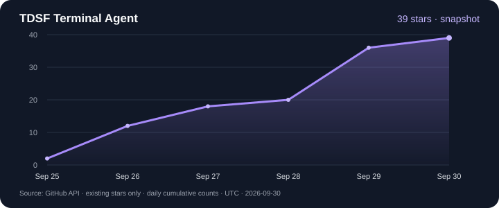

<div align="center">


# TDSF Terminal Agent

**A terminal-first Linux operations workbench where the AI agent works inside your real shell — visibly, step by step.**

[中文](README.md) · **English**

[Website](https://harryopo.github.io/tdsf-terminal-agent/) · [Install](#installation-windows-x64) · [Capabilities](#core-capabilities) · [Tools](#tool-catalog-25) · [Architecture](#architecture) · [Development](#development)

[](https://github.com/harryopo/tdsf-terminal-agent/releases/latest)
[](https://github.com/harryopo/tdsf-terminal-agent/actions/workflows/ci.yml)
[](https://github.com/harryopo/tdsf-terminal-agent/stargazers)
[](LICENSE)


-3776AB)

</div>

<p align="center">
  <a href="https://github.com/harryopo/tdsf-terminal-agent/releases/latest"><strong>Download for Windows</strong></a> ·
  <a href="https://harryopo.github.io/tdsf-terminal-agent/#demo">Watch the real demo</a> ·
  <a href="https://github.com/harryopo/tdsf-terminal-agent/issues">Report an issue</a>
</p>

> This is a **pre-stable 0.x release; installers are Windows x64 only**. Start in a test environment. The installer is not yet Authenticode-signed; see [installation](#installation-windows-x64) for checksum verification.

| Real operations | Controlled collaboration | Learn by doing |
|---|---|---|
| Local / WSL / SSH workspaces, SFTP browsing and editing | Visible-terminal or background execution, real output, risk levels and approval cards | One command card per step, predicted output and result-based explanations |
| Directory following, drag-and-drop uploads, service and network inspection | Expandable reasoning, task progress and evidence | Terminal translation, command prediction, skills and local knowledge retrieval |

---

<a href="https://harryopo.github.io/tdsf-terminal-agent/#demo">
  
</a>

The demo shows: connecting an SSH workspace, the agent typing a command into the real terminal character by character, an approval card gating the write, and remote output flowing back into the tool card.
▶ Full video in the [demo section of the promo page](https://harryopo.github.io/tdsf-terminal-agent/#demo).

---

## Contents

- [What it is](#what-it-is)
- [Core capabilities](#core-capabilities)
- [Four interaction modes](#four-interaction-modes)
- [Tool catalog (25)](#tool-catalog-25)
- [Safety boundary](#safety-boundary)
- [Architecture](#architecture)
- [Installation (Windows x64)](#installation-windows-x64)
- [Automatic updates](#automatic-updates)
- [Development](#development)
- [Repository layout](#repository-layout)
- [Privacy and data](#privacy-and-data)
- [Star history](#star-history)
- [License and origin](#license-and-origin)

---

## What it is

TDSF Terminal Agent is a desktop terminal workbench — local PTY, WSL and SSH sessions, an editor and a file tree — with **an AI operations agent wired into the execution path**, not a chat panel bolted onto a terminal.

It is built on top of an open-source terminal project and extended with **SSH server management**, a **visible-execution agent runtime**, and a **single-step teaching workflow** for Linux operations.

Two properties separate it from "AI in a sidebar":

1. **Commands are typed into the shell you can see.** In visible-terminal mode a command is written into a live local PTY or SSH session at a human pace, character by character, echoed in blue at the prompt, and the real output is correlated back into the tool card. Press any key and control is handed straight back to you.
2. **Every action crosses a real safety boundary.** Command-impact classification, a hard denylist floor, human approval with per-session FIFO ordering, and exit codes reported as they are — so "the agent said it succeeded" is never taken on faith.

## Core capabilities

### Agent runtime

- A single `main` agent driven by [Strands Agents](https://github.com/strands-agents/sdk-python). **The tool registry is the single source of truth** for implementation, schema and policy, and a gate keeps the parameters the model sees identical to the ones the code accepts.
- **25 registered tools** ([full catalog](#tool-catalog-25)).
- **Observe mode removes write-capable tools from the schema** — the model cannot call a tool it never received.
- Provider retries are owned by one component, so a single 429 does not fan out into dozens of requests.

### SSH server management

- Pure-Rust SSH client (russh) with password and public-key authentication. **Credentials live in the Windows credential store**, never in the repository.
- **TOFU host-key verification**: unknown hosts raise an approval prompt; a changed key raises a man-in-the-middle warning, with an option to clear that host's stale entries and re-trust after you verify it.
- Multiple terminal tabs in one workspace each hold **their own independent connection**; closing a tab releases the session it exclusively owned.
- SFTP browsing and editing, drag-and-drop upload from the file explorer, and a remote tree that follows the current session's working directory.
- Local, remote and dynamic (SOCKS5) port forwarding.
- A live server monitor (CPU, memory, disk, network, processes) collected over the SSH channel without occupying the agent.

### Terminal, editor and everyday tooling

- Local PTY / WSL / SSH terminals share one xterm.js render pool; split panes; per-workspace tab sets.
- **Command prediction**: bundled spec index, carapace parameter completion, curated Chinese tldr descriptions and the remote shell's own command set. Parameter completion is throttled, so it does not spawn a process per keystroke. Static flags work without any install; to suggest branches, files and services that actually exist **on the server**, install the completion component there once from Settings → 通用 (General) → 远端补全组件.
- CodeMirror 6 editor with LSP and remote file editing, snippets, and selection translation that resolves against the built-in dictionaries offline — the "AI 补全释义" button is what additionally asks your configured model for a richer explanation.

### Local knowledge retrieval

- Indexes documents already present in the local data directory or imported by you; the entry count depends on the machine.
- Retrieval runs entirely locally: SQLite **FTS5** keyword search plus **sqlite-vec** semantic search (fastembed / BGE-small-zh, 512 dimensions), fused with RRF.
- Reasoning still uses the model provider you configure; knowledge retrieval itself sends nothing out.

### Workspaces, sessions and memory

- **A workspace is the isolation unit**: the agent only sees the environment of the workspace its conversation belongs to, so a command meant for host A cannot land on host B.
- Conversations are isolated per workspace. Session summaries and successful troubleshooting cases can be stored locally with a workspace tag and recalled by later conversations in that workspace.

## Four interaction modes

The UI offers four modes. **Permissions** are decided by three sidecar modes (observe / confirm / auto, defaulting to confirm); teaching is the observe permission set plus a teaching flag.

| Mode | What the agent may do | Typical use |
|------|----------------------|-------------|
| **Observe** | Read-only analysis; write-capable tools are absent from the schema | Production inspection |
| **Confirm** *(default)* | Full toolset; recognised read-only queries run directly, anything unknown or state-changing goes through an approval card | Day-to-day operations, human in the loop |
| **Auto** | Low-risk (L0–L2) runs directly; L3/L4 still require approval | Trusted environment |
| **Teach** | Observe permissions plus the teaching flow; one command card at a time, nothing executed by the backend | Classroom / self-paced learning |

In teaching mode, explanations follow a fixed section contract (concepts and principles → path breakdown → design philosophy → worked examples → pitfalls → exercise). Each action becomes a command card; the command reaches the visible terminal only when you press Run, and the lesson continues after the real output returns.

## Tool catalog (25)

| Group | Tools |
|-------|-------|
| Execution and observation | `ssh_command` · `get_terminal_output` · `suggest_command` · `python_run` · `ask_user` |
| Remote files | `read_remote_file` · `write_remote_file` |
| Operations | `service_manage` · `package_manage` · `firewall_manage` · `security_audit` · `performance_analyze` · `network_diagnose` · `inspect_processes` · `analyze_logs` |
| Evidence and review | `assess_confidence` · `search_history` · `config_diff` · `backup_restore` · `todo_write` |
| Knowledge and skills | `knowledge_search` · `knowledge_get_doc` · `skill_invoke` · `save_skill` |
| Sessions | `ssh_list_sessions` |

Teaching mode is not a 26th tool: it intercepts the tools above and returns a structured single-step command card, which the terminal then really executes.

## Safety boundary

The latest remote-file approval, Python risk-classification and SSH forwarding-isolation fixes are not yet included in existing installers. See [unreleased changes](CHANGELOG.md#unreleased).

- **Impact levels**: current classification emits L0 / L2 / L3 / L4 (L1 is kept for compatibility); unknown commands fail closed, and compound commands are assessed segment by segment.
- **Hard denylist**: catastrophic operations are blocked outright, with no "approve anyway" path.
- **Reading credentials requires consent**: commands such as `cat ~/.ssh/id_rsa` or `head /etc/shadow` are raised to L3 approval on both the SSH and Python paths — the credential path list has exactly one owner shared by both channels.
- **Per-session FIFO**: the next approval card is not shown until the previous command has returned from SSH.
- **Circuit breaker**: up to 50 tool calls per turn; three consecutive failures for one tool trips the breaker.
- **Exit codes reported honestly**: read-only / low-risk commands may be marked completed with a non-zero code, while retaining the actual `exit_code`, `stderr` and an explanation. State-changing failures remain errors; missing exit codes are indeterminate, not invented successes.
- **Output redaction** filters known credential patterns before they enter model context and logs; the configured API key is no longer written to disk in plaintext. Redaction is not a confidentiality guarantee: review attachments and output before sending.
- **No silent channel switches**: a write operation is never moved to the background because "no terminal is visible" — only read-only commands may be rerouted, and the reroute is stated in the payload.

Risk classification and approval are not an OS sandbox. Local `python_run` uses a Python subprocess; setting its working directory does not restrict all filesystem or network access. Execution retains the current account's permissions.

## Architecture

```
React 19 frontend   (agent panel, terminals, workspaces, editor)
      │  Tauri invoke / events
      ▼
Rust shell          (PTY · SSH · SFTP · tunnels · human-typing engine · sidecar supervisor)
      │  JSON-RPC over stdio
      ▼
Python sidecar      (Strands agent · tool registry · approvals · knowledge · evidence)
```

| Layer | Stack |
|-------|-------|
| Desktop shell | Tauri 2 (Rust) |
| Frontend | React 19 · TypeScript · Vite · Tailwind CSS v4 · zustand · xterm.js · CodeMirror 6 |
| SSH / PTY | russh · russh-sftp · portable-pty · keyring |
| Agent runtime | Python sidecar with Strands Agents (DeepSeek, Zhipu, Qwen, Moonshot, Doubao, Ollama, custom OpenAI-compatible endpoints) |
| Knowledge | SQLite FTS5 + sqlite-vec (512-dim) + RRF |

## Installation (Windows x64)

The shipping artifact is a **Windows x64 NSIS installer** (per-user install, no administrator rights required).

1. Download `TDSF.Terminal.Agent_<version>_x64-setup.exe` from [Releases](https://github.com/harryopo/tdsf-terminal-agent/releases) and find its SHA-256 in the corresponding release notes.
2. Verify the checksum before running it:

   ```powershell
   Get-FileHash '.\TDSF.Terminal.Agent_<version>_x64-setup.exe' -Algorithm SHA256
   ```

3. Run the installer. It fetches the Microsoft WebView2 bootstrapper only when WebView2 is missing.
4. Open **Settings → Models**, add an API key for a model provider, then create a workspace (local, WSL or SSH).

The installer is not Authenticode-signed yet, so SmartScreen may show an unknown-publisher warning on first run; verify the SHA-256 checksum before continuing.

## Automatic updates

From **0.9.0** an installed release discovers new versions on its own:

- One check about 8 seconds after start-up, then at most once per day. The check only retrieves the release manifest from GitHub and uploads no local data.
- When an update exists, a chip appears in the status bar. **No modal dialog interrupts you.**
- Downloading and installing both need an explicit click, and the dialog states the package size first (it is a full installer, not a delta).
- Update packages are minisign-signed and verified before installation; the private signing key is not shipped with the installer.
- Installation is refused while an approval is waiting or a turn is still running, and your session is left untouched. A normal install closes things down in order: cancel the turn → disconnect this window's SSH sessions → close terminals → stop language servers → stop the sidecar.

## Development

**Requirements**: Node.js ≥ 20, pnpm ≥ 9, Rust stable, Python ≥ 3.11 (the sidecar environment is constrained by `src-tauri/sidecar/pyproject.toml`; the agent runtime version is pinned in `src-tauri/sidecar/STRANDS_RUNTIME_VERSION`)

```bash
pnpm install              # frontend dependencies
pnpm tauri:dev            # launch the development build (first compile: 2–5 min)
```

On Windows you can also double-click `启动.bat` in the repository root. The development build uses a different application identifier and data directory, so it never overwrites released settings or sessions.

| Command | Purpose |
|---------|---------|
| `pnpm typecheck` / `pnpm lint` | Type and static checks |
| `pnpm test` | Frontend unit tests (vitest) |
| `pnpm test:python` | Sidecar tests (pytest: agent, tools, safety policy, knowledge) |
| `cargo test` (in `src-tauri/`) | Rust side: PTY / SSH / filesystem / system boundaries |
| `pnpm probe:ui` | Real-window UI gate: control hit areas, clipping and alignment measured over CDP |
| `pnpm probe:dialog` / `probe:ssh` / `probe:ipc` | Dialog geometry, SSH session reaping, IPC method allowlist |
| `pnpm check:release-version` | Verifies the five version declarations match |
| `pnpm build:win` | Version check → sidecar packaging and smoke test → NSIS installer |

Release flow: push a `v*` tag → CI builds the signed installer and update manifest into a **draft** release → you verify, then publish. The manifest only resolves published releases, so clients cannot see it before you click publish.

## Repository layout

```
src/                React frontend (modules/ by feature: ai, terminal, ssh, explorer, editor…)
src-tauri/
  src/              Rust shell: pty / ssh / sftp / tunnel / lsp / sidecar supervisor
  sidecar/          Python agent runtime (strands_backend/ + tools/ + knowledge/)
  sidecar/tests/    pytest suite
  capabilities/     Tauri permission sets
  tauri.*.conf.json release / dev / per-platform configuration
scripts/            build and data-generation scripts; probe/ holds the real-window gates
website/            promo page (deployed to GitHub Pages)
assets/             logo sources
.github/workflows/  CI (frontend / Python / Rust on three platforms) · release · Pages
```

## Privacy and data

Network uses include your configured model service, SSH hosts you add, GitHub update checks and downloads, and the WebView2 bootstrapper when needed. Webpage previews and user-initiated knowledge imports or crawling also access selected websites or sources; see [PRIVACY.md](PRIVACY.md).

Conversations, workspace configuration and the knowledge base stay in the local data directory. Your model provider can receive the conversation, the selected workspace context and the tool results needed to answer — review terminal output and attachments before sending sensitive information to a cloud model. See [PRIVACY.md](PRIVACY.md) for details.

Uninstalling does not delete workspaces, skills or application data you created; remove those directories and saved credentials manually when a complete local reset is required.

## Star history

[](https://www.star-history.com/#harryopo/tdsf-terminal-agent&Date)

A snapshot of dates for existing stars from the GitHub API, observed on **2026-09-30 (UTC)**: **39** stars. It excludes removed stars and is not a live net-growth chart. [See current stargazers](https://github.com/harryopo/tdsf-terminal-agent/stargazers). If the project helps you, consider a star; reproducible issue reports are equally welcome.

## License and origin

- Original contributions in this project: **Apache-2.0** — see [LICENSE](LICENSE).
- Built on top of an open-source terminal project (Apache-2.0) and extended with SSH server management, the visible-execution agent runtime and the Linux teaching workflow.
