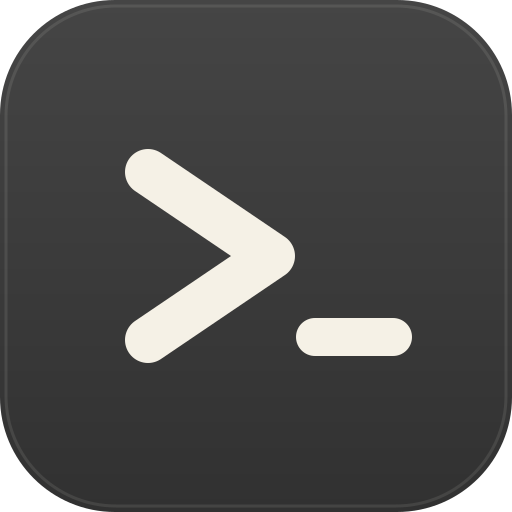
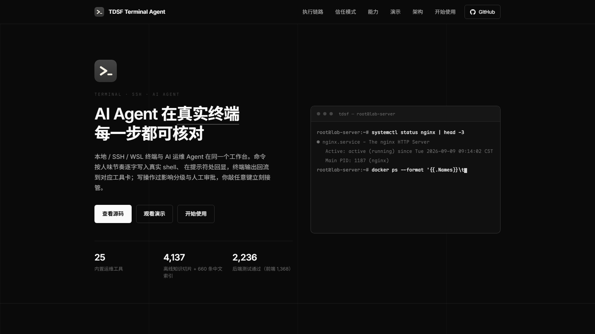

<div align="center">



# TDSF Terminal Agent

**A terminal-first Linux operations workbench where the AI agent works inside your real shell — visibly, step by step.**

[Website](https://harryopo.github.io/tdsf-terminal-agent/) · [Quick start](#quick-start) · [Capabilities](#core-capabilities) · [Architecture](#architecture) · [GitHub](https://github.com/harryopo/tdsf-terminal-agent)


-3776AB)


</div>

---

## Demo

<a href="https://harryopo.github.io/tdsf-terminal-agent/#demo">
  
</a>

▶ **Watch the demo** — [promo page demo section](https://harryopo.github.io/tdsf-terminal-agent/#demo) · video file: `website/assets/video/demo.mp4` ([how to add it](website/assets/video/README.md))
> The demo shows: connecting an SSH workspace, the agent typing a command into the real terminal character by character, the approval card gating the write, and the remote output flowing back into the tool card.

## What it is

TDSF Terminal Agent is a **desktop terminal IDE with an AI operations agent built into the shell path** — not a chat panel bolted onto a terminal.

It is built on top of an open-source terminal IDE and extended with **SSH server management**, a **visible-execution agent runtime**, and a **step-by-step teaching workflow** for Linux operations.

Two properties separate it from "AI in a sidebar":

- **The agent works in the real shell.** In visible mode, commands are typed into a live local PTY / SSH session character by character (Weibull-timed, inspired by `expect send -h`), echoed in blue at the shell prompt, and the terminal output is correlated back into the tool card. Pressing a key hands control back to you instantly.
- **Every action passes a real safety boundary.** Command impact classification, a hard denylist floor, human approval with per-session FIFO ordering, and an SSH exit-code hard boundary — so "the agent said it succeeded" is never taken on faith.

## Core capabilities

**Agent runtime — one main Strands agent, tool-boundary enforced**

- Single `main` agent over Strands Agents; the tool registry is the single source of truth for implementation, schema and policy.
- **25 registered tools** (SSH exec, remote file read/write, log analysis, process inspection, network diagnosis, service/package/firewall management, security audit, performance analysis, knowledge search/get-doc, skill invoke, todo, terminal output, config diff, backup/restore, evidence assessment, history search, skill save, python run, session listing, command suggestion) plus a runtime-registered teaching tool in teaching mode.
- **Observe mode** physically removes write tools from the schema — the model cannot call a tool it never received.

**Four trust modes**

| Mode | What the agent may do | Typical use |
|------|----------------------|-------------|
| **Observe** | Read-only analysis; write tools removed from the schema | Production inspection |
| **Confirm** *(default)* | Full toolset; recognised read-only queries run, anything unknown or state-changing goes through an approval card | Day-to-day operations, human in the loop |
| **Auto** | Low-risk (L0–L2) runs directly; L3/L4 still require approval | Trusted sandbox |
| **Teach** | Read-only + structured lesson output with single-step command cards | Classroom / self-paced learning |

**SSH server management**

- Pure-Rust SSH client (russh) with password / public-key auth; credentials live in the OS keyring, never in the repo.
- **TOFU host-key verification** — unknown host keys raise an approval prompt, changed keys raise a mismatch warning.
- SFTP browsing and editing, drag-and-drop upload, and a remote tree that follows the current session's `cwd` consistently across servers.
- Local / remote / dynamic (SOCKS5) port forwarding, and a live server monitor (CPU, memory, disk, network, processes) polled over the SSH channel without involving the agent.

**Safety boundary**

- Command impact classification (L0–L4) with per-segment breakdown of compound commands.
- Hard denylist for catastrophic operations — blocked outright, not offered for approval.
- Per-session FIFO: the next approval card is not shown until the previous command returns from SSH.
- Tool-call cap (50 per turn) plus a 3-consecutive-failure circuit breaker.
- Output redaction before anything reaches the UI, the model, or the logs.
- **SSH exit-code hard boundary**: a non-zero or missing exit code is reported as an error, never as success.

**Offline knowledge base**

- Ships with **4,137 embedded documentation chunks** (Arch Wiki, nginx, Apache, Docker, Kubernetes, Redis, SSH, SELinux, git and more) plus a **660-entry distilled Chinese index**.
- Hybrid retrieval: SQLite **FTS5** keyword search + **sqlite-vec** semantic search, fused with RRF. Fully local, no network required.

**Workspaces, sessions and memory**

- Workspace = the isolation unit. Each workspace keeps its own windows and tabs; the agent sees only the environment of the conversation's own workspace.
- Conversations are **isolated per workspace**, and **conversations inside one workspace share the same long-term memory** (session summaries and diagnosed cases are written back and recalled with the workspace tag).

**Teaching workflow**

- Lesson output in a fixed section contract (concepts & principles, path breakdown, design philosophy, worked examples, pitfalls, exercise).
- **Single-step command cards**: the lesson produces one command card at a time; the student clicks Run, it is typed into the visible terminal, and only after the real result returns does the lesson continue.

**Terminal, editor and workspace tooling**

- Local PTY, WSL and SSH terminals behind a shared xterm.js render pool; split panes; workspaces with independent tab sets.
- Command prediction: bundled spec index, carapace parameter completion, curated Chinese tldr descriptions and the remote shell's own command set.
- CodeMirror 6 editor with LSP support, remote file editing, offline selection translation, and snippets.

## Architecture

```
React 19 frontend   (agent panel, terminals, workspaces, editor)
      │  Tauri invoke / events       125 Tauri IPC commands
      ▼
Rust shell          (PTY · SSH · SFTP · tunnels · human-type engine · sidecar supervisor)
      │  JSON-RPC over stdio         121 sidecar RPC methods
      ▼
Python sidecar      (Strands agent · tool registry · approvals · knowledge · evidence)
```

| Layer | Stack |
|-------|-------|
| Desktop shell | Tauri 2 (Rust) |
| Frontend | React 19 · TypeScript · Vite · Tailwind v4 · zustand · xterm.js · CodeMirror 6 |
| SSH / PTY | russh · russh-sftp · portable-pty · keyring |
| AI runtime | Python sidecar with Strands Agents (OpenAI-compatible providers: DeepSeek, Zhipu, Qwen, Moonshot, Doubao, Ollama, custom endpoints) |
| Knowledge | SQLite FTS5 + sqlite-vec (512-dim) + RRF |

## Quick start

**Requirements**: Node.js ≥ 20, pnpm ≥ 9, Rust stable, Python ≥ 3.12

```bash
pnpm install          # frontend dependencies
pnpm tauri:dev        # launch the desktop app (first build: 2–5 min)
```

The Python sidecar environment lives in `src-tauri/sidecar/` (a virtualenv); `启动.bat` on Windows wires it up and launches the app.

Add an API key in **Settings → Models** (DeepSeek, Zhipu, Qwen, Moonshot, Doubao, Ollama or a custom OpenAI-compatible endpoint), then create a workspace — local, WSL or SSH — and start a conversation inside it.

## License and upstream

- Original contributions in this project: **Apache-2.0** — see [`LICENSE`](LICENSE).
- Built on top of an open-source terminal IDE (Apache-2.0); this project extends it with SSH server management, the visible-execution agent runtime and the Linux teaching workflow.

---
---

<div align="center">


# TDSF Terminal Agent（中文）

**终端优先的 Linux 运维工作台 —— AI Agent 直接在真实 shell 里干活，而且你看得见每一步。**

[宣传页](https://harryopo.github.io/tdsf-terminal-agent/) · [快速开始](#快速开始) · [核心能力](#核心能力) · [架构](#架构) · [GitHub](https://github.com/harryopo/tdsf-terminal-agent)

</div>

## 它是什么

TDSF Terminal Agent 是一款**把 AI 运维 Agent 装进 shell 执行链路的桌面终端 IDE**，而不是"终端旁边挂一个聊天框"。

项目在开源终端项目的架构基础之上开发完善，并新增 **SSH 服务器管理**、**可见执行的 Agent 运行时**，以及面向 Linux 运维的**步步确认教学模式**。

两点让它区别于普通的"侧边栏 AI"：

- **Agent 在真实 shell 里工作。** 可视模式下，命令按人味节奏**逐字符**敲进本地 PTY / SSH 会话（Weibull 分布采样，思路取自 `expect send -h`），在命令行处蓝色回显，真实输出回流到工具卡；你敲任意键立刻交还控制权。
- **每个动作都过真实的安全边界。** 命令影响分级、硬底线黑名单、人工审批（按会话 FIFO）、SSH 退出码硬边界 —— "AI 说它成功了"从来不作为事实。

## 核心能力

**Agent 运行时：唯一 main Agent，工具边界受控**

- Strands Agents 驱动的单一 `main` Agent；工具注册表是实现、Schema 与策略的单一真源。
- **25 个注册工具**（SSH 执行、远程文件读写、日志分析、进程检查、网络诊断、服务/软件包/防火墙管理、安全审计、性能分析、知识检索与整文档读取、技能调用、任务清单、终端输出、配置比对、备份恢复、证据评估、历史案例检索、技能沉淀、Python 执行、SSH 会话枚举、命令建议），教学模式额外在运行时注册教学工具。
- **观察模式**在 schema 层直接移除写类工具 —— 模型无法调用它从未拿到的工具。

**四档信任模式**

| 档位 | Agent 能做什么 | 适用场景 |
|------|---------------|---------|
| **观察** | 只读分析，写类工具从 schema 移除 | 生产巡检 |
| **确认**（默认） | 全量工具；已识别的只读查询直接跑，未知与状态变更类逐条走审批卡 | 日常运维，人在回路 |
| **自动** | 低危（L0–L2）直接执行，L3/L4 仍需审批 | 可信沙箱 |
| **教学** | 只读 + 结构化讲解，单步命令卡 | 课堂 / 自学 |

**SSH 服务器管理**

- 纯 Rust SSH 客户端（russh），支持密码与公钥认证；凭据存入系统密钥库，不进仓库。
- **TOFU 主机密钥校验**：未知主机弹审批，密钥变更给出中间人告警。
- SFTP 浏览与编辑、拖拽上传、跨服务器一致的远程文件树（跟随当前会话 `cwd`）。
- 本地 / 远程 / 动态（SOCKS5）端口转发；服务器实时监控（CPU、内存、磁盘、网络、进程）走 SSH 通道采集，不占用 Agent。

**安全边界**

- 命令影响分级（L0–L4），复合命令逐段拆解展示。
- 灾难性操作硬底线黑名单 —— 直接拦截，不提供审批选项。
- 同会话 FIFO：上一条命令未从 SSH 返回前，不展示下一条审批卡。
- 单次调用工具上限 50 次 + 连续失败 3 次熔断。
- 输出脱敏：进入 UI、模型上下文与日志前统一处理。
- **SSH 退出码硬边界**：非零或缺失退出码一律按错误上报，不谎报成功。

**离线知识库**

- 内置 **4137 条官方文档切片**（Arch Wiki、nginx、Apache、Docker、Kubernetes、Redis、SSH、SELinux、git 等）+ **660 条中文提炼索引**。
- 混合检索：SQLite **FTS5** 关键词 + **sqlite-vec** 向量语义，RRF 融合。全程本地，无需联网。

**工作区、会话与记忆**

- 工作区是隔离单元：每个工作区保存自己的窗口与标签页；Agent 只看到当前对话所属工作区的环境。
- **对话按工作区隔离**，而**同一工作区内的不同对话共享同一份长期记忆**（会话摘要与排障案例写回后按工作区标签召回）。

**教学流程**

- 讲解输出遵循固定板块契约（概念与原理、路径拆解、设计哲学、操作示例、易错点、练习）。
- **单步命令卡**：一次只给一条命令，学生点击 Run 后敲进可见终端，真实结果返回后才继续下一步。

**终端、编辑器与工作区工具**

- 本地 PTY / WSL / SSH 终端共用 xterm.js 渲染池；支持分屏；工作区各自独立的标签页。
- 命令预测：内置 spec 索引、carapace 参数补全、中文 tldr 描述与远端 shell 自身命令集。
- CodeMirror 6 编辑器 + LSP、远程文件编辑、离线选词翻译、命令片段（Snippets）。

## 架构

```
React 19 前端    （Agent 面板 · 终端 · 工作区 · 编辑器）
      │  Tauri invoke / 事件        125 个 Tauri IPC 命令
      ▼
Rust 壳          （PTY · SSH · SFTP · 隧道 · 打字机引擎 · sidecar 监管）
      │  JSON-RPC over stdio        121 个 sidecar RPC 方法
      ▼
Python sidecar   （Strands Agent · 工具注册表 · 审批 · 知识库 · 证据链）
```

| 层 | 选型 |
|----|------|
| 桌面壳 | Tauri 2（Rust） |
| 前端 | React 19 · TypeScript · Vite · Tailwind v4 · zustand · xterm.js · CodeMirror 6 |
| SSH / PTY | russh · russh-sftp · portable-pty · keyring |
| AI 运行时 | Python sidecar + Strands Agents（DeepSeek / 智谱 / 通义 / Kimi / 豆包 / Ollama / 自定义 OpenAI 兼容端点） |
| 知识库 | SQLite FTS5 + sqlite-vec（512 维）+ RRF |

## 验证状态

本项目严格区分**"代码与自动化测试已验证"**与**"仍需原生桌面验收"**，没有证据的能力不会写成端到端完成。

| 门禁 | 结果 |
|------|------|
| `pytest`（sidecar） | 2236 通过 |
| `vitest` | 1368 通过（140 个文件） |
| `cargo test` | 364 通过 |
| `tsc` / `eslint` | 0 错误 0 警告 |

## 快速开始

**环境要求**：Node.js ≥ 20、pnpm ≥ 9、Rust stable、Python ≥ 3.12

```bash
pnpm install          # 安装前端依赖
pnpm tauri:dev        # 启动桌面应用（首次编译 2–5 分钟）
```

Python sidecar 环境位于 `src-tauri/sidecar/`（虚拟环境）；Windows 下双击 `启动.bat` 即可自动接线并启动。

在**设置 → 模型**中填入 API Key（DeepSeek / 智谱 / 通义 / Kimi / 豆包 / Ollama / 自定义 OpenAI 兼容端点），然后新建一个工作区（本地 / WSL / SSH），在工作区内新建对话开始使用。

## 许可与上游

- 本项目原创贡献以 **Apache-2.0** 授权 —— 见 [`LICENSE`](LICENSE)。
- 在开源终端项目的架构基础之上开发完善（Apache-2.0），并新增 SSH 服务器管理、可见执行 Agent 运行时与 Linux 教学流程。
