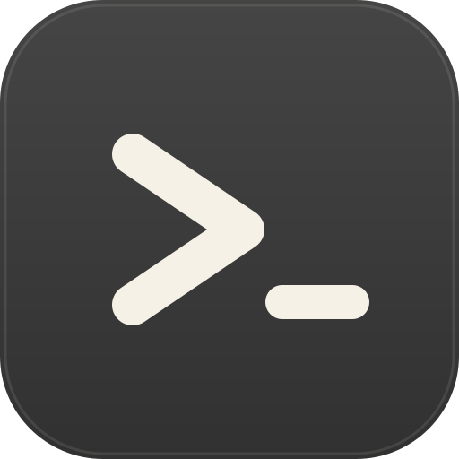
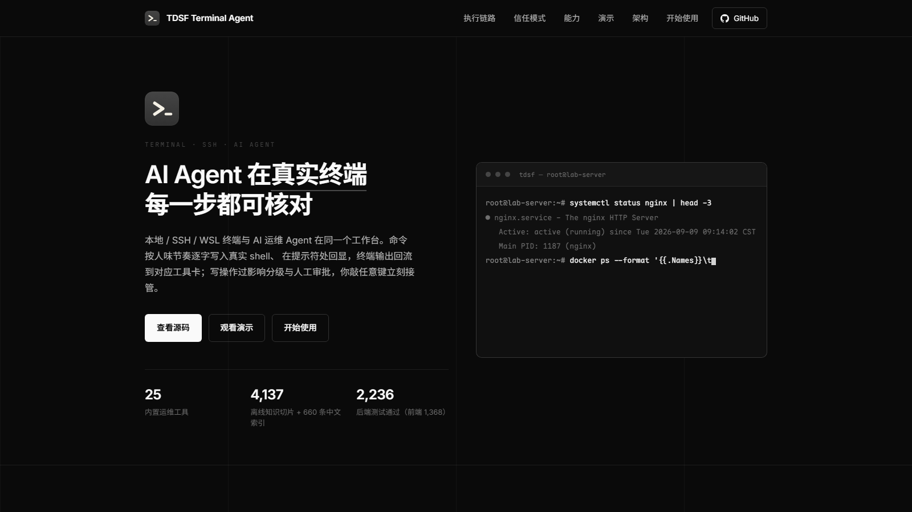

<div align="center">



# TDSF Terminal Agent

**终端优先的 Linux 运维工作台 —— AI Agent 直接在你的真实 shell 里干活，每一步都看得见。**

**中文** · [English](README.en.md)

[宣传页](https://harryopo.github.io/tdsf-terminal-agent/) · [下载与安装](#安装windows-x64) · [核心能力](#核心能力) · [工具清单](#工具清单25-个) · [架构](#架构) · [开发指南](#开发指南)


-3776AB)

</div>

---

<a href="https://harryopo.github.io/tdsf-terminal-agent/#demo">
  
</a>

演示内容：接入 SSH 工作区 → Agent 把命令逐字符敲进真实终端 → 写操作被审批卡拦下等人确认 → 远端输出回流到工具卡。
▶ 完整视频在[宣传页的 Demo 区块](https://harryopo.github.io/tdsf-terminal-agent/#demo)。

---

## 目录

- [这是什么](#这是什么)
- [核心能力](#核心能力)
- [四档交互](#四档交互)
- [工具清单（25 个）](#工具清单25-个)
- [安全边界](#安全边界)
- [架构](#架构)
- [安装（Windows x64）](#安装windows-x64)
- [自动更新](#自动更新)
- [开发指南](#开发指南)
- [仓库结构](#仓库结构)
- [隐私与数据](#隐私与数据)
- [许可与来源](#许可与来源)

---

## 这是什么

TDSF Terminal Agent 是一款桌面终端工作台：本地 PTY、WSL、SSH 会话、编辑器、文件树，加上一个**接进执行链路的 AI 运维 Agent** —— 不是"终端旁边挂一个聊天框"。

项目在开源终端项目的架构基础之上开发完善，新增了三块能力：**SSH 服务器管理**、**可见执行的 Agent 运行时**、面向 Linux 运维教学的**单步确认流程**。

它和"侧边栏 AI"的区别在于两件事：

1. **命令真的敲进你看得见的那个 shell。** 可见终端模式下，命令按人的节奏逐字符写入本地 PTY 或 SSH 会话，在命令行处以蓝色回显，执行结果从终端回流到工具卡片。你敲下任意键，控制权立刻回到你手里。
2. **每个动作都要过一道真实的安全边界。** 命令影响分级、灾难性操作硬拦截、人工审批（同会话先进先出）、退出码如实上报 —— "Agent 说它成功了"不会被当成事实。

## 核心能力

### Agent 运行时

- 单一 `main` Agent，由 [Strands Agents](https://github.com/strands-agents/sdk-python) 驱动；**工具注册表是实现、Schema 与策略的唯一真源**，模型看到的参数与代码接收的参数由门禁钉住一致。
- 共 **25 个注册工具**（[完整清单](#工具清单25-个)）。
- **观察档在 Schema 层移除写类工具**：模型拿不到的工具，也就调不出来。
- 模型侧退避收敛为一个主人（`retry_policy`），一次 429 不会放大成几十次请求。

### SSH 服务器管理

- 纯 Rust SSH 客户端（russh），支持密码与公钥认证；**凭据存入 Windows 系统密钥库**，不落仓库。
- **TOFU 主机密钥校验**：首次连接的新主机弹审批；密钥与已知记录不一致时给中间人告警，并支持"核对后清除本机这一台的旧记录再信任"。
- 同一个工作区可以开多个终端标签页，**每个标签页各占一条独立连接**，互不串台；关闭标签页时释放它独占的会话。
- SFTP 浏览与编辑、从资源管理器拖拽上传文件、远程文件树跟随当前会话的工作目录。
- 本地转发 / 远程转发 / 动态转发（SOCKS5）三类端口转发。
- 服务器实时监控（CPU、内存、磁盘、网络、进程）直接走 SSH 通道采集，不占用 Agent 的对话。

### 终端、编辑器与效率

- 本地 PTY / WSL / SSH 终端共用一套 xterm.js 渲染池，支持分屏；工作区各自独立的标签页集合。
- **命令预测**：内置 spec 索引、carapace 参数补全、中文 tldr 释义，外加远端 shell 自身的命令集；带节流的参数补全，不会为每个按键起一个进程。
- CodeMirror 6 编辑器 + LSP、远程文件编辑、命令片段库；选词翻译默认查内置词典（离线，不联网），点一次「AI 补全释义」才会调用你配置的模型补一条更详细的解释。

### 本地知识检索

- 索引本机数据目录中已有或由你导入的文档，条目数量取决于这台设备实际装了什么。
- 检索全程在本地完成：SQLite **FTS5** 关键词 + **sqlite-vec** 向量语义（fastembed / BGE-small-zh，512 维），两路结果用 RRF 融合。
- Agent 的推理仍由你配置的模型服务完成；知识检索本身不外发。

### 工作区、会话与记忆

- **工作区是隔离单元**：Agent 只看到当前对话所属工作区的环境，不会把 A 服务器的命令打进 B。
- 对话按工作区隔离；会话摘要与成功排障案例可按工作区标签存在本地，供同一工作区之后的对话检索召回。

## 四档交互

界面上有四档。**权限**由 sidecar 的三种模式决定（观察 / 确认 / 自动，缺省为确认），教学档是在观察权限之上叠加一个教学标记：

| 档位 | Agent 能做什么 | 适用场景 |
|------|---------------|---------|
| **观察** | 只读分析，写类工具不出现在 Schema 里 | 生产巡检 |
| **确认**（默认） | 全量工具；可识别的只读查询直接执行，未知命令与状态变更逐条走审批卡 | 日常运维，人在回路 |
| **自动** | 低危（L0–L2）直接执行，L3/L4 仍需审批 | 可信环境 |
| **教学** | 观察权限 + 教学标记：一次只出一张命令卡，后端不代执行 | 课堂 / 自学 |

教学档的完整链路：讲解遵循固定板块（概念与原理 → 路径拆解 → 设计哲学 → 操作示例 → 易错点 → 练习），每讲到一个动作就生成一张命令卡；命令由你点 Run 送进可见终端，真实输出回传之后才继续下一步。

## 工具清单（25 个）

| 分类 | 工具 |
|------|------|
| 执行与观察 | `ssh_command` · `get_terminal_output` · `suggest_command` · `python_run` · `ask_user` |
| 远程文件 | `read_remote_file` · `write_remote_file` |
| 运维动作 | `service_manage` · `package_manage` · `firewall_manage` · `security_audit` · `performance_analyze` · `network_diagnose` · `inspect_processes` · `analyze_logs` |
| 证据与复盘 | `assess_confidence` · `search_history` · `config_diff` · `backup_restore` · `todo_write` |
| 知识与技能 | `knowledge_search` · `knowledge_get_doc` · `skill_invoke` · `save_skill` |
| 会话 | `ssh_list_sessions` |

教学模式不是第 26 个工具：它拦截上述工具调用，返回结构化的单步命令卡，由终端真实执行。

## 安全边界

- **影响分级**：当前判定产出 L0 / L2 / L3 / L4（L1 保留兼容）；未识别的命令按高风险处理，复合命令逐段拆开评估。
- **硬底线黑名单**：灾难性操作直接拦截，不提供"仍要审批"的入口。
- **凭据读取需要点头**：`cat ~/.ssh/id_rsa`、`head /etc/shadow` 这类读取凭据类文件的命令，无论走 SSH 还是 Python 通道都提到 L3 审批（凭据路径名单只有一份，两条通道共用）。
- **同会话先进先出**：上一条命令没有从 SSH 返回之前，不会弹出下一条审批卡。
- **熔断**：单次回合工具调用上限 50 次；同一工具连续失败 3 次熔断。
- **退出码如实上报**：非零退出码与"没取回退出码"是两种不同状态，都不会被写成成功；只读命令的非零退出会附带 `stderr` 与含义说明，不谎报也不吞信息。
- **输出脱敏**：进入界面、模型上下文与日志之前统一处理；API Key 不再明文落盘。
- **不静默换通道**：写操作不会因为"当前没有可见终端"就被应用自己改到后台执行；只有只读命令会改道，且改道事实写进返回载荷。

## 架构

```
React 19 前端    （Agent 面板 · 终端 · 工作区 · 编辑器）
      │  Tauri invoke / 事件
      ▼
Rust 壳          （PTY · SSH · SFTP · 端口转发 · 打字机引擎 · sidecar 监管）
      │  JSON-RPC over stdio
      ▼
Python sidecar   （Strands Agent · 工具注册表 · 审批 · 知识检索 · 证据链）
```

| 层 | 选型 |
|----|------|
| 桌面壳 | Tauri 2（Rust） |
| 前端 | React 19 · TypeScript · Vite · Tailwind CSS v4 · zustand · xterm.js · CodeMirror 6 |
| SSH / PTY | russh · russh-sftp · portable-pty · keyring |
| Agent 运行时 | Python sidecar + Strands Agents（DeepSeek / 智谱 / 通义 / Kimi / 豆包 / Ollama / 自定义 OpenAI 兼容端点） |
| 知识检索 | SQLite FTS5 + sqlite-vec（512 维）+ RRF |

## 安装（Windows x64）

发布形态是 **Windows x64 NSIS 安装包**（当前用户级安装，不需要管理员权限）。

1. 从 [Releases](https://github.com/harryopo/tdsf-terminal-agent/releases) 下载 `TDSF.Terminal.Agent_<版本>_x64-setup.exe` 与 `SHA256SUMS.txt`。
2. 运行前先核对校验值：

   ```powershell
   Get-FileHash '.\TDSF.Terminal.Agent_1.0.2_x64-setup.exe' -Algorithm SHA256
   ```

3. 双击安装。只有在系统缺少 Microsoft WebView2 时，安装器才会去下载它。
4. 打开 **设置 → 模型**，填入一个模型服务的 API Key，然后新建工作区（本地 / WSL / SSH）开始使用。

安装包目前未做 Authenticode 代码签名，Windows SmartScreen 首次运行可能提示"未知发布者"；核对 SHA-256 后再继续即可。

## 自动更新

自 **1.0.2** 起，已安装的正式版会自己发现新版本：

- 启动后约 8 秒检查一次，之后最多每 24 小时一次；检查只是拉取 GitHub Release 的更新清单，不上传任何本机数据。
- 有新版本时，窗口底部状态栏出现提示；**不会弹模态打断你**。
- 下载与安装都需要你点一下确认，弹窗会写明包体积（完整安装包，不是增量）。
- 更新包带 minisign 签名，安装前验签；签名私钥只存在于 CI。
- 有审批在等你回答、或 Agent 一轮还没跑完时，安装会被拒绝且不改动你的现场；正常安装前会依次收尾：取消本轮任务 → 断开本窗口 SSH → 关闭终端 → 停语言服务器 → 停 sidecar。

1.0.1 及更早版本没有更新客户端，需要手动安装一次 1.0.2。

## 开发指南

**环境要求**：Node.js ≥ 20、pnpm ≥ 9、Rust stable、Python ≥ 3.11（sidecar 的虚拟环境版本由 `src-tauri/sidecar/pyproject.toml` 约束，Agent 运行时版本钉在 `src-tauri/sidecar/STRANDS_RUNTIME_VERSION`）

```bash
pnpm install              # 前端依赖
pnpm tauri:dev            # 启动开发版桌面应用（首次编译 2–5 分钟）
```

Windows 下也可以直接双击仓库根目录的 `启动.bat`。开发版与正式版使用不同的应用标识与数据目录，互不覆盖。

| 命令 | 作用 |
|------|------|
| `pnpm typecheck` / `pnpm lint` | 类型与静态检查 |
| `pnpm test` | 前端单元测试（vitest） |
| `pnpm test:python` | sidecar 测试（pytest：Agent、工具、安全策略、知识检索） |
| `cargo test`（在 `src-tauri/`） | Rust 侧：PTY / SSH / 文件系统 / 系统边界 |
| `pnpm probe:ui` | 真机界面门禁：通过 CDP 量已挂载窗口里的控件尺寸、裁切与对齐 |
| `pnpm probe:dialog` / `probe:ssh` / `probe:ipc` | 弹窗几何、SSH 会话回收、IPC 方法白名单的真机核对 |
| `pnpm check:release-version` | 校验五处版本号声明一致 |
| `pnpm build:win` | 版本号校验 → sidecar 打包与冒烟 → NSIS 打包 |

发布流程：推一个 `v*` 标签 → CI 构建带签名的安装包与更新清单，落成**草稿** Release → 验收后手动发布。清单只解析已发布的版本，所以在点"发布"之前，客户端查不到它。

## 仓库结构

```
src/                React 前端（modules/ 按功能分区：ai、terminal、ssh、explorer、editor…）
src-tauri/
  src/              Rust 壳：pty / ssh / sftp / tunnel / lsp / sidecar 监管
  sidecar/          Python Agent 运行时（strands_backend/ + tools/ + knowledge/）
  sidecar/tests/    pytest 套件
  capabilities/     Tauri 权限清单
  tauri.*.conf.json 正式 / 开发 / 各平台配置
scripts/            构建与资源生成脚本；probe/ 下是真机门禁
website/            宣传页（部署到 GitHub Pages）
assets/             logo 源文件
.github/workflows/  CI（前端 / Python / Rust 三平台） · 发布 · Pages
```

## 隐私与数据

联网只发生在这些用途：调用你配置的模型服务、连接你自己添加的 SSH 主机、检查更新时拉取 GitHub 的更新清单、安装器按需下载 WebView2。

会话记录、工作区配置与知识库都存放在本机数据目录；模型提供方会收到对话内容、被选中的工作区上下文以及回答所需的工具结果 —— 向云端模型发送敏感信息前，请先检查终端输出与附件。细节见 [PRIVACY.md](PRIVACY.md)。

卸载不会自动删除你创建的工作区、技能与应用数据；需要彻底清理时请手动删除对应目录与保存在系统里的凭据。

## 许可与来源

- 本项目原创部分以 **Apache-2.0** 授权，见 [LICENSE](LICENSE)。
- 在开源终端项目的架构基础之上开发完善（Apache-2.0），并新增 SSH 服务器管理、可见执行的 Agent 运行时与 Linux 教学流程。
