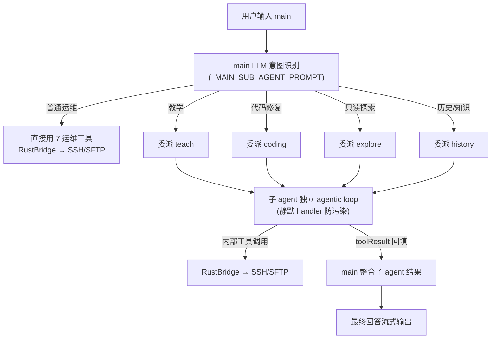

# TDSF Terminal Agent · Agent 架构说明书

> **版本**：v1.2（2026-09-05，源码事实校准）
> **基线**：以当前代码事实为准（`src-tauri/sidecar/strands_backend/adapter.py`、`src/modules/ai/`）
> **配套**：产品与技术方案书 `docs/方案书-v1.0.md`（总纲）、开发状态 `docs/dev-state.md` §37.17/37.18

---

> **重要校正**：2026-08-29 起，生产 `StrandsAgentAdapter` 已删除 `Agent.as_tool` 与 teach/coding/explore/history 子 Agent 委派。下方旧的多 Agent 图、委派时序及文件说明仅保留作演进记录，**不能用于修改现役链路**；完整审计见 `docs/agent/当前架构与实施状态矩阵-2026-09-05.md`。

## 1. 现役生产架构

```text
React UI / Zustand stores
  -> Tauri IPC 与事件订阅
    -> Rust SidecarManager（JSON 行协议、SSH/终端桥接）
      -> Python sidecar（RPC、事件总线、needs_you 生命周期）
        -> StrandsAgentAdapter：唯一 main Agent
          -> TOOL_REGISTRY（模式裁剪、风险、知识库、Skill、SSH 等）
            -> RustBridge / 本地知识库 / 受控本地工具
```

| 关注点 | 现役语义 |
|---|---|
| 编排 | `main` 是唯一生产 Agent。`agent_id` 仅为兼容/缓存键，未知值回退同一 main 工具集。 |
| 模式 | observe 按 Schema 裁剪只读工具；confirm 对未知/网络/副作用或写入逐条审批；auto 仍保留 L3-L4 审批。 |
| 教学 | 是 prompt 与教学命令卡契约，不是独立 Agent；仅明确教学请求可产生 TeachCard。 |
| 知识库 | `knowledge_search`、`knowledge_get_doc` 为本地只读工具，结果使用普通 Markdown 和工具生命周期卡。 |
| 护栏 | `TOOL_REGISTRY` 单一真源、RiskChecker/needs_you、单次 50 次调用上限、连续失败 3 次熔断、脱敏与 agent log。 |

## 历史 1. 架构总览

三层进程分离架构，AI 编排采用 **Strands Agents 单框架**：

```
┌─────────────────────────────────────────────────────────────┐
│  React 19 前端（Tauri WebView）                              │
│  终端渲染池(xterm) │ Space/Tab 模型 │ 文件树 │ AI 面板        │
│  Vercel AI SDK 流式 │ 工具行渲染 │ AgentStatusPill           │
└──────────────────────────┬──────────────────────────────────┘
                           │ Tauri IPC（invoke + event）
┌──────────────────────────▼──────────────────────────────────┐
│  Rust 主进程（Tauri 2）                                      │
│  PTY 池 │ SSH 会话池(russh) │ SFTP │ keyring │ Sidecar 管理  │
│  双向 JSON-RPC 桥（Python→Rust 反向调用）                    │
└──────────────────────────┬──────────────────────────────────┘
                           │ stdio JSON-RPC 2.0
┌──────────────────────────▼──────────────────────────────────┐
│  Python Sidecar（Strands Agents 单框架）                     │
│  main agent（统一入口，11 工具）                             │
│    ├─ 7 运维工具：ssh_command / read_remote_file /           │
│    │   analyze_logs / inspect_processes / network_diagnose / │
│    │   skill_invoke / suggest_command                        │
│    └─ 4 子 agent 工具：teach / coding / explore / history    │
│  子 agent（真实 Strands 实例，独立 prompt + 工具白名单）      │
│  安全：4 级权限 │ RiskChecker │ 脱敏 │ ToolCallLimitHook      │
└─────────────────────────────────────────────────────────────┘
```

---

## 历史 2. Agent 体系（已废弃，非现役）

### 2.1 主 Agent（main）— 统一对话入口

用户只需与 main 对话。main 的 system prompt 包含运维助手职责 + 委派原则，由 **LLM 自主识别意图**：

| 意图                                   | 行为                        |
| -------------------------------------- | --------------------------- |
| 普通运维操作（查日志、跑命令、读文件） | 直接用 7 个运维工具，不委派 |
| 教学讲解请求                           | 委派`teach` 子 agent      |
| 代码/配置定位修复                      | 委派`coding` 子 agent     |
| 只读探索（文件/日志/进程/网络）        | 委派`explore` 子 agent    |
| 过往操作/领域知识查询                  | 委派`history` 子 agent    |

### 2.2 子 Agent（4 个真实 Strands 实例）

| Agent       | 工具集（schema-level safety）                                                                                        | 定位                                 |
| ----------- | -------------------------------------------------------------------------------------------------------------------- | ------------------------------------ |
| `teach`   | read_remote_file / analyze_logs / skill_invoke / suggest_command（**无 ssh_command**）                         | 结构化教学：概念→示例→易错点→练习 |
| `coding`  | ssh_command / read_remote_file / suggest_command                                                                     | 远程代码/配置定位与修复方案          |
| `explore` | read_remote_file / analyze_logs / inspect_processes / network_diagnose / suggest_command（**无 ssh_command**） | 只读系统探索                         |
| `history` | suggest_command / skill_invoke                                                                                       | 基于上下文的过往操作复盘 + 知识卡    |

**schema-level safety**：子 agent 注册表中不存在执行工具（LLM 无法调用不存在于其 schema 的工具），从根源杜绝教学/探索场景误执行命令。

### 2.3 Agent 缓存

- 主缓存：`(agent_id, session_id, permission_level)` → Strands Agent 实例
- 子 agent 工具缓存：`(agent_id, session_id, permission_level)` → `Agent.as_tool()` 包装
- 权限级别变化 / LLM 配置变更 → `clear_cache()` 全量重建

---

## 历史 3. 委派流程图（已废弃，非现役）



---

## 历史 4. 委派时序（已废弃，非现役）

一次"帮我讲一下 nginx"的完整事件流：

```
用户 ──agent.invoke(main)──▶ Sidecar
                               │
main LLM 决策: 调用 teach      │
                               │
  main handler 收到 tool_stream 事件
  ├─ emit tool_call("agent:teach", started, params={input})
  │    └─▶ 前端: 工具卡片出现 "Teach Agent" 徽标 + 委派输入摘要
  ├─ 子 agent 运行 (独立 loop, 静默 handler)
  │    ├─ 内部工具经 RustBridge 执行 (SSH/SFTP)
  │    └─ 文本增量 → tool_stream(data) → main handler
  │         └─ emit agent_message(msg_type=agent_call)  [调试/日志]
  ├─ emit agent_switch("teach")      └─▶ 前端 Pill: main → teach
  ├─ 子 agent 完成 → toolResult 回填
  │    └─ emit tool_call("agent:teach", completed, result=全文)
  │         └─▶ 前端: 工具卡片折叠展开子 agent 全文
  │
main 整合教学结果 ──▶ 最终回答
  ├─ emit agent_switch("main")       └─▶ 前端 Pill: teach → main (归位)
  └─ observation 流式输出 (text-delta)
```

### 事件协议

| 事件                      | 载荷                                                        | 用途                                         |
| ------------------------- | ----------------------------------------------------------- | -------------------------------------------- |
| `sidecar:tool_call`     | `tool_name="agent:<name>"`, started(输入)/completed(全文) | 子 agent 调用卡片（复用工具行管道）          |
| `sidecar:agent_switch`  | `agent`                                                   | Pill 联动显示当前活跃 agent                  |
| `sidecar:agent_message` | `msg_type="agent_call"`                                   | 子 agent 增量（调试/日志，前端不渲染防污染） |
| `sidecar:mood_change`   | thinking/working/done/error                                 | 状态点与动画                                 |

---

## 5. 安全体系（四层护栏）

| 层           | 机制                   | 说明                                                                     |
| ------------ | ---------------------- | ------------------------------------------------------------------------ |
| 1. Schema 层 | 工具白名单             | `TOOL_REGISTRY` 按模式裁剪；observe 仅保留只读工具                       |
| 2. 工具层    | RiskChecker + 4 级权限 | 高危命令（rm -rf/reboot/mkfs/fork bomb 等）逐行检测，L1-L4 分级审批      |
| 3. 循环层    | ToolCallLimitHook      | 单次 invoke 工具调用上限 50 次；单工具连续失败 3 次熔断（fix-loop 保护） |
| 4. 输出层    | redact_sensitive       | 私钥/密码/AKIA/URL 凭据/Bearer 等 7 类模式脱敏                           |

**现役约束**：不再存在 Agent-to-Agent 委派；模式 Schema、RiskChecker 与 needs_you 是唯一工具执行边界。

---

## 6. 演进对照（历史 → 当前）

| 维度            | 历史（LangGraph 时代）                         | 当前（P0-6 后）                                   |
| --------------- | ---------------------------------------------- | ------------------------------------------------- |
| 编排框架        | LangGraph 7 节点 PAOR 图（遗产，主路径不执行） | Strands Agents 单框架                             |
| 意图识别        | 关键词正则路由（plan_task）                    | main 直接使用完整工具集，不再 agent-as-tool 委派  |
| 子 agent        | 9 个 BaseAgent 类，被 override 绕过            | 无现役 Strands 子 Agent；兼容 agent_id 回退 main |
| 可视化          | agent_switch Pill                               | 工具/审批/知识库/教学命令卡与流式状态             |
| 流式            | 24 字符/8ms 伪流式切片                         | Strands 事件真流式（agent_message → text-delta） |

---

## 7. 关键文件索引

| 文件                                                    | 职责                                                         |
| ------------------------------------------------------- | ------------------------------------------------------------ |
| `src-tauri/sidecar/strands_backend/adapter.py`        | 唯一 main Agent、模式/教学 prompt、循环护栏、事件转发         |
| `src-tauri/sidecar/strands_backend/tools/registry.py` | 工具实现/Schema/policy 的单一真源                             |
| `src-tauri/sidecar/strands_backend/tools/__init__.py` | 工具工厂、模式过滤、教学包装、RustBridge 与审批入口            |
| `src-tauri/sidecar/needs_you.py`                      | 同会话审批 FIFO 生命周期                                      |
| `src/modules/ai/lib/sidecar-adapter.ts`               | 事件→流式 part 转换、活动感知超时、工具行管道                |
| `src/components/ai-elements/tool.tsx`                 | 工具、审批和教学命令卡渲染                                    |

---

## 8. 已知边界

- 原生 Tauri + SSH/xterm 的端到端验收仍需真实桌面控制面；浏览器 localhost 不具备 Tauri IPC。
- agent 会话内 `_session_messages` 仍是内存态，sidecar 重启不能 checkpoint 恢复中间执行。
- 写操作尚无 durable intent id；严格“命令完成后才展示下一审批”需 SSH 完成事件进入审批生命周期。
- 置信度证据分组已实现，但高置信来源展示尚未完成，不能把文本启发式当作工具证据。
