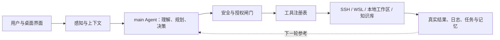

# TDSF Terminal Agent：当前架构与路演讲稿

> 适用对象：不了解 Agent 的评委、合作方和项目介绍场景。
> 事实口径：截至 `ba109bf`，以当前源码和定向测试为准；规划中的能力不当作已完成能力。

配套架构图：[打开 HTML 架构图](agent-architecture-roadshow-2026-09-07.html)。

## 一句话说明

TDSF Terminal Agent 是一个面向 Linux 运维与教学的桌面智能体：它先了解当前终端、服务器和工作区，再用大模型决定下一步，通过受权限控制的工具执行或提出建议，最后把真实结果、证据和任务进度反馈给用户。

它当前不是多个 Agent 相互委派的系统，而是一个 `main` Agent 统一调度多个工具。这样做的好处是责任边界清楚：谁看到什么、谁能执行什么、结果来自哪里，都可以追溯。

## 架构图

这张图表达的是一个闭环，而不是一次性问答：**感知 → 决策 → 受控行动 → 真实结果 → 继续判断**。

## 用“感知、规划、记忆、执行”理解本项目

| 层 | 在项目中的实际实现 | 对评委的解释 |
|---|---|---|
| 交互层 | React/Tauri 桌面界面、对话、终端、任务清单、工具卡片、历史与日志面板 | 用户能看见 Agent 正在做什么，而不是只得到一段黑箱回答。 |
| 感知层 | 当前工作区、终端状态、SSH 会话、WSL 发行版、远程文件、终端输出和知识库检索 | Agent 先识别“我现在面对的是本地、WSL 还是哪台服务器”，再决定使用什么命令或工具。 |
| 理解与规划层 | Strands `main` Agent、系统提示词、`todo_write`、任务收尾检查 | 大模型负责理解目标和排列步骤；多步骤任务会生成真实任务清单，而不是只在文字里假装有计划。 |
| 安全与决策层 | 观察/确认/自动模式、工具 Schema 裁剪、命令风险识别、影响预测、审批 FIFO、硬性禁止规则 | 安全规则不只写在提示词里；不应出现的工具会从可调用列表移除，高风险操作要等待用户逐条批准。 |
| 执行层 | `TOOL_REGISTRY`、Rust Bridge、SSH、受控本地 Python、可见终端通道 | Agent 只能通过登记过的工具行动，不能任意编造或绕开执行链路。 |
| 记忆与证据层 | 会话上下文压缩、任务状态、Agent 日志、操作账本、历史检索、知识库与 Skill | 每一步尽量留下“做过什么、得到什么结果、下一步为何这样做”的依据。 |
| 验证与呈现层 | 写后只读验证、工具结果、终端命令块、证据分组、知识库/教学卡片渲染 | Agent 不应把“已发送命令”说成“已经成功”；有退出码和验证结果后才可以下结论。 |

## 一次任务是怎样流转的

1. 用户提出目标，例如检查服务器、排查服务、学习一个 Linux 主题。
2. 前端把当前上下文一并提供：工作区、终端类型、SSH 会话、可引用文件和近期终端输出。
3. `main` Agent 根据系统提示词、当前模式和可用工具制定下一步；复杂任务写入任务清单。
4. 工具注册表按模式和安全策略过滤工具。观察模式中，执行型工具根本不会进入模型可调用的 Schema。
5. 若需要行动，命令先经过风险识别、影响分析和审批；确认模式按同一会话逐条排队。
6. 工具从 SSH、WSL、本地受控进程、知识库或终端取得结果，并进行必要的脱敏。
7. 写入或变更之后，Agent 会被要求再做一次只读验证；结果、日志、任务进度和证据回到界面，成为下一轮判断的输入。

## 三种授权模式与教学模式

| 模式 | 实际规则 |
|---|---|
| 观察 | 只暴露只读工具，适合感知环境、查询资料和分析问题；不能通过工具直接修改系统。 |
| 确认 | 已识别的只读查询可直接执行；写入、状态变更、外网访问和未知风险操作进入审批队列，一次只展示并处理一条。 |
| 自动 | 常规允许操作自动推进；硬性危险规则仍然会阻止不可接受的命令，不能把“自动”理解为无边界执行。 |
| 教学 | 是观察模式上的讲解皮肤，不是第二个执行后门。只有明确教学意图才渲染 TeachCard；普通知识检索仍是普通 Markdown。教学命令卡必须由学生点击后在可见终端执行，结果再回流继续讲解。 |

授权模式与“执行在哪里”是两件事。当前执行通道默认走后台 SSH；也可以选择真实的可见终端 Shell。可见终端不存在、会话不匹配或终端繁忙时，系统会拒绝执行，绝不悄悄切回后台 SSH。

## 当前 23 个工具：按作用理解

工具注册表是唯一入口，模型只能看见当前模式允许的工具。

| 工具组 | 工具 | 用途 |
|---|---|---|
| SSH 与终端 | `ssh_command`、`ssh_list_sessions`、`get_terminal_output` | 执行远程命令、枚举已连接会话、读取终端回显。 |
| 只读运维感知 | `read_remote_file`、`analyze_logs`、`inspect_processes`、`network_diagnose`、`security_audit`、`performance_analyze` | 查看文件、日志、进程、网络、安全和资源状态。 |
| 变更与配置 | `service_manage`、`package_manage`、`firewall_manage`、`config_diff`、`backup_restore` | 管理服务、软件包、防火墙，比较、备份或恢复配置；带有写入影响的动作受审批保护。 |
| 规划与判断 | `todo_write`、`suggest_command`、`assess_confidence` | 维护真实任务清单、生成但不执行的命令建议、评估本轮证据充分程度。 |
| 知识与经验 | `knowledge_search`、`knowledge_get_doc`、`search_history`、`skill_invoke`、`save_skill` | 查询资料、取得全文、查历史决策、调用可复用经验、把新经验保存为 Skill。 |
| 本地受控计算 | `python_run` | 在本地工作区执行受控 Python；有工作目录、超时和输出长度边界，SSH 会话下不会误用 Windows 进程执行 Linux 路径。 |

## 知识库、Skill 和记忆的区别

| 概念 | 解决的问题 | 当前实现 |
|---|---|---|
| 知识库 | “这件事是什么、有哪些可靠资料？” | 本地 RAG 混合检索。`knowledge_search` 返回标题、来源、分类和摘要；需要全文时再用 `knowledge_get_doc`。检索结果是资料，不应自动变成教学课程。 |
| Skill | “这类任务通常怎样做？” | 一个带说明、触发条件、允许工具和可选步骤的 `SKILL.md` 能力包。`skill_invoke` 当前主要取回参考内容和 playbook，并可同步为任务清单；它不是绕过权限的命令执行器。 |
| 会话记忆 | “这次对话刚刚做过什么？” | `main` Agent 在同一运行期保留对话消息，并自动压缩长上下文；模式切换或模型更新时能迁移给新实例。 |
| 历史与证据 | “过去有什么相似决策，这次有什么真实结果？” | Agent 日志、历史检索、操作账本、工具结果和终端命令块共同提供可追溯依据。 |

最重要的边界是：**知识库提供事实材料，Skill 提供可复用流程，记忆保存当前任务上下文，工具负责真实行动。它们不能相互假冒。**

## 当前已经完成的关键闭环

- 单一 `main` Agent 运行时、工具 Schema、上下文注入和实时流式回传已经贯通。
- 任务清单、工具调用次数上限、连续失败熔断、写后验证回环已经落地。
- 命令风险分析、确认模式 FIFO 审批和输出脱敏已经在执行链路上生效。
- 持久化操作账本记录审批、派发、退出码和异常状态；无法证明结果时使用 `indeterminate`，而不是假装成功。
- 知识检索与教学输出已分流；教学模式要求显式标记和显式命令卡点击。
- 可见终端执行通道已实现：命令只走一个真实执行路径，长命令打字输入有节奏上限，超时从回车后开始。

## 尚未完成或需要继续验收的重点

这些是下一阶段应如实向评委说明的边界，不应包装成“已经完全具备”。

1. **原生端到端验收仍需补齐。** 自动化测试覆盖了大量逻辑，但 Tauri 原生窗口、系统密钥链、真实 SSH、xterm/OSC 和真实模型的组合，需要继续用保存的 SSH profile 留存证据。
2. **会话可恢复性不足。** 当前短期对话记忆主要在 sidecar 内存中；sidecar 重启后，不能像 LangGraph checkpoint 一样从 Agent 中间步骤精确恢复。
3. **操作账本已存在，但语义去重仍需增强。** 每次派发都记录 `operation_id` 与 `intent_id`，重启中的未完成操作会保守标为“结果未定”；但针对用户重复提交同一高影响意图的跨重启去重策略，还没有形成完整产品能力。
4. **终端完成记录仍需演进。** 当前用精确终端命令块关联结果；后续应沉淀为可追加、可重放的 `CommandCompletion` 记录，覆盖重复 OSC、乱序、重连和多终端叶子场景。
5. **回答级引用仍未完成。** 目前能展示本轮工具证据，但“回答中的每个主张对应哪条知识片段或命令结果”还没有绑定协议，因此不把一般回答伪装成逐句可证实的高置信结论。
6. **部分规划属于未来选项。** Docker 实训沙箱、Headroom MCP、SSH 更完整的 known-hosts/ssh_config 管理，以及终端中“蓝色 AI 输入”这类渲染能力，都尚未作为稳定现役能力交付。

## 建议的下一步顺序

1. 先做原生 Tauri + 真实 SSH 的验收与日志取证，确认运行边界，而不是继续盲目堆功能。
2. 把终端结果升级为持久 `CommandCompletion`，再完善操作意图的去重与恢复。
3. 为最终回答增加“主张 → 工具结果/知识来源”的引用绑定，再升级回答置信度展示。
4. 最后评估外部生态能力，例如沙箱和 MCP；只有明确收益和安全边界后才接入。

## 可直接使用的路演讲稿

“我们的 TDSF Terminal Agent 不是只会聊天的助手，而是一个面向 Linux 运维和教学的可控执行系统。它首先感知用户当前的工作区、终端和服务器状态，再由一个统一的 main Agent 进行理解和规划。复杂任务会变成可见的任务清单，Agent 通过登记过的工具查询知识库、分析日志、检查进程或执行受控操作。

安全是这套架构的核心。观察模式只提供只读能力；确认模式把写入和高影响操作按顺序交给用户审批；自动模式也保留硬性危险规则。每一个执行结果都会回到终端、日志和证据区，写入操作还需要再验证，不能把‘已经发出命令’说成‘已经成功’。

在知识能力上，我们把知识库、Skill 和记忆分开：知识库负责提供资料，Skill 负责沉淀可复用流程，记忆保存任务上下文，工具负责真实行动。这种分层让系统可以持续扩展，同时保留清晰的安全边界和可追溯性。”

## 文档导航

- 本文：用于路演和非技术说明。
- `当前架构与实施状态矩阵-2026-09-05.md`：源码核对与已完成/未完成边界。
- `Agent真实稳定性实施总方案-2026-09-05.md`：稳定性专项的 W0-W5 路线。
- `方案书-v4.0-Agent架构闭环升级.md`：已完成的闭环升级设计与测试依据。
- `visible-terminal-execution-channel-2026-09-07.md`：后台 SSH 与可见终端执行通道的真实行为合同。
