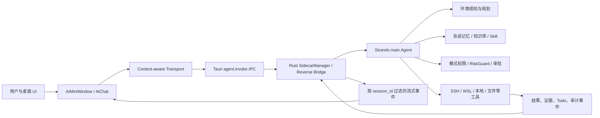

# Agent 系统对抗性审查报告（2026-09-08）

> 审查对象：TDSF Terminal Agent 当前工作树（Strands 主链、Tauri 桌面端、Python sidecar、工具与前端事件渲染）
> 审查口径：以当前源码、自动化门禁、历史运行日志和真实桌面启动为证据；浏览器预览不计入桌面验收，真实 SSH/WSL 交互由用户最终验收。

## 一、结论

当前 Agent 已经具备较完整的“感知—规划—记忆—执行—验证—展示”闭环，不是需要推倒重做的原型。主链架构清楚，工具、知识库、Skill、审批、任务清单、超时与证据组件也都已经存在。

本次审查仍发现了一个会影响真实性的 P0 问题：前端调用 `agent.invoke` 时没有传递对话会话 ID，同时监听全局 sidecar 事件时也没有按会话过滤。并发或切换对话时，Agent 实例缓存、Todo、审批、证据与流式工具事件存在串会话风险。该问题已经修复并加入跨会话回归测试。

其余主要问题集中在工具事件关联、意图误匹配、日志脱敏、WSL 语义、测试真实性和遗产代码一致性。高风险问题已做最小修复；没有为了“全绿”删除安全边界，也没有把浏览器 mock 当作真实桌面验收。

## 二、当前生产架构事实

生产前端只选择一个 `main` Agent。Python `agents/` 下的九 Agent 注册表仍作为历史兼容/降级元数据存在，但不是当前 Strands 主链上的多 Agent 编排。当前实际链路为：

`AiMiniWindow → AiChat → transport.ts → sidecar-adapter.ts → Tauri IPC → Rust sidecar → StrandsAgentAdapter → 模式过滤后的工具 → EventBus → Tauri event → 对话/工具/Todo UI`

## 三、审查方法与证据边界

本轮从四个方向交叉检查：

1. **架构与状态隔离**：追踪对话 ID、SSH session、workspace、WSL distro、Agent 缓存、Todo、审批、证据和事件回流。
2. **Agent 行为质量**：检查系统提示、模式语义、工具选择、意图匹配、工具并发、超时、降级和长上下文处理。
3. **安全与可观测性**：检查全自动模式、Python 执行边界、日志持久化、敏感信息、工具调用关联和 CI 供应链门禁。
4. **前端真实性**：核对当前生产组件与测试目标是否一致，并真实启动 Tauri 桌面端观察 sidecar 就绪过程。

证据分级：

- **已验证**：源码契约 + 自动化回归通过，或真实桌面启动日志可直接证明。
- **待原生验收**：必须在用户选择的真实 SSH/WSL/可见终端中点击、执行并观察的行为。
- **历史/遗产**：仍在仓库中但不属于当前生产主链，不能拿来宣传现役能力。

## 四、发现清单

| 编号 | 等级 | 状态 | 发现 | 影响 |
|---|---|---|---|---|
| A-01 | P0 | 已修复 | `agent.invoke` 未传对话 `session_id`，前端监听四类全局事件也未按会话过滤 | 多对话并发时可能串 Agent 历史、Todo、审批、证据和工具卡 |
| A-02 | P1 | 已修复/待演进 | 11 个工具事件模块中只有 3 个具备显式 `tool_call_id`，并行同名工具无法可靠配对 | 输入、输出、时长与审计记录可能错配 |
| A-03 | P1 | 已修复 | `todo_write` 过去只发完成事件，没有成对的 started/completed/error 生命周期 | 任务链 UI 难以稳定展示“进行中→完成/失败” |
| A-04 | P1 | 已修复 | 建议引擎用“服务、空间、网络”等泛词做子串匹配 | “服务器”“网络命名空间”等请求会生成错误命令 |
| A-05 | P1 | 已修复 | Agent JSONL 日志在截断前未统一脱敏，且工具调用 ID 未保留 | Token、密码等可能落盘；问题难以按一次调用追踪 |
| A-06 | P1 | 已修复 | `unavailable` 被提示词固定解释成只读；确认模式和 WSL 运行上下文描述不完整 | 模型会把通道失败误判为权限限制，或把 WSL 当 Windows/无终端 |
| A-07 | P1 | 已修复 | CI 只监听 `main`，未覆盖实际开发分支；生产依赖审计允许失败 | 当前分支改动可能没有 CI，供应链高危告警不会阻断 |
| A-08 | P1 | 已修复 | 传递依赖 DOMPurify 版本存在高危审计告警 | Markdown/图形渲染的输入净化风险 |
| A-09 | P2 | 已修复 | pytest/旧回退路径写入 `src-tauri/sidecar/data` 时会触发 `tauri dev` 监听器反复重编译 | 开发测试期间桌面窗口重启，易被误认为 Agent 崩溃 |
| R-01 | P1 | 已知产品风险 | 自动模式按当前产品决定，仅硬 denylist 拦截；`python_run` 明确为无沙箱进程执行 | 误提示、提示注入或错误工具参数的破坏面较大 |
| R-02 | P2 | 待演进 | 为保证真实性，当前暂时采用串行工具执行；尚未完成全部工具显式调用 ID 迁移 | 稳定性提高，但多项独立探查的速度收益暂时放弃 |
| R-03 | P2 | 测试债 | 现有 48 条 Playwright 用例目标是已删除/停用的九 Agent UI、旧知识卡测试 Hook 和旧 AgentPanel，配置端口 9000，而 Vite/Tauri 使用 9300 | 不能代表当前桌面端，运行通过或失败都不构成真实验收 |
| R-04 | P2 | 架构债 | Python 九 Agent 注册表、LangGraph 降级话术与当前“Strands 单 main Agent”叙述并存 | 健康元数据、文档和新开发者理解容易漂移 |
| R-05 | P2 | 门禁债 | Python 配置声明覆盖率阈值 80%，CI 的 pytest 命令却没有启用 coverage | 测试数量很多，但覆盖率阈值实际上没有被执行 |
| R-06 | P3 | 性能债 | Web 构建仍有循环 chunk、动态/静态混用和大包告警，主产物约 10.9 MB | 首次加载与低配设备体验仍有优化空间 |
| R-07 | P1 | 待用户验收 | 真实 SSH、WSL、自动模式写操作、可见终端打字机及远程文件改写尚未在本轮由自动化点击验收 | 不能宣称原生端到端已经全部完成 |

## 五、Agent 能力成熟度

以下是审查量表，不是宣传评分：

| 维度 | 评分 | 判断 |
|---|---:|---|
| 环境感知与上下文 | 4/5 | 本地、WSL、SSH、cwd、活动文件、终端输出均有结构化入口；真实跨环境验收仍待完成 |
| 规划与工具使用 | 4/5 | Todo、工具限制、连续失败熔断、watchdog、写后验证均已存在；全工具调用 ID 尚未统一 |
| 记忆、知识库与 Skill | 4/5 | 会话记忆、召回、3969 条知识、用户目录 Skill 与热重载已接通；引用到主张的精确绑定仍不足 |
| 执行真实性 | 4/5 | 工具结果、退出码、可见终端证据和远程文件链路设计完整；本轮未替用户做原生验收 |
| 权限与安全治理 | 3/5 | 确认/观察模式边界较完整；全自动模式与无沙箱 Python 是明确但较高的剩余风险 |
| 可观测性 | 4/5 | 事件、证据、Todo、日志、Langfuse 本地链路齐全；遗产元数据和部分无 ID 工具影响追踪质量 |
| 自动化测试 | 4/5 | 前端、Python、Rust 门禁规模较强；当前浏览器 E2E 已失真，原生桌面测试仍依赖人工 |

综合判断：**工程成熟度约 4/5，适合继续做稳定性收敛，不适合重写。** 下一阶段的重点不是继续增加工具数量，而是统一事件协议、降低遗产路径、补原生场景证据。

## 六、建议的后续顺序

1. 由用户完成本轮真实桌面验收：多会话隔离、确认/自动模式、SSH、WSL、远程文件、Todo 链和可见终端。
2. 将剩余所有工具迁移到统一 `tool_call_id + started + completed/error` 协议，加入乱序/取消/超时回归后，再评估恢复安全并行。
3. 删除或明确隔离九 Agent/LangGraph 遗产注册表，统一健康检查、设置页和架构文档的事实口径。
4. 重建桌面级原生自动化测试；旧 48 条浏览器用例应重写或下线，不能继续充当质量证据。
5. 对自动模式增加显著风险提示和会话级紧急停止能力；如果未来面向非测试机，再讨论进程沙箱。

## 七、本轮验证快照

- 真实 Tauri 桌面端已启动；Python 3.14.7，Strands 后端激活，121 个 RPC 方法就绪。
- 知识库检测到 3969 条官方条目，用户目录加载 8 个 Skill。
- 前端 Vitest：133 个文件、1346 项通过。
- Python sidecar：2222 项通过、0 失败。
- Rust：独立 target 目录下四组测试均通过（362 / 25 / 27 / 1；共 7 项 ignored）。
- TypeScript typecheck、ESLint、Web build、Cargo check 均通过。
- 生产依赖审计：无已知漏洞。
- 浏览器 Playwright 未作为验收执行；真实 SSH/WSL/UI 行为留给用户在当前桌面端验收。
