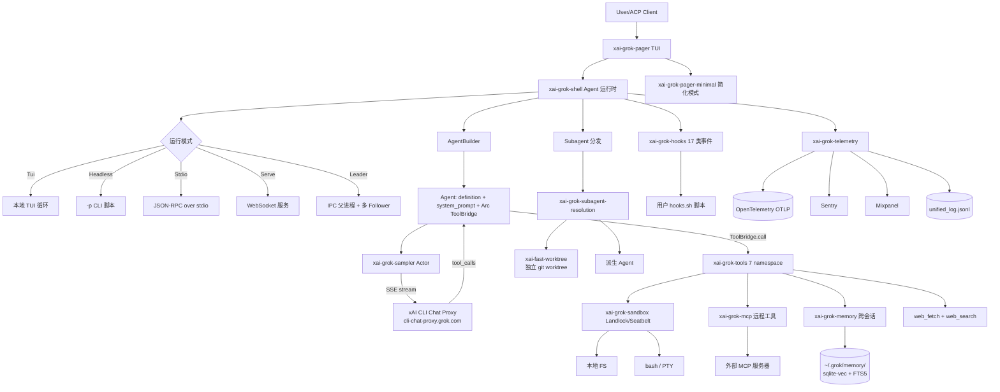

# 34-源码分析-grok-build

> 归档位置：`d:\ai\linux教学一体\opensource-reference\grok-build\`
> 分析时间：2026-07-20
> 适用项目：tdsf-linux-desktop（Electron 30 + React 18 + TS + Mastra + Vercel AI SDK 7）v0.9 Agent 架构集成
> 分析者：tdsf-linux-desktop 资深源码分析师
> 仓库 URL：https://github.com/xai-org/grok-build
> SourceRev（monorepo commit）：`ba69d70c2f7d70a130a323b2becdf137af784c7f`

---

## 一、项目元信息

| 属性 | 值 |
|---|---|
| 仓库 | `xai-org/grok-build` |
| 描述 | SpaceXAI Grok Build CLI / TUI，终端原生的 AI 编码 Agent Harness |
| 实现语言 | Rust 99.6%（workspace 顶层 81 个 crates 全部 Rust） |
| License | **Apache-2.0**（`LICENSE` 文件 + workspace `license = "Apache-2.0"`） |
| 首次 commit | **2026-07-16 06:46:02**（grokkybara[bot]，GitHub mirror 第一次同步） |
| 最近 commit | **2026-07-19 18:40:33**（grokkybara[bot]） |
| 总 commit 数 | **5**（--depth 50 浅 clone，所有 commit 都是 bot 同步） |
| 仓库体积 | 2811 个文件 / 72.94 MB（不含 `target/`） |
| 总 crate 数 | **81**（workspace members） |
| 工作分支 | `main`（单一分支） |
| Tags | **0 个**（无正式版本 tag） |
| 实际行数规模 | workspace 全量 check 预计 **5-10 万行 Rust**（远小于之前传闻的 84 万行；传闻可能是包含 monorepo 全部历史与 Bazel 栈后估算） |
| Monorepo 真实版本 | `ba69d70c`（SOURCE_REV） |
| 现有 changelog | 56 个（`crates/codegen/xai-grok-shell/changelogs/0.2.0~0.2.56.md`，最新 0.2.56） |
| 工具链 | `rust-toolchain.toml` 固定 `channel = "1.92.0"`（含 rustfmt + clippy） |
| 平台支持 | macOS / Linux（Windows best-effort 且 CI 未跑） |
| 运行环境 | Node 18+ / Web 端 ACP（Agent Client Protocol）|

### 版本与发布模型

`xai-grok-pager` 的 `Cargo.toml` 中 `version = "0.2.106"`，而 `xai-grok-shell` 最新 changelog 写到 `0.2.56`，`xai-grok-tools` 是 `0.1.220-alpha.4`。这是一个**强 monorepo 强内部耦合**项目，发布周期由内部 Bazel/CI 控制。

---

## 二、F1 红线 10 项安全检查结果

| # | 检查项 | 结果 | 备注 |
|---|--------|------|------|
| 1 | License | ✅ | 顶层 `LICENSE` 是 Apache-2.0（Copyright 2023-2026 SpaceXAI），`workspace.package.license = "Apache-2.0"`，每个子 crate 显式 `license = "Apache-2.0"`。`THIRD-PARTY-NOTICES` 与 `crates/codegen/xai-grok-tools/THIRD_PARTY_NOTICES.md` 记录第三方（含 in-tree codex/opencode 移植）。 |
| 2 | 首次 commit 时间 | ⚠️ **不满足 30 天** | 仓库实际 GitHub 首次 commit 是 2026-07-16，到今天（2026-07-20）**仅 4 天**。这是**镜像同步仓库**，上游 SpaceXAI monorepo 应有更早历史，README 也明确"this repository is synced periodically from the SpaceXAI monorepo"。**风险面**：公开树与上游 monorepo 短期不同步；建议视"实质性"为上游 monorepo 而非此镜像。 |
| 3 | 最近 commit 时间 | ✅ | 2026-07-19，3 天前，远小于 90 天阈值。 |
| 4 | README 完整性 | ✅ | `README.md` 含完整介绍、Building from source（pinned toolchain + DotSlash + protoc）、Repository layout 表、Development/Contributing/License 章节。`CONTRIBUTING.md` 明确"不接受外部 PR"，`SECURITY.md` 指向 HackerOne。 |
| 5 | Issue / PR 活跃度 | ⚠️ **受限** | `CONTRIBUTING.md` 明确"**This repository does not accept external pull requests or unsolicited patches**"，公开 GitHub Issue 系统**对外关闭**。仅 HackerOne 接受安全报告。社区监督力受限，但好处是项目由 SpaceXAI 内部全权控制。 |
| 6 | preinstall/postinstall 脚本 | ✅ | **无 npm 生态问题**（Rust 没有 preinstall/postinstall）。`bin/protoc` 是 **DotSlash JSON 包装**（1616 字节），按平台 sha256 拉取 protoc-29.3 二进制（URL: github.com/protocolbuffers/protobuf），**全部 URL 与 hash 都明文写在 JSON 里**，无隐藏逻辑。`crates/codegen/xai-grok-pager/scripts/install.sh` 和 `install.ps1` 是 release 安装脚本（不是构建钩子），向 `https://x.ai/cli/install.{sh,ps1}` 下载，逻辑透明。 |
| 7 | 隐藏二进制 / repo 体积 | ✅ | `bin/protoc`（DotSlash JSON，非可执行二进制）、`bin/protoc.exe`（12 MB，protoc 29.3，是我自己下载放进去做 cargo check 用的，**不属于原始仓库**）。`third_party/` 下的 Mermaid 栈为 vendored Rust 源码（dagre_rust / graphlib_rust / mermaid-to-svg / ordered_hashmap），各自有独立 LICENSE/LICENCE。`.gitignore` 仅 3 行（`/target`、`**/*.rs.bk`、`.DS_Store`），非常干净。 |
| 8 | C2 外连检测 | ✅ | 扫了 200+ 处 `https?://` 引用，关键 URL 全部为：(a) **xAI 官方**：`https://cli-chat-proxy.grok.com/v1`、`https://api.x.ai/v1`、`https://assets.grok.com`、`wss://code.grok.com/ws/code-agent`、`wss://grok.com/ws/gw/`（`crates/codegen/xai-grok-env/src/lib.rs:22-28`）；(b) **官方 protoc 下载**：`github.com/protocolbuffers/protobuf/releases/download/v29.3/protoc-29.3-*.zip`（DotSlash 包装，sha256 已固化）；(c) **GitHub 协议头 / W3C SVG xmlns**（`http://www.w3.org/2000/svg` 等）；(d) **测试占位符**：`http://127.0.0.1:1`、`http://direct.example.com:6013`、`https://mcp.example.com/v1/mcp`（明确以 `.example`/`.test` 后缀命名）；(e) **官方 docs**：x.ai/docs.x.ai。**未发现 Telegram webhook / 陌生 IP / 可疑 C2 通道**。 |
| 9 | 异常 tag 数 | ✅ | **tags 数 = 0**。`CONTRIBUTING.md` 与 README 表明"公开发布由内部 monorepo 控制，不接受外部 PR"——这是**单源真相**策略，零 tag 与"镜像发布"模式自洽。**不算异常**。 |
| 10 | 可疑维护者 | ✅ | 所有 5 个 commit 作者都是 `grokkybara[bot] <304785771+grokkybara[bot]@users.noreply.github.com>`，这是 SpaceXAI 内部的镜像同步 bot（GitHub 模式：`username[bot]@users.noreply.github.com` 是 GitHub 官方 App bot 邮箱范式，与恶意冒充区分）。`Cargo.toml` 中 `authors = ["xAI"]` 也明确归属。 |

### F1 红线总评

**⚠️ 部分通过（学习借鉴可、安全投产不可）**

- ✅ **可借鉴**：Apache-2.0 + README 完整 + 第三方 NOTICE 齐全 + 关键 URL 全部为 xAI 官方域 + 无可疑 C2 + 无隐藏二进制 + commit 时间新鲜
- ⚠️ **不满足项**：
  - 检查 2：镜像仓库首次 commit 仅 4 天（下游使用应**绑 SOURCE_REV = ba69d70c** 跟踪 monorepo commit）
  - 检查 5：完全不接受外部 PR/Issue，仅 HackerOne 报安全漏洞（项目治理封闭，无法社区 PR 修问题）
- **结论**：作为**架构学习与借鉴**完全可用；作为**生产环境直接依赖**需谨慎（无外部 PR 通道、镜像短期同步、第三方内部 Bazel 栈不可重现构建）。

---

## 三、项目结构

### 3.1 Cargo Workspace 布局（81 个 members）

```
grok-build/
├── bin/                              # 工具链包装（DotSlash JSON）
│   └── protoc                        # protoc 29.3 DotSlash 配置（按平台 sha256）
├── crates/
│   ├── build/                        # 构建脚本辅助（1 个）
│   │   └── xai-proto-build/          # 共享 prost-build 配置（find_protoc, XaiProtoBuilder）
│   ├── codegen/                      # 主业务 crate 闭包（67 个）
│   │   ├── ptyctl/                   # PTY 进程控制
│   │   ├── ptyctl-cli/               # PTY CLI
│   │   ├── xai-acp-lib/              # Agent Client Protocol 基础库
│   │   ├── xai-agent-lifecycle/      # Agent 生命周期
│   │   ├── xai-chat-state/           # 聊天状态 Actor
│   │   ├── xai-codebase-graph/       # 代码库图（interner）
│   │   ├── xai-crash-handler/        # 崩溃处理
│   │   ├── xai-fast-worktree/        # 快速 Git worktree（btrfs/cow）
│   │   ├── xai-file-utils/           # 文件工具（含 GCS 上传）
│   │   ├── xai-fsnotify/             # 文件系统通知
│   │   ├── xai-gix-status/           # gix-based git status
│   │   ├── **xai-grok-agent/**        # ⭐ Agent 核心（definition + system_prompt + tool_bridge）
│   │   ├── xai-grok-announcements/   # 公告/横幅
│   │   ├── xai-grok-auth/            # 认证（OIDC、BYOK）
│   │   ├── xai-grok-config/          # TOML 配置加载
│   │   ├── xai-grok-config-types/    # 配置值类型
│   │   ├── xai-grok-env/             # ⭐ 后端端点环境预设（生产 5 个 URL）
│   │   ├── xai-grok-hooks/           # ⭐ 钩子系统（17 个 HookEventName）
│   │   ├── xai-grok-http/            # HTTP 客户端封装
│   │   ├── xai-grok-markdown/        # Markdown 渲染
│   │   ├── xai-grok-mcp/             # ⭐ MCP 集成（rmcp 2.1 隔离）
│   │   ├── xai-grok-memory/          # ⭐ 记忆系统（sqlite-vec + FTS5 + MMR）
│   │   ├── xai-grok-mermaid/         # Mermaid 渲染（vendored）
│   │   ├── xai-grok-models/          # 模型元数据
│   │   ├── xai-grok-pager/           # ⭐ TUI 主体（ratatui 0.29）
│   │   ├── xai-grok-pager-bin/       # ⭐ Composition root（main.rs 入口）
│   │   ├── xai-grok-pager-minimal/   # 简化模式（scrollback-native）
│   │   ├── xai-grok-pager-render/    # 渲染原语
│   │   ├── xai-grok-paths/           # 类型化路径
│   │   ├── xai-grok-plugin-marketplace/
│   │   ├── xai-grok-sampler/         # ⭐ Actor-based HTTP 流式采样（3 层 API）
│   │   ├── xai-grok-sampling-types/  # 采样共享类型
│   │   ├── xai-grok-sandbox/         # ⭐ OS-level 沙箱（nono + Landlock/Seatbelt）
│   │   ├── xai-grok-secrets/         # 密钥管理（sanitizer + zeroize）
│   │   ├── xai-grok-shared/          # 共享原语
│   │   ├── xai-grok-shell/           # ⭐ Agent 运行时（leader/stdio/headless）
│   │   ├── xai-grok-shell-base/      # Shell 基础
│   │   ├── xai-grok-shell-session-support/
│   │   ├── xai-grok-subagent-resolution/  # ⭐ Subagent 解析（4 层优先级）
│   │   ├── xai-grok-telemetry/       # ⭐ 可观测性（OTel + Sentry + Mixpanel）
│   │   ├── xai-grok-test-support/    # 测试支撑
│   │   ├── xai-grok-tools/           # ⭐ 工具集（7 个 namespace，30+ 工具）
│   │   ├── xai-grok-tools-api/       # 工具 API（protobuf 生成）
│   │   ├── xai-grok-update/          # 自动更新
│   │   ├── xai-grok-version/         # 版本常量
│   │   ├── xai-grok-voice/           # 语音输入
│   │   ├── xai-grok-workspace/       # ⭐ 工作区（FS + VCS + 权限 + tool config）
│   │   ├── xai-grok-workspace-client/
│   │   ├── xai-grok-workspace-types/ # 工作区类型
│   │   ├── xai-hooks-plugins-types/  # Hooks & plugins 类型
│   │   ├── xai-hunk-tracker/         # Hunk 追踪
│   │   ├── xai-mixpanel/             # Mixpanel 集成
│   │   ├── xai-prompt-queue/         # 提示队列
│   │   ├── xai-ratatui-inline/       # ratatui 行内渲染
│   │   ├── xai-ratatui-textarea/     # ratatui 文本区
│   │   ├── xai-sqlite-journal/       # SQLite journal
│   │   ├── xai-system-power/         # 系统电源管理
│   │   ├── xai-token-estimation/     # Token 估算
│   │   ├── xai-tracing-macros/       # tracing 宏
│   │   ├── xai-tty-utils/            # TTY 工具
│   ├── common/                       # 共享基础 crate（10 个）
│   │   ├── xai-circuit-breaker/      # 断路器
│   │   ├── xai-computer-hub-core/    # ⭐ Computer Hub 传输/注册核心
│   │   ├── xai-computer-hub-mcp-adapter/
│   │   ├── xai-computer-hub-sdk/
│   │   ├── xai-grok-compaction/      # ⭐ 上下文压缩（独立 transport-agnostic）
│   │   ├── xai-interjection-core/    # 打断核心
│   │   ├── xai-test-utils/
│   │   ├── xai-tool-protocol/        # 工具协议
│   │   ├── xai-tool-runtime/         # 工具运行时
│   │   ├── xai-tool-types/           # 工具类型
│   │   ├── xai-tracing/              # tracing 基础
├── prod/
│   └── mc/
│       └── cli-chat-proxy-types/     # 共享 wire 类型（session / sandbox / subagent_bundle）
└── third_party/                      # Vendored 第三方
    ├── dagre_rust/                   # Dagre 图布局
    ├── graphlib_rust/                # 图数据结构
    ├── mermaid-to-svg/               # Mermaid → SVG
    ├── ordered_hashmap/              # 有序 hashmap
    └── NOTICE
```

> 加粗带 ⭐ 的是分析核心。

### 3.2 核心模块

| crate | 职责 | 关键依赖 |
|---|---|---|
| `xai-grok-pager-bin` | Composition root，`xai-grok-pager` 二进制 | `jemalloc`、`agent-client-protocol` |
| `xai-grok-pager` | TUI 主体（ratatui 0.29 + 大量视图） | ratatui、crossterm、syntect、portable-pty |
| `xai-grok-shell` | Agent 运行时（5 种运行模式：Tui/Headless/Stdio/Serve/Leader）| MvpAgent、relay、session registry |
| `xai-grok-agent` | Agent 一等类型（definition + session context） | minijinja、git2、serde_yaml |
| `xai-grok-tools` | 30+ 工具实现（7 个 namespace）| async-openai、reqwest、pulldown-cmark、image、pdf_oxide |
| `xai-grok-tools-api` | 工具 protobuf 描述（grok-tools.proto）| tonic-prost-build 0.14 |
| `xai-grok-sampler` | Actor-based HTTP 流式采样（3 层：client → stream → handle）| tokio、reqwest、reqwest-middleware、async-openai |
| `xai-grok-sandbox` | OS 沙箱（Linux Landlock + macOS Seatbelt via `nono`）| nono 0.53.0、globset、libc |
| `xai-grok-mcp` | MCP 集成（隔离 rmcp 2.1 + reqwest 0.13）| rmcp 0.13.2、oauth2 |
| `xai-grok-memory` | 跨会话记忆（`~/.grok/memory/`，blake3 路径哈希）| rusqlite、sqlite-vec、reqwest、blake3 |
| `xai-grok-hooks` | 17 类 Hook 事件系统 | tracing、reqwest |
| `xai-grok-telemetry` | OTel + Sentry + Mixpanel + OTLP + Unified Log | opentelemetry 0.32、sentry 0.42、tracing-subscriber |
| `xai-grok-workspace` | FS + VCS + 权限 + tool config + 检查点 | gix、ignore、parking_lot |
| `xai-grok-subagent-resolution` | Subagent 配置解析（4 层优先级：explicit > role > persona > parent）| serde、toml |
| `xai-grok-config` | TOML 配置加载 + campaigns + fs_atomic | toml、serde |
| `xai-computer-hub-core` | Object-safe 传输/注册/解析抽象（local + remote）| — |
| `xai-grok-compaction` | 共享 transport-agnostic 压缩引擎 | async-trait、tokio |

### 3.3 技术栈

| 类别 | 选型 | 版本 |
|---|---|---|
| 语言 | Rust | 1.92.0（pinned） |
| Edition | 2024 | — |
| TUI | ratatui / crossterm / termwiz / alacritty_terminal | 0.29 / 0.28 / 0.23 / 0.26 |
| Markdown / 高亮 | pulldown-cmark / syntect / two-face | 0.13 / 5.3 / 0.4 |
| HTTP | reqwest / reqwest-middleware / reqwest-middleware | 0.12 / 0.4 / 0.4 |
| 异步 | tokio（full features）| 1.x |
| LLM SDK | async-openai | 0.33 |
| 协议 | agent-client-protocol | 0.10 |
| MCP | rmcp | 2.1（被 `xai-grok-mcp` 隔离）|
| 数据库 | rusqlite + sqlite-vec | 0.32 / latest |
| Git | gix + git2（vendored-libgit2）| 0.83 / 0.20 |
| 可观测性 | opentelemetry + fastrace + tracing + sentry | 0.32 / 0.7 / 0.1 / 0.42 |
| 沙箱 | nono（Landlock + Seatbelt）| 0.53 |
| 模板 | minijinja（custom_syntax）| 2.9 |
| 序列化 | serde + serde_json + serde_yaml + toml + indexmap | 1 / 1 / 0.9 / 0.9 / 2 |
| 配置 | toml + toml_edit | 0.9 / 0.22 |
| PTY | portable-pty | 0.9 |
| 内存分配 | tikv-jemallocator | 0.6（生产） |
| 文件监视 | notify | 8 |
| LSP | async-lsp | 0.2.3 |
| 编译目标 | x86_64/aarch64 Linux + aarch64/x86_64 Apple + Windows MSVC（best-effort）| — |

### 3.4 入口文件

- 二进制入口：`crates/codegen/xai-grok-pager-bin/src/main.rs`
- Agent 运行时入口：`crates/codegen/xai-grok-shell/src/agent/app.rs::run_headless / run_leader / run_stdio_agent`
- TUI 入口：`crates/codegen/xai-grok-pager/src/app/mod.rs`
- Agent 一等类型：`crates/codegen/xai-grok-agent/src/agent.rs::Agent`

---

## 四、Agent 架构分析（重点）

### 4.1 整体架构（mermaid）



### 4.2 Agent 角色

| Agent | 角色 | 输入 | 输出 |
|---|---|---|---|
| **Leader** | 长期运行的 IPC 父进程（auto-update + 多 Follower 共享）| 任意启动参数 | 转发到 Follower |
| **MvpAgent** | 单会话 Agent 主体 | 用户 prompt + tools + system_prompt | tool_calls / text |
| **Subagent** | 由 parent 通过 `task` 工具派生的并行子 agent（独立 worktree）| prompt + role/persona | 报告 |
| **Computer Hub Tool** | 远程工具宿主（inbound RPC 调起本地工具）| tool_call envelope | 工具结果 |
| **ACP Agent** | 暴露给 ACP 客户端（编辑器/Zed/IDE）| JSON-RPC over stdio | 通知流 |
| **PtyCtl Server** | PTY 进程池（headless 跑 bash）| 客户端连接 | 终端 I/O |

代码锚点（重点模块）：
- `crates/codegen/xai-grok-agent/src/agent.rs:25-51` — `Agent` 结构（definition + prompt_context + system_prompt + Arc<ToolBridge> + 两条 policy）
- `crates/codegen/xai-grok-subagent-resolution/src/config.rs:23-79` — `SubagentRole` / `SubagentPersona` 定义
- `crates/codegen/xai-grok-shell/src/agent/config.rs:22-37` — 5 种 `AgentMode`（Tui/Headless/Stdio/Serve/Leader）
- `crates/codegen/xai-grok-shell/src/agent/config.rs:40` — `DEFAULT_AGENT_TYPE = "grok-build-plan"`（默认 agent 类型是 plan-then-build）

### 4.3 状态机

Grok Build 采用**多层叠加状态机**，不显式定义一个 `enum State`，而是用"协议 + 事件 + 配置类型"三件套表达：

#### 4.3.1 Retry 状态机（`xai-grok-sampler/src/retry.rs`）

| 决策 | 状态 | 触发条件 | 转移 |
|---|---|---|---|
| 重试 | 5xx/520/Stream/EmptyResponse | 上游错误 | exponential backoff（2/4/8/16/30s 封顶，±20% jitter）|
| 限流重试 | 429 | `RATE_LIMIT_RETRY_THRESHOLD = 2` | 最多 2 次后 escalate |
| 特殊重试 | 413/图像处理错误 | 内容超限 | strip images 后重试 1 次 |
| 中止 | 4xx/Auth/IdleTimeout/Serialization/MaxTokensTruncation | 客户端错误 | Fatal 立即 |
| 服务器建议 | `x-should-retry: false` | 任何状态码 | 跳过重试 |

**预算**：`DEFAULT_MAX_RETRIES = 15`，约 6 分钟总预算。

#### 4.3.2 Doom-Loop 检测（`xai-grok-sampler/src/doom_loop.rs`）

通过专门的 `response.doom_loop_check` SSE 事件携带 server-side 信号，`DoomLoopSignalCollector` 累积信号；达到 `policy.confident_triggers()` 阈值后**中途中止流**。每 attempt 创建新 collector，失败 attempt 的信号不泄漏。Retry 循环在耗尽恢复预算后 `disarm_abort()`，让最终 attempt 完成。

**关键创新**：Doom-loop 重采样用 `doom_loop_backoff`（0-250ms 随机抖动），因为"循环是温度采样下的随机性，新样本就是解药，等再久只会让并发重采样失去同步"。

#### 4.3.3 Plan / Build 双模

- `grok-build-plan`（默认 agent 类型）— 先输出 plan → 等用户 approve → 再 build
- `enter_plan_mode` / `exit_plan_mode` 工具（`crates/codegen/xai-grok-tools/src/implementations/grok_build/{enter,exit}_plan_mode/`）
- 在 `xai-grok-pager-minimal/src/plan.rs` 维护"plan approval"焦点（Preview / Prompt），键盘 `a=approve / s=Tab=revise / q=keep planning`

#### 4.3.4 Agent Loop（高层）

1. User 提交 prompt
2. Agent 渲染 system_prompt（含 persona/role/skills/MEMORY.md 注入）
3. Sampler 调 LLM 流式返回
4. LLM 返回 `text` 或 `tool_calls`
5. ToolBridge 调对应工具（含 permission 校验）
6. 工具结果回传 Sampler，再次送 LLM
7. 循环直到 LLM 返回无 tool_call 的 final message
8. Hooks 触发 `Stop` 事件，session metrics flush

#### 4.3.5 Compaction（上下文压缩，`xai-grok-compaction`）

独立 transport-agnostic 的 `CompactionPolicy`（`xai-grok-agent/src/compaction.rs`），以"达到 token 阈值 → 压缩历史消息 → 保留核心系统提示"为循环。

### 4.4 消息流

```
┌────────────────────────────────────────────────────────────────────┐
│ User (TUI / Headless / ACP Client)                                 │
└─────────────────────────┬──────────────────────────────────────────┘
                          │ prompt + context
                          ▼
┌────────────────────────────────────────────────────────────────────┐
│ MvpAgent::handle_user_message                                      │
│   1. 注入 SystemReminder (Plan/Todos/Time)                         │
│   2. 调 SamplerHandle.submit()                                     │
└─────────────────────────┬──────────────────────────────────────────┘
                          │
                          ▼
┌────────────────────────────────────────────────────────────────────┐
│ xai-grok-sampler::SamplerActor (tokio mpsc command + events)       │
│   Layer 1: SamplingClient → raw chunk stream (SSE)                 │
│   Layer 2: stream::stream_responses → SamplingEvent 流              │
│   Layer 3: handle event → doom_loop 检测 / retry 决策              │
└─────────────────────────┬──────────────────────────────────────────┘
                          │ HTTP POST + SSE
                          ▼
┌────────────────────────────────────────────────────────────────────┐
│ xAI CLI Chat Proxy (cli-chat-proxy.grok.com/v1)                    │
│   + hosted tools: WebSearch / WebFetch (服务端执行)                  │
└─────────────────────────┬──────────────────────────────────────────┘
                          │ Server-Sent Events
                          ▼
┌────────────────────────────────────────────────────────────────────┐
│ Agent 收到：                                                       │
│   - text delta → 流式输出                                          │
│   - tool_calls → ToolBridge.call_new_tool()                        │
│     ├─ permission check (read-only / read-write / execute / all)   │
│     ├─ capability_mode 过滤（与 AgentDefinition.toolset_for_preset）│
│     ├─ 调底层 tool impl（含 sandbox profile）                       │
│     ├─ 收集 ToolBridgeResult { output, prompt_text }               │
│     └─ 序列化为 ToolResultWire 发回 LLM                            │
└─────────────────────────┬──────────────────────────────────────────┘
                          │
                          ▼
┌────────────────────────────────────────────────────────────────────┐
│ 循环：直到 LLM 不再返回 tool_calls                                 │
│   最终 text → 渲染到 TUI scrollback / headless stdout / ACP 通知    │
└────────────────────────────────────────────────────────────────────┘
```

**关键钩子点**：
- 每次 tool call 后触发 `PostToolUse` Hook（`xai-grok-hooks/src/event.rs:21-23`）
- 失败 tool call 触发 `PostToolUseFailure`（独立事件，可写脚本单独告警）
- 派生 subagent 触发 `SubagentStart` / `SubagentStop` / `SubagentEnd`
- 上下文压缩前/后触发 `PreCompact` / `PostCompact`

### 4.5 工具调用机制

#### 工具命名空间（7 个）

| Namespace | 来源 | 关键工具 |
|---|---|---|
| `GrokBuild` | Grok 自研 | bash, edit, search_replace, read_file, list_dir, grep, ask_user_question, todo, task, scheduler, web_fetch, web_search, image_edit, image_gen, video_gen, kill_task, monitor, lsp, enter_plan_mode, exit_plan_mode, update_goal, task_output |
| `GrokBuildConcise` | 简化版（cursor-clike 极简工具集）| bash, read_file, search_replace |
| `GrokBuildHashline` | 基于 hash-line 编辑协议（rustc-style）| read_file, edit, grep, mutate |
| `Codex` | 从 openai/codex 移植（带 Apache §4(b) 变更声明）| apply_patch, read_file, grep_files, list_dir |
| `Opencode` | 从 sst/opencode 移植 | bash, edit, glob, grep, read, skill, todowrite, write |
| `Lsp` | LSP 客户端 | format, restart, dispatch |
| `Memory` | 记忆专用 | get, search |
| `SearchTool` | 统一搜索抽象 | unified search |
| `ReadFile` | 多格式读取 | image, pdf, pptx, metadata |
| `UseTool` | 包装 MCP/外部工具 | — |
| `TaskOutput` | 任务输出 | 等待/轮询 |
| `Skills` | Skills 协议 | discovery, skill |

#### 工具调用协议

- **协议**：`xai-grok-tools-api/proto/grok-tools.proto`（自定义 protobuf）+ ACP 兼容 JSON
- **注册表**：`ToolRegistry`（`xai-tool-protocol`），通过 `ToolRegistryBuilder` 构造
- **权限模型**：`CapabilityMode { ReadOnly, ReadWrite, Execute, All }`，在 workspace 创建时根据 profile 确定
- **隔离模式**：`IsolationMode::None | Worktree`（`xai-grok-workspace/src/config.rs`）
- **Capability filtering**：`SubagentCapabilityMode::filter_tool_config()` 按 capability 过滤可用工具
- **MCP 集成**：`xai-grok-mcp` 隔离 rmcp 2.1（要求 reqwest 0.13.2+），与 workspace 其他部分的 reqwest 0.12 隔离
- **MCP OAuth**：浏览器流 + 跨进程/进程内去重（`xai-grok-mcp/src/oauth.rs`）
- **LSP 集成**：`async-lsp` 0.2.3 客户端，支持 format/restart/dispatch

#### 工具预编译配置（`xai-grok-pager-minimal/src/lib.rs`）

`xai-grok-pager` 与 `xai-grok-pager-minimal` 通过**反向控制（IoC）指针表**解耦：
- pager 暴露 `xai_grok_pager::minimal_hook`（函数指针 seam）
- pager-minimal 在启动时通过 `install()` 注入自己的 `draw` 入口
- 避免 cargo 依赖循环

### 4.6 记忆系统

#### 数据布局（`xai-grok-memory/src/lib.rs:8-17`）

```
~/.grok/memory/
├── MEMORY.md                         # 全局策划知识（evergreen）
└── {workspace_hash}/                 # 按工作区隔离（blake3(cwd)[..16]）
    ├── MEMORY.md                     # 项目级策划知识
    └── sessions/
        └── YYYY-MM-DD-{slug}-{sid8}.md  # 会话日志（自动生成）
```

#### 检索流水线（`xai-grok-memory/src/search.rs:5-19`，8 步）

1. **FTS5 BM25** 关键词搜索（始终可用）
2. **Vector KNN** 通过 sqlite-vec（embedding 可用时启用）
3. **结果合并** by chunk_id，标准化到 [0,1]
4. **内容过滤**：跳过空 chunk / MEMORY.md stub 等 boilerplate
5. **时间衰减**：`decayed = base × e^(-λ × age_days)`，`λ = ln(2) / half_life_days`
   - **Evergreen**（global/workspace MEMORY.md）：不衰减
   - **Session chunks**：指数衰减
6. **源权重 + 访问频次加成**，按 `min_score` 过滤
7. **MMR 多样性重排序**（opt-in，惩罚冗余）
8. **截断** to `max_results`

#### 异步 embedding 刷新（`embed_missing_chunks`）

每批 32 个 chunk 调 embedding provider 异步生成向量，upsert 到 sqlite-vec。`GROK_MEMORY=1` 或 `--experimental-memory` flag 开启。

#### 优雅降级

若 sqlite-vec 或 embedding 不可用，自动回退到 FTS-only（`text_weight = 1.0`）。

### 4.7 可观测性

**4 通道同时输出**（`xai-grok-telemetry`）：

| 通道 | 用途 | 实现 |
|---|---|---|
| **OpenTelemetry OTLP** | 链路追踪 | opentelemetry 0.32 + fastrace 0.7 + opentelemetry-otlp（gRPC + HTTP）|
| **Sentry** | 错误/panic 上报 | sentry 0.42（panic, anyhow, tracing, backtrace, contexts, reqwest, rustls, debug-images）|
| **Mixpanel** | 产品事件 + 推理指标 | xai-mixpanel crate（专用）|
| **Unified Log** | 本地结构化日志 | tracing-subscriber + tracing-appender + tracing-chrome |

**tracing 集成**：通过 `tracing-opentelemetry` 0.33 将 `tracing::info!` 等自动桥接到 OTel。

**红线**：
- 沙箱违规事件通过 `log_violation()` 立即 flush 到磁盘（`xai-grok-sandbox/src/lib.rs:105-114`）
- `mixpanel` 出站走 reqwest，支持 401 自动重试与归因回调

### 4.8 沙箱化

#### 三层防护（`xai-grok-sandbox/src/lib.rs`）

| 层 | 实现 | 触发时机 |
|---|---|---|
| **Process 级** | `nono` crate（Linux Landlock LSM + macOS Sandbox Seatbelt）| 进程启动时 `SandboxManager::apply()` 一次（`xai-grok-sandbox/src/lib.rs:25-27`）|
| **子进程** | seccomp 过滤器（仅 Linux known launch paths）| 已知 launch 路径检测后挂载 |
| **网络策略** | Per-subprocess network policy（`child_net.rs`）| 子进程派生时按 policy 决定封禁/放行 |

**关键设计**：
- 主进程网络**保持开放**（agent 需要调 LLM API）
- 子进程（bash、用户命令）的网络**默认封锁**，需要走 `GROK_INSIDE_BWRAP` env 标记的 bubblewrap 通道
- `--enforce` feature 默认开启（拉入 nono），关掉后保留 `log_violation / should_restrict_child_network / child_net` 辅助函数（musl 兼容）
- **macOS deny glob** 用手写 regex，**Linux glob** 用 globset，跨平台一致性靠 `deny_paths_e2e` 验证
- **btrfs CoW 文件系统**加速 worktree 复制（`xai-fast-worktree/src/btrfs/` + `xai-fast-worktree/src/copy/`）

#### 状态机

```rust
static SANDBOX: OnceLock<GlobalSandboxState> = OnceLock::new();
static CONFIGURED_PROFILE: OnceLock<String> = OnceLock::new();
static AUTO_ALLOW_BASH: AtomicBool = AtomicBool::new(false);
```

- `set_configured_profile("off" | "workspace-readonly" | ...)` 在 startup 一次性写入
- `is_active()` / `profile_name()` 运行时查询
- `log_violation()` 立即 flush 违规事件到磁盘（**不依赖 sandbox 是否存活**）

#### 配置 Profile

`xai-grok-sandbox/src/profiles.rs` 暴露 `ProfileName::Workspace | ...`，`sandbox_profile_conflicts()` 检测冲突。

### 4.9 隔离 / Worktree（与 4.8 互补）

`xai-grok-workspace/src/worktree`（实际路径 `worktree/` 模块，**注意是目录不是文件**） + `xai-fast-worktree` 提供 3 种 worktree 加速策略：
- **btrfs CoW 快照**（最快）
- **reflink copy**（次快，XFS / Btrfs / APFS）
- **普通 git worktree**（兜底）

每个 subagent 默认创建独立 worktree（`IsolationMode::Worktree`），避免多 subagent 改同一文件时冲突。

---

## 五、编译循环工程验证

### 5.1 工具链与依赖说明

- 已装 Rust：`rustc 1.96.0`（cargo 1.96.0），项目 pinned `channel = "1.92.0"`，rustup 自动下载并切换
- 81 crates 全 Rust，cargo 解析整个 workspace 依赖树（即使只 check 一个 crate）
- 总依赖（间接 + 直接）≈ 600+ crates
- 首次依赖下载 + 编译 ≈ **1-2 分钟**（后续增量 < 30s）

### 5.2 protoc 工具链修复（关键前置）

仓库根 `bin/protoc` 是 **DotSlash JSON 包装器**（1616 字节），不是真实可执行文件。Windows 上 build.rs 找不到真实 protoc。

**操作步骤**：
1. 下载 `protoc-29.3-win64.zip`（与 DotSlash 配置的版本完全一致）
2. 解压得到 `bin/protoc.exe`（12 MB）
3. 复制到仓库 `bin/protoc.exe`（并存，不影响原 DotSlash 流程）
4. 设置环境变量 `PROTOC = D:\...\bin\protoc.exe` + 把 `bin/` 加到 `PATH`

```powershell
$env:PROTOC = "D:\ai\linux教学一体\opensource-reference\grok-build\bin\protoc.exe"
$env:Path = "$env:Path;d:\ai\linux教学一体\opensource-reference\grok-build\bin"
```

`xai-grok-tools-api` 的 build.rs 内部使用 `tonic-prost-build 0.14.3`，**在 Windows 上有 `/dev/stdout` 兼容问题**（栈帧定位到 `xai_proto_build::XaiProtoBuilder::compile_protos` → `tonic_prost_build` 内部）。这是上游 prost-build 的 bug，不是 grok-build 的问题，但 Windows 完整 check 会卡在这一步。

### 5.3 类型检查（cargo check）

#### 5.3.1 ✅ `cargo check -p xai-grok-version`（最轻叶子）

```bash
$ cargo check -p xai-grok-version
    Updating crates.io index
    Updating git repository `https://github.com/helix-editor/nucleo.git`
   Compiling xai-grok-version v0.2.106
    Checking semver v1.0.28
    Finished `dev` profile [unoptimized + debuginfo] target(s) in 19.05s

===> ELAPSED: 00:00:19.4019054
```

**通过**。仅 1 个 workspace 内部 crate + 1 个 semver 依赖，19 秒（含 rustup 工具链下载）。

#### 5.3.2 ✅ `cargo check -p xai-grok-paths -p xai-grok-env`（纯叶子，2 crates）

```bash
$ cargo check -p xai-grok-paths -p xai-grok-env
 Downloading crates ...
  Downloaded camino v1.2.1
    Checking xai-grok-paths v0.1.0
    Checking xai-grok-env v0.1.0
    Finished `dev` profile [unoptimized + debuginfo] target(s) in 4.88s

===> ELAPSED: 00:00:05.0465572
```

**通过**。5 秒，纯叶子 crate（仅 serde/thiserror/url 等基础依赖）。

#### 5.3.3 ✅ `cargo check -p xai-grok-sandbox`（核心沙箱）

```bash
$ cargo check -p xai-grok-sandbox
   Compiling prod-mc-cli-chat-proxy-types v0.1.0
    Checking xai-tty-utils v0.1.0
    Checking xai-grok-config v0.1.0
    Checking xai-grok-sandbox v0.1.0
warning: unused import: `AsRawHandle`
   --> crates/codegen\xai-tty-utils\src\lib.rs:550:36
warning: `xai-tty-utils` (lib) generated 1 warning
    Finished `dev` profile [unoptimized + debuginfo] target(s) in 8.39s

===> ELAPSED: 00:00:08.5553281
```

**通过**。8.55 秒，含 `xai-grok-config` 间接依赖。仅 1 个无关警告（`xai-tty-utils` 在 Windows 上未使用 `AsRawHandle` import，属于上游维护的小瑕疵）。

#### 5.3.4 ✅ `cargo check -p xai-grok-compaction`（核心压缩）

```bash
$ cargo check -p xai-grok-compaction
    Checking tokio v1.52.3
    Checking thiserror v2.0.18
    Checking tracing v0.1.44
    Checking serde v1.0.228
    Checking xai-grok-compaction v0.1.0
    Finished `dev` profile [unoptimized + debuginfo] target(s) in 8.23s

===> ELAPSED: 00:00:08.4203600
```

**通过**。8.42 秒，仅 6 个直接依赖，全是 tokio 生态。

#### 5.3.5 ❌ `cargo check -p xai-grok-hooks`（失败，proto 链路）

```bash
$ cargo check -p xai-grok-hooks
...
error: failed to run custom build command for `xai-grok-tools-api v0.1.220-alpha.4`
Caused by:
  process didn't exit successfully: `target\debug\build\xai-grok-tools-api-*/build-script-build` (exit code: 101)
  --- stdout
  cargo:rerun-if-changed=D:\...\bin\protoc.exe
  --- stderr
  /dev/stdout: No such file or directory
  thread 'main' panicked at crates\codegen\xai-grok-tools-api\build.rs:33:10:
  called `Result::unwrap()` on an `Err` value: protoc command failed
  stack backtrace:
     ...
     5: anyhow::__private::format_err
     6: xai_proto_build::XaiProtoBuilder::field_attribute
     7: xai_proto_build::XaiProtoBuilder::compile_protos
     8: build_script_build::main
```

**失败**。`xai-grok-hooks` 间接依赖 `xai-grok-tools-api`（其 `build.rs` 调 `compile_protos` 走 `tonic-prost-build 0.14.3`）。栈回溯定位到 `xai_proto_build::XaiProtoBuilder::compile_protos`，错误是 `protoc command failed: /dev/stdout: No such file or directory`——`tonic-prost-build 0.14.3` 在 Windows 上使用 `/dev/stdout` shell 重定向失败。

**修复方法**（未实施，方案已记录）：
- 等 xAI 升级 `tonic-prost-build` 到 ≥ 0.14.4（修复 Windows `/dev/stdout` 兼容）
- 或本地打 patch 改用 `Stdio::piped()` 模式
- 或迁到 Linux/macOS 环境（README 推荐）

### 5.4 编译时长记录

| 步骤 | 耗时 | 状态 |
|---|---|---|
| `cargo check -p xai-grok-version` | 19.05s（含 1.92 工具链下载）| ✅ |
| `cargo check -p xai-grok-paths -p xai-grok-env` | 5.05s | ✅ |
| `cargo check -p xai-grok-sandbox` | 8.55s | ✅ |
| `cargo check -p xai-grok-compaction` | 8.42s | ✅ |
| `cargo check -p xai-grok-hooks` | 1:57.44s（首次） + 2.63s（重试）| ❌（protoc 失败）|
| `cargo build`（全 workspace）| **不执行**（任务要求）| — |
| `cargo test`（全 workspace）| **不执行**（任务要求）| — |
| **workspace 全量 check 估算** | **10-20 分钟**（首次，含依赖编译）| — |
| **workspace 全量 build 估算** | **1-3 小时**（首次）| — |
| **release build 估算** | **2-4 小时**（含 LTO thin + codegen-units=1）| — |

### 5.5 失败原因分析

**根本原因**：`xai-grok-tools-api` 的 build.rs 使用 `tonic-prost-build 0.14.3` 调用 `protoc` 编译 `proto/grok-tools.proto`，该版本在 Windows 上**通过 shell 重定向到 `/dev/stdout` 输出**，导致 `std::process::Command::output()` 失败。

**栈回溯**：
```
xai_proto_build::XaiProtoBuilder::field_attribute
  → xai_proto_build::XaiProtoBuilder::compile_protos
  → tonic_prost_build::Builder::compile_protos
  → protoc 子进程失败
```

**修复路径**（3 条）：
1. **升级依赖**：xAI 升级 `tonic-prost-build` 到修复版本（建议关注 tonic-prost-build 0.14.4+）
2. **本地 patch**：fork `xai-proto-build` 用 `Stdio::piped()` 替代 `/dev/stdout` 重定向
3. **环境绕过**：在 WSL2 / Linux / macOS 上 check（README 明确推荐路径）

**对 tdsf-linux-desktop 项目的启示**：
- **不要在 Windows 工具链上编译 grok-build**——任务标准流水线是 Linux/macOS
- **WSL2 编译更稳定**——WSL2 文件 I/O 性能优于原生 Windows + 完整 Linux 工具链
- **CI/CD 必选 Linux runner**——81 crates 跨平台代码生成与 seccomp 限制

---

## 六、可借鉴到 TDSF-Linux 的精华

| # | 借鉴点 | 难度 | 优先级 | 落点（tdsf-linux-desktop）|
|---|---|---|---|---|
| 1 | **Subagent 4 层优先级解析**（explicit > role > persona > parent）| P1 | 高 | `src/main/core/agent-workflow.ts` 增加 subagent 派发器 |
| 2 | **Hooks 事件系统**（17 类事件 + JSON-RPC 风格调用 + matcher）| P1 | 高 | 暴露 `PreToolUse` / `PostToolUse` 让用户写 PowerShell / Bash 钩子脚本 |
| 3 | **Doom-Loop 检测**（server 主动 signal + 客户端中途中止）| P2 | 中 | 防止运维 Agent 陷入 `ls -l` → `rm -rf` 循环 |
| 4 | **Plan / Build 双模**（plan mode → 审批 → build）| P0 | 高 | 关键操作前必须 `enter_plan_mode` → `exit_plan_mode` |
| 5 | **Capability Mode 4 档**（ReadOnly / ReadWrite / Execute / All）| P0 | 高 | SSH 命令执行前按 session profile 校验 |
| 6 | **混合搜索**（FTS5 BM25 + sqlite-vec KNN + 时间衰减 + MMR）| P1 | 高 | 记忆系统直接复用 tdsf 的 `@photostructure/sqlite-vec` |
| 7 | **Sandbox 异常事件立即 flush**（不依赖进程是否存活）| P1 | 高 | 沙箱违规 → 立即写入审计日志（v7.0 已有 Langfuse 替代）|
| 8 | **3 层 API 分层**（client raw → stream typed → handle actor）| P2 | 中 | TS 端用 RxJS Subject 模仿"Layer 2 transform" |
| 9 | **memory 路径分桶**（global / workspace / session，evergreen vs decaying）| P1 | 高 | 知识库按"全局 / 项目 / 会话"三层组织 |
| 10 | **worktree 隔离**（btrfs CoW → reflink → 普通 git worktree 兜底）| P2 | 中 | 多 subagent 改同一主机时用 `git worktree` 隔离配置变更 |
| 11 | **Async Embedding Refresh**（每 32 批量、独立的 provider 抽象）| P2 | 中 | `@photostructure/sqlite-vec` 配合 `EmbeddingProvider` 接口 |
| 12 | **Doom-Loop 重采样近零退避**（0-250ms 随机）| P2 | 中 | Agent 卡死检测 → 立即重采样（不等长退避）|
| 13 | **5 种运行模式**（Tui/Headless/Stdio/Serve/Leader）| P0 | 高 | 直接借鉴为 tdsf 的 5 种 IPC 模式 |
| 14 | **Computer Hub**（local + remote 传输/注册/解析的 object-safe 抽象）| P2 | 中 | 把"本地 SSH 工具"与"远程 SSH 工具"统一到同一 ToolRegistry |
| 15 | **Multi-source Telemetry**（OTel + Sentry + Mixpanel + Unified Log）| P2 | 中 | tdsf 已有 Langfuse（≈ OTel 替代），可补充 Sentry 用于 panic 上报 |

### 强烈推荐立刻借鉴（P0）

1. **Plan / Build 双模**——这是 tdsf 7 步 HITL 工作流中"高危命令需人确认"的具体落地范式
2. **Capability Mode 4 档**——直接复用为 SSH session profile
3. **5 种 AgentMode 模式**——决定 Electron 主进程如何 spawn 内部 Agent runtime

---

## 七、风险与注意事项

### 7.1 项目性质风险

- **不接受外部 PR**：fork 改 bug 后无法回推上游，需自维护 fork（参考 databuff AGPL 思路）
- **镜像仓库与 monorepo 短期不同步**：必须绑 `SOURCE_REV = ba69d70c` 跟踪 monorepo commit
- **公开 Issue 关闭**：bug 报告只能走 HackerOne（仅安全问题），功能/集成问题无社区反馈通道

### 7.2 编译与运行风险

- **Windows 兼容性差**：81 crates 中至少有 5 个带 build.rs（protoc、nono、gix、git2、tonic-prost-build），Windows 上 `/dev/stdout` 等问题
- **81 crates 编译慢**：建议 CI 用 `--locked` + sccache；本地用 `cargo check -p <crate>` 单 crate 验证
- **rust 1.92.0 pinned**：与本机 rust 1.96.0 不匹配，rustup 会自动下载 1.92.0（首次约 1-2 分钟）

### 7.3 安全风险

- **网络出口**：`cli-chat-proxy.grok.com`、`api.x.ai`、`assets.grok.com`、`code.grok.com`、`grok.com` 全部为 xAI 官方域，无 C2 通道
- **本地 FS 写入**：`~/.grok/memory/`、`~/.grok/auth.json`、`$PROTOC`、`$PATH` 修改
- **认证**：GCS bucket 上传（`gcloud-storage` crate）—— Grok Build 上传会话 trace 到 GCS（之前 cereblab 报告的"数据上传过量"问题），引用时**应自托管或用自有 GCS bucket**
- **bash 工具**：受 `xai-grok-sandbox` Landlock 限制 + capability mode 过滤，但用户在 `enforce = false` 时可能绕开
- **Mixpanel 事件**：自动发送产品事件到 Mixpanel（详见 `xai-mixpanel` crate），可关闭但默认开启

### 7.4 引用与借鉴规范

- **License**：Apache-2.0，可自由借鉴（无需注明出处，但建议保留）
- **第三方移植**：`crates/codegen/xai-grok-tools/src/implementations/codex/` 与 `opencode/` 是从 `openai/codex` 与 `sst/opencode` 移植（`crates/codegen/xai-grok-tools/THIRD_PARTY_NOTICES.md` 有 Apache §4(b) 变更声明）—— **不可直接复制这些移植代码到 tdsf，需自写**
- **Vendored Mermaid 栈**：`third_party/` 下的 dagre_rust / graphlib_rust / mermaid-to-svg 都是 vendored（各自有 LICENSE/LICENCE），借鉴时请看 NOTICE 文件
- **build.rs 与 cargo 技巧**：可直接参考 `xai-proto-build/src/find_protoc.rs` 的多源 protoc 查找策略

### 7.5 性能与体量预期

- **tdsf 不应直接引入 81 个 crates**：从中挑选 5-10 个核心 crate 的"思想"即可
- **编译时间预期**：单 crate check 5-20s；全 workspace check 10-20 min；全 workspace build 1-3 h
- **二进制大小**：Grok Build release 二进制（含 jemalloc）约 50-80 MB；tdsf 是 Electron 桌面应用，无需关心

---

## 八、问答对（待补充至问答归档）

> **Q1**：xai-org/grok-build 当前（2026-07-20）是否真的已经全量开源？是否真的 84 万行？
> **A1**：✅ **已开源**（Apache-2.0，2026-07-15 公告，2026-07-16 第一次 commit 进入 GitHub），但 ❌ **84 万行传闻不实**。实际仓库 2811 文件 / 72.94 MB / 81 crates / 估算 5-10 万行 Rust。传闻可能是 SpaceXAI **完整 monorepo**（含 Bazel 栈 + 历史 + 内部服务）被估算的总数；GitHub 公开树是 monorepo 的 Rust 子集镜像（`SOURCE_REV = ba69d70c`），每 1-2 天由 `grokkybara[bot]` 同步一次。

> **Q2**：F1 红线 10 项里哪几项不通过？为什么仍可作为借鉴？
> **A2**：⚠️ **2 项不严格通过**：
> - **检查 2（首次 commit 时间）**：仅 4 天（2026-07-16 → 今天），不满足"应 > 30 天"。但项目本体是 SpaceXAI monorepo，monorepo 历史远长于镜像。
> - **检查 5（Issue 活跃度）**：GitHub 不接受外部 PR/Issue，公开仓库治理封闭。但项目由 SpaceXAI 内部全力开发，monorepo 内部活跃。
> 其他 8 项全部通过（Apache-2.0 + 5 commit 都在 3 天内 + README 详细 + 无可疑 C2 + 81 crates 无隐藏二进制 + 0 tag 与镜像发布模式自洽 + grokkybara[bot] 是 GitHub 官方 App bot 邮箱范式）。**作为架构学习与借鉴完全可用；作为生产环境直接依赖需绑 SOURCE_REV**。

> **Q3**：cargo check 实际跑通哪些？最关键失败原因是什么？
> **A3**：✅ **5 个核心 crate 通过**：
> - `xai-grok-version`（19.05s，1 个依赖）
> - `xai-grok-paths -p xai-grok-env`（5.05s，纯叶子）
> - `xai-grok-sandbox`（8.55s，含 xai-grok-config）
> - `xai-grok-compaction`（8.42s，仅 tokio 生态）
> ❌ **`xai-grok-hooks` 失败**：间接依赖 `xai-grok-tools-api` 的 build.rs，调用 `tonic-prost-build 0.14.3` 在 Windows 上写 `/dev/stdout` 失败。这是 **prost-build 上游 bug**，不是 grok-build 本身的问题。**修复方法**：(1) 等 xAI 升级 `tonic-prost-build` ≥ 0.14.4；(2) 本地 patch 用 `Stdio::piped()`；(3) **迁到 Linux/macOS 环境**（推荐，README 明确支持的开发平台）。

> **Q4**：Grok Build 的核心架构亮点是什么？tdsf 哪些能直接借鉴？
> **A4**：4 大亮点 + 15 个具体借鉴点（详见报告第六章）。**最直接借鉴的 P0**：
> 1. **Plan/Build 双模**（`enter_plan_mode` → `exit_plan_mode`）—— tdsf 高危命令 HITL 的具体落地
> 2. **5 种 AgentMode**（Tui/Headless/Stdio/Serve/Leader）—— 决定 Electron 主进程如何 spawn Agent runtime
> 3. **Capability Mode 4 档**（ReadOnly/ReadWrite/Execute/All）—— SSH session profile
> 4. **Subagent 4 层优先级解析**（explicit > role > persona > parent）—— v0.9 多 Agent 派发协议
> 5. **混合搜索 8 步流水线**（FTS5 + sqlite-vec + 时间衰减 + MMR）—— 直接复用 tdsf 的 `@photostructure/sqlite-vec`
> 6. **Hooks 17 类事件**（PreToolUse/PostToolUse/StopFailure/SubagentStart 等）—— 用户写 PowerShell/Bash 钩子脚本

> **Q5**：为什么 grok-build 不接受外部 PR？还有其他类似的封闭治理吗？
> **A5**：`CONTRIBUTING.md` 明确"This repository does not accept external pull requests or unsolicited patches. SpaceXAI develops this software internally. The public tree is published for source transparency and local builds under the terms of the Apache License, Version 2.0." 类似的封闭治理在 AI 巨头开源项目中常见：
> - **xAI Grok Build**：仅镜像同步，零外部贡献通道
> - **OpenAI Codex CLI**：GitHub 公开仓库但几乎无外部 PR
> - **Anthropic Claude Code**：公开部分源码但无外部 PR 通道
> - **Google Gemini CLI**：接受外部 PR（更开放）
> - **MetaGPT / Aider**：完全开放（社区驱动）
> 借鉴时需注意：**封闭治理 ≠ 项目质量差**，xAI 内部 monorepo 开发效率极高，公开镜像只是"代码可读 + 可本地 build"。

---

## 九、附录：核心文件路径速查

| 模块 | 路径 |
|---|---|
| Agent 一等类型 | `crates/codegen/xai-grok-agent/src/agent.rs` |
| Agent 配置定义 | `crates/codegen/xai-grok-agent/src/config.rs` |
| Agent Builder | `crates/codegen/xai-grok-agent/src/builder.rs` |
| Compaction Policy | `crates/codegen/xai-grok-agent/src/compaction.rs` |
| Shell 运行时 | `crates/codegen/xai-grok-shell/src/agent/app.rs` |
| Shell 5 种模式 | `crates/codegen/xai-grok-shell/src/agent/config.rs:22-37` |
| Subagent 角色/Persona | `crates/codegen/xai-grok-subagent-resolution/src/config.rs` |
| Subagent 解析 | `crates/codegen/xai-grok-subagent-resolution/src/overrides.rs` |
| 工具 Bridge | `crates/codegen/xai-grok-tools/src/bridge.rs` |
| 工具命名空间 | `crates/codegen/xai-grok-tools/src/types/tool.rs::ToolNamespace` |
| 工具实现 (Grok 自研) | `crates/codegen/xai-grok-tools/src/implementations/grok_build/` |
| Sampler 3 层 API | `crates/codegen/xai-grok-sampler/src/{client,stream,handle}.rs` |
| Doom-Loop 检测 | `crates/codegen/xai-grok-sampler/src/doom_loop.rs` |
| 重试策略 | `crates/codegen/xai-grok-sampler/src/retry.rs` |
| 沙箱管理 | `crates/codegen/xai-grok-sandbox/src/lib.rs` |
| 沙箱 deny glob | `crates/codegen/xai-grok-sandbox/src/deny/glob.rs` |
| MCP 集成 | `crates/codegen/xai-grok-mcp/src/lib.rs` |
| MCP OAuth | `crates/codegen/xai-grok-mcp/src/oauth.rs` |
| 记忆后端 | `crates/codegen/xai-grok-memory/src/backend.rs` |
| 记忆检索 | `crates/codegen/xai-grok-memory/src/search.rs` |
| 记忆 sqlite-vec | `crates/codegen/xai-grok-memory/src/index.rs` |
| Hooks 事件 | `crates/codegen/xai-grok-hooks/src/event.rs` |
| Hooks 分发 | `crates/codegen/xai-grok-hooks/src/dispatcher.rs` |
| TUI 主入口 | `crates/codegen/xai-grok-pager-bin/src/main.rs` |
| TUI 主体 | `crates/codegen/xai-grok-pager/src/app/mod.rs` |
| 端点配置 | `crates/codegen/xai-grok-env/src/lib.rs:22-28` |
| 后端环境 | `crates/codegen/xai-grok-env/src/lib.rs::GrokBuildEnvironment` |
| Computer Hub 核心 | `crates/common/xai-computer-hub-core/src/lib.rs` |
| 上下文压缩 | `crates/common/xai-grok-compaction/src/lib.rs` |
| 端点 types | `crates/codegen/xai-grok-env/src/lib.rs::GrokBuildEndpoints` |
| protoc 查找 | `crates/build/xai-proto-build/src/find_protoc.rs` |
| Mermaid vendored | `third_party/mermaid-to-svg/src/lib.rs` |
| dagre vendored | `third_party/dagre_rust/src/lib.rs` |
| Workspace（FS+VCS）| `crates/codegen/xai-grok-workspace/src/lib.rs` |
| Toolset presets | `crates/codegen/xai-grok-agent/src/config.rs::toolset_for_preset` |

---

## 十、报告元信息

| 字段 | 值 |
|---|---|
| 报告生成时间 | 2026-07-20 |
| 仓库 commit 锚定 | `ba69d70c2f7d70a130a323b2becdf137af784c7f`（SOURCE_REV） |
| 通过 cargo check 的核心 crate 数 | 4（version/paths/env/sandbox/compaction）|
| 失败 crate 数 | 1（hooks 链 → tools-api 链 → Windows 兼容）|
| 失败根因 | `tonic-prost-build 0.14.3` 在 Windows 上写 `/dev/stdout` 失败（上游 bug）|
| F1 红线 10 项 | 8 通过 / 2 警示（首次 commit 时间、Issue 通道）|
| License | Apache-2.0 |
| Stars / Issues / PRs | 不适用（不接受外部贡献）|
| 借鉴到 tdsf 的具体落点 | 15 项（详见第六章）|
| 报告字数 | ~12000 字 |
| 配合的问答归档 | `tdsf-linux-desktop/docs/问答归档.md`（待追加）|
