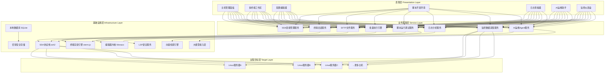
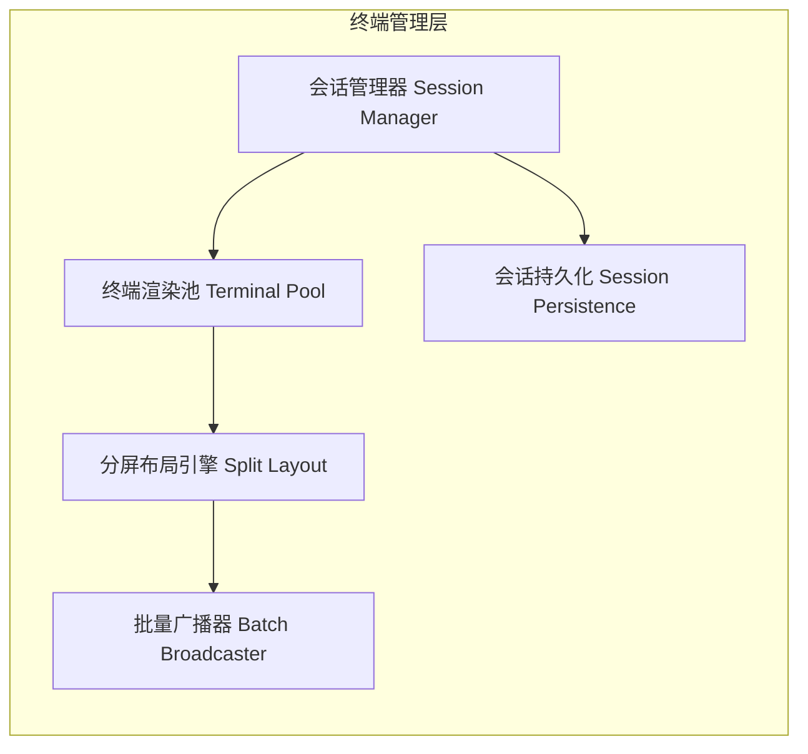
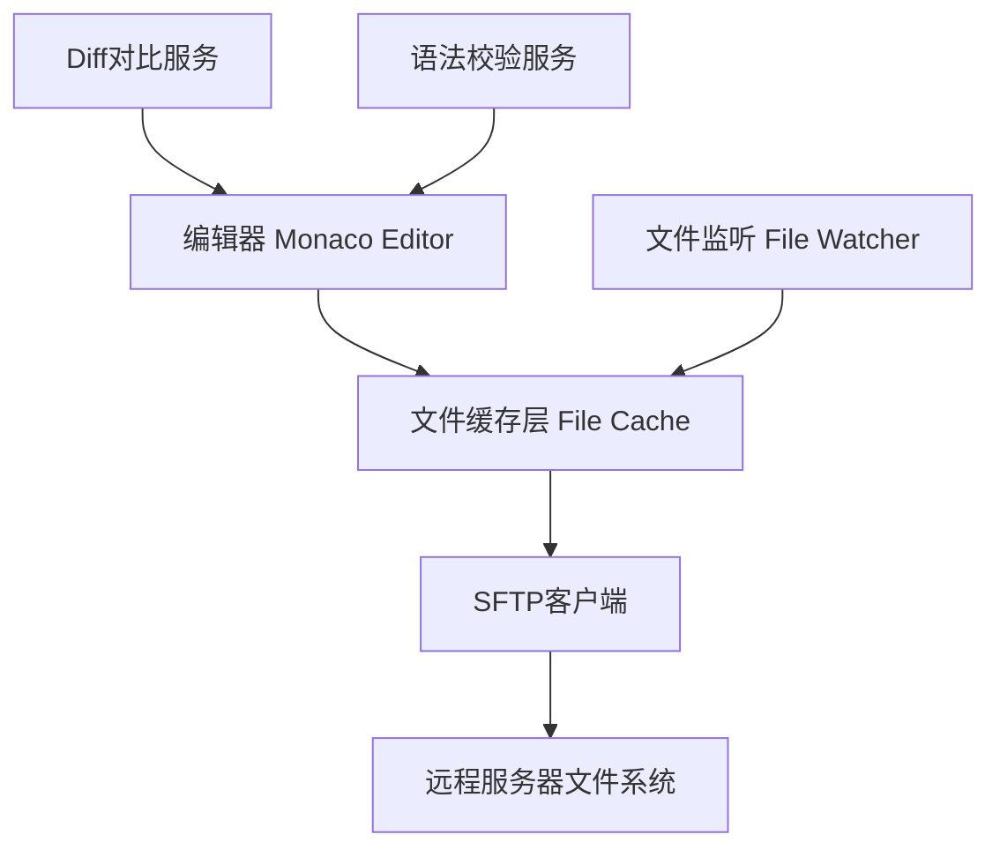
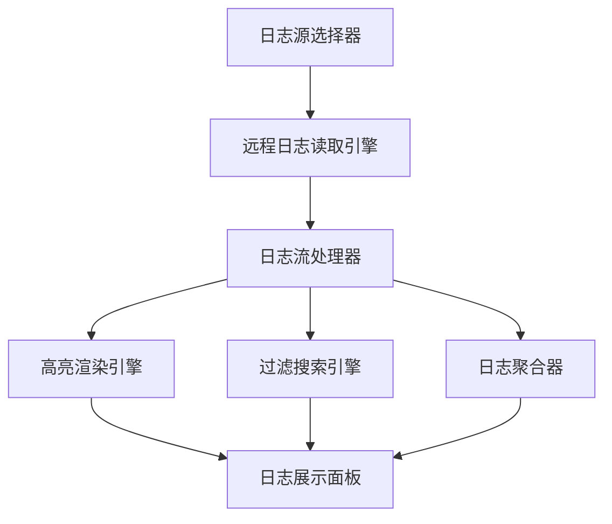
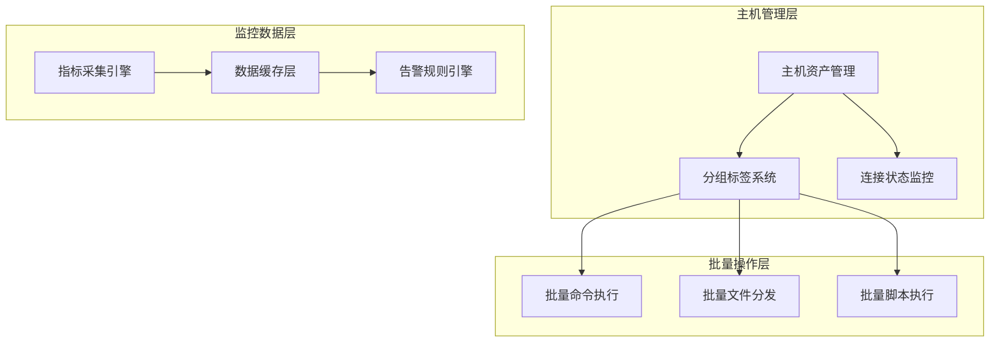
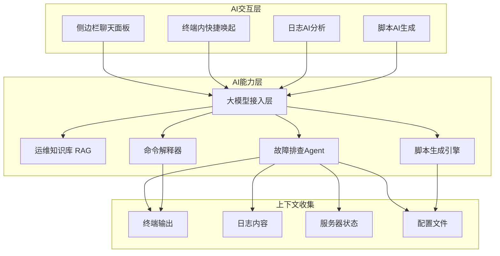

# Linux运维方向专用IDE（运维工作台）技术方案

## 一、产品定位与核心价值

### 1.1 产品定位

**运维IDE（OpsIDE）** 是面向Linux运维工程师的一体化专用工作台，区别于通用代码编辑器，它以服务器管理为核心，将终端操作、配置编辑、脚本开发、日志排查、监控告警、AI辅助等运维高频场景深度整合，打造运维人员的"主力工作环境"。

核心设计理念：**让运维工程师在一个窗口内完成80%的日常工作**，无需在Xshell、VS Code、浏览器监控、日志系统等多个工具间频繁切换。

### 1.2 目标用户与核心场景

**目标用户**

- Linux系统运维工程师
- DevOps/SRE工程师
- 后端开发人员（需频繁操作服务器）
- 中小企业技术负责人（兼顾运维）

**核心使用场景**

1. **日常服务器操作**：SSH登录、命令执行、文件传输
2. **批量运维**：集群批量执行命令、批量部署配置
3. **配置编辑**：Nginx、Docker Compose、Ansible Playbook等配置文件编写
4. **脚本开发**：Shell、Python运维脚本编写调试
5. **故障排查**：日志查看、性能分析、问题定位
6. **监控巡检**：资源状态查看、告警处理、日常巡检

### 1.3 与通用IDE的本质区别

| 维度                 | 通用IDE（VS Code/Cursor） | 运维IDE（OpsIDE）                   |
| -------------------- | ------------------------- | ----------------------------------- |
| **核心对象**   | 本地代码项目              | 远程服务器集群                      |
| **主要操作**   | 编写代码、构建运行        | SSH连接、命令执行、配置修改         |
| **文件系统**   | 本地工作区                | 远程服务器文件系统（SFTP）          |
| **终端定位**   | 辅助功能（运行命令）      | 核心功能（主要工作区）              |
| **语言支持**   | 通用编程语言              | Shell/Python/Ansible/YAML等运维专属 |
| **AI能力方向** | 代码生成、重构            | 故障排查、脚本生成、命令解释        |
| **安全要求**   | 代码安全                  | 主机权限、审计合规、密钥管理        |

---

## 二、整体架构设计

### 2.1 系统架构总览



### 2.2 核心设计原则

#### 2.2.1 连接为中心

- 所有功能围绕"主机连接"展开
- 一次认证，多模块复用SSH连接
- 连接状态全局可见，异常自动重连

#### 2.2.2 多会话并行

- 支持同时打开几十个SSH会话
- 分屏、标签页、分组多种组织方式
- 批量操作与独立操作灵活切换

#### 2.2.3 安全优先

- 密钥加密存储，不明文保存密码
- 操作审计日志，所有命令可追溯
- 权限分级，高危操作二次确认

#### 2.2.4 AI原生

- AI深度融入每个运维场景
- 终端内随时唤起AI解释命令、排查错误
- 日志、告警自动AI分析

---

## 三、六大核心功能模块技术方案

### 3.1 多终端管理模块

#### 3.1.1 功能架构



#### 3.1.2 SSH连接管理

**连接核心实现**

- 底层库：`ssh2`（Node.js最成熟的SSH客户端库）
- 连接池：每个主机维护一个或多个SSH Channel
- 连接复用：终端、SFTP、批量执行共享同一条TCP连接
- 心跳保活：定期发送keepalive包防止连接断开

**认证方式支持**

1. **密码认证**：AES加密存储到本地数据库
2. **密钥认证**：支持RSA/ECDSA/Ed25519密钥，密钥文件加密存储
3. **跳板机代理**：支持多级跳板机跳转（ProxyJump）
4. **一次性密码**：支持TOTP两步验证

**连接状态管理**

```typescript
interface SSHConnection {
  id: string;
  host: string;
  port: number;
  status: 'disconnected' | 'connecting' | 'connected' | 'error';
  channels: Map<string, SSHChannel>;  // 终端、SFTP等复用通道
  reconnectAttempts: number;
  lastActivity: number;
}
```

**自动重连机制**

- 断开检测：心跳超时、error事件、close事件
- 指数退避重试：1s → 2s → 4s → 8s → 最大30s
- 会话恢复：重连后自动恢复终端状态、重新执行当前命令（可选）
- 网络切换感知：监听网络状态变化，自动重连

#### 3.1.3 终端渲染引擎

**核心组件：xterm.js**

- VS Code同款终端组件，成熟稳定
- GPU加速渲染，性能优秀
- 完整VT100/VT220协议支持
- 支持中文、emoji、IME输入

**关键Addon集成**

- `AttachAddon`：WebSocket/Stream数据绑定
- `FitAddon`：自动适配容器尺寸
- `WebLinksAddon`：URL点击识别
- `SearchAddon`：终端内搜索
- `Unicode11Addon`：宽字符支持

**终端实例管理**

- 终端池：复用Terminal实例，避免频繁创建销毁
- 虚拟滚动：DOM节点复用，支持万行历史
- 主题系统：256色、真彩色支持，内置多套主题

#### 3.1.4 分屏与布局系统

**布局模式**

1. **标签页模式**：单终端占满编辑区，标签切换
2. **横向分屏**：左右并排2-N个终端
3. **纵向分屏**：上下堆叠2-N个终端
4. **网格布局**：M×N矩阵排列
5. **自定义拖拽**：拖拽调整大小和位置

**技术实现**

- 基于GoldenLayout或自研分屏组件
- 每个分屏单元独立Terminal实例
- 尺寸变化时自动resize终端（fit）
- 焦点终端高亮边框指示

#### 3.1.5 批量命令执行

**执行模式**

1. **广播模式**：输入同步发送到所有选中终端
2. **顺序执行**：逐台执行，上一台完成再下一台
3. **并行执行**：同时执行，统一收集结果
4. **脚本模式**：上传并执行Shell脚本

**广播输入实现**

```typescript
class BatchBroadcaster {
  private targetTerminals: Terminal[];
  
  broadcastInput(data: string) {
    // 同步输入到所有目标终端
    this.targetTerminals.forEach(term => {
      term.sendData(data);
    });
  }
  
  // 支持单独切换某台的广播开关
  toggleBroadcast(terminalId: string, enabled: boolean) {
    // ...
  }
}
```

**结果聚合展示**

- 汇总视图：按主机分列展示输出
- 差异对比：高亮显示不同主机的输出差异
- 失败统计：自动统计执行失败的主机
- 导出报告：批量执行结果导出为报告

#### 3.1.6 会话持久化

**保存内容**

- 主机列表与分组
- 终端布局与排列
- 每个会话的工作目录
- 命令历史记录（按主机隔离）
- 滚动缓冲区内容（可选）

**恢复机制**

- 启动时自动恢复上次的布局
- 后台自动重连所有主机
- 重连后恢复到上次工作目录
- 命令历史完整保留

### 3.2 配置文件编辑器模块

#### 3.2.1 远程文件编辑架构



#### 3.2.2 SFTP远程文件系统

**核心能力**

- 基于ssh2的sftp子系统
- 文件列表、上传、下载、删除、重命名
- 目录递归操作
- 大文件断点续传

**文件编辑流程**

1. 用户双击远程文件
2. 后台SFTP下载到本地临时缓存
3. Monaco Editor打开缓存文件
4. 用户编辑修改
5. 保存时SFTP回写远程服务器
6. 可选：保存前自动备份原文件

**缓存策略**

- 内存缓存：最近打开的文件
- 磁盘缓存：临时目录，按主机+路径存储
- 一致性检查：保存前校验远程文件是否被修改
- 冲突处理：远程已修改时弹出Diff对比

#### 3.2.3 运维专属语法支持

**语法高亮与智能提示**

| 文件类型          | 语法方案         | LSP支持                 | 校验工具               |
| ----------------- | ---------------- | ----------------------- | ---------------------- |
| Shell脚本 (.sh)   | shell语法        | bash-language-server    | shellcheck             |
| YAML (.yml/.yaml) | YAML语法         | yaml-language-server    | yamllint               |
| JSON (.json)      | JSON语法         | 内置                    | 内置校验               |
| Nginx配置         | nginx语法        | -                       | nginx -t               |
| Ansible Playbook  | YAML+Ansible增强 | ansible-language-server | ansible-lint           |
| Dockerfile        | dockerfile语法   | docker-langserver       | hadolint               |
| Docker Compose    | YAML+Compose增强 | yaml-ls                 | docker compose config  |
| Systemd Unit      | systemd语法      | -                       | systemd-analyze verify |
| Python脚本        | Python语法       | pylsp                   | pylint/flake8          |

**Nginx配置高亮**

- 自定义Monaco语法定义
- 识别server、location、upstream等块
- 内置指令高亮
- 变量、正则特殊标记

**Ansible Playbook增强**

- 识别playbook结构（hosts、tasks、handlers等）
- 模块名智能补全（yum、copy、template等）
- 参数提示与文档悬停
- 语法错误实时标注

#### 3.2.4 Diff与版本对比

**内置Diff编辑器**

- Monaco Diff Editor组件
- 本地修改 vs 远程当前版本
- 保存前预览变更
- 逐行Accept/Reject

**历史版本**

- 每次保存自动备份（保留最近N个版本）
- 版本时间线浏览
- 任意两版本对比
- 一键回滚到历史版本

### 3.3 脚本开发环境模块

#### 3.3.1 脚本开发工作流


#### 3.3.2 Shell脚本开发

**LSP集成：bash-language-server**

- 补全：命令、变量、函数名
- 悬停：命令man文档、函数定义
- 跳转定义：函数、变量跳转
- 引用查找：查找函数调用位置
- 语法诊断：shellcheck集成

**运行与调试**

- 一键运行：当前脚本在远程服务器执行
- 参数配置：运行前可配置命令行参数
- 工作目录：指定脚本执行目录
- 环境变量：预置或自定义环境变量
- 输出面板：彩色输出、错误标红

**ShellCheck集成**

- 实时检查：输入时即时反馈
- 错误分级：error/warning/info
- 快速修复：一键应用建议
- 规则配置：支持.shellcheckrc

#### 3.3.3 Python脚本开发

**LSP集成：python-lsp-server**

- 代码补全、跳转定义、查找引用
- 语法错误、类型检查
- 代码格式化（black/yapf/autopep8）

**远程运行**

- 自动上传脚本到远程服务器
- 虚拟环境支持：自动激活venv/conda
- 依赖检查：缺少依赖自动提示
- 调试支持：基础的print调试，后续可加debugpy

#### 3.3.4 Ansible Playbook开发

**ansible-language-server集成**

- Playbook语法验证
- 模块名与参数补全
- 变量、模板智能提示
- ansible-lint诊断结果展示

**一键执行**

- 当前Playbook一键ansible-playbook运行
- Inventory选择：支持多套主机清单
- 标签过滤：--tags参数选择
- Check模式：dry run预览变更
- 实时输出：Ansible彩色输出终端展示

#### 3.3.5 运行结果面板

**功能特性**

- 独立输出面板，不干扰终端
- ANSI彩色渲染
- 错误行高亮，点击跳转到对应代码行
- 执行时间统计
- 退出码显示（成功绿色/失败红色）
- 历史执行记录

### 3.4 日志查看器模块

#### 3.4.1 日志查看架构



#### 3.4.2 实时日志流（tail -f）

**实现方式**

- SSH执行`tail -f /path/to/log`命令
- 终端模式：直接在终端中查看，保留完整交互
- 增强模式：解析后在专用面板展示，支持更多功能

**增强模式特性**

- 自动暂停：滚动查看历史时自动暂停新日志
- 新日志提示：底部显示"新增N条"按钮
- 跳转最新：一键跳转到最新日志
- 速度控制：日志过快时自动降采样

#### 3.4.3 关键词高亮

**内置高亮规则**

- ERROR/FAIL：红色背景
- WARN/WARNING：黄色文字
- INFO：默认色
- DEBUG：灰色
- 时间戳：蓝色
- IP地址：绿色
- 异常堆栈：特殊标记

**自定义高亮**

- 用户可添加正则高亮规则
- 支持多套高亮方案切换
- 支持按日志类型自动切换方案

#### 3.4.4 过滤与搜索

**实时过滤**

- 包含过滤：只显示匹配关键词的行
- 排除过滤：隐藏匹配关键词的行
- 正则支持：完整正则表达式过滤
- 多条件组合：AND/OR逻辑组合

**搜索功能**

- 向上/向下搜索
- 正则搜索
- 搜索结果高亮
- 搜索结果计数

#### 3.4.5 多日志聚合

**使用场景**

- 集群多节点日志同时查看
- 应用日志+错误日志合并查看
- 多服务日志时间线对齐

**技术实现**

- 同时tail多个日志文件（可跨主机）
- 按时间戳合并排序
- 来源标记：每行标注来自哪个主机/文件
- 按来源筛选：只看某台主机的日志

#### 3.4.6 大日志文件处理

**性能优化**

- 按需加载：只渲染可视区域（虚拟滚动）
- 分页读取：大文件不一次性加载全部
- 后端搜索：grep远程执行，不下载整个文件
- 索引构建：常用日志文件构建行索引

### 3.5 服务器管理面板模块

#### 3.5.1 主机管理架构



#### 3.5.2 主机资产管理

**主机信息字段**

```typescript
interface Host {
  id: string;
  name: string;              // 显示名称
  host: string;              // IP或域名
  port: number;              // SSH端口
  username: string;          // 登录用户
  authType: 'password' | 'key';  // 认证方式
  group: string;             // 所属分组
  tags: string[];            // 标签
  os?: string;               // 操作系统（探测后填充）
  remark?: string;           // 备注
}
```

**分组与标签**

- 多级分组：按环境（生产/测试）、业务线、角色等分组
- 标签系统：灵活打标，支持多维度筛选
- 智能分组：可按OS、地域、标签自动分组

**导入导出**

- 支持批量导入（CSV/Excel/Ansible Inventory格式）
- 配置加密导出备份
- 支持从云厂商API同步主机列表（阿里云/AWS等）

#### 3.5.3 资源监控

**采集方式**

- 轻量Agentless：通过SSH执行命令采集，无需安装客户端
- 采集频率：默认15秒一次，可配置
- 数据保留：本地保留最近24小时数据

**采集指标**

| 指标类别   | 采集命令                           | 说明                     |
| ---------- | ---------------------------------- | ------------------------ |
| CPU使用率  | `top -bn1` / `mpstat`          | 用户态、系统态、空闲     |
| 内存使用率 | `free -m`                        | 已用、缓存、可用         |
| 磁盘使用率 | `df -h`                          | 各分区使用率、inode      |
| 磁盘IO     | `iostat -x`                      | 读写速率、await、util    |
| 网络流量   | `sar -n DEV` / `/proc/net/dev` | 各网卡收发速率           |
| 负载均衡   | `uptime`                         | 1/5/15分钟负载           |
| 进程数     | `ps aux                            | wc -l`                   |
| TCP连接    | `ss -s`                          | ESTABLISHED、TIME_WAIT等 |

**展示方式**

- 列表视图：主机列表实时刷新指标
- 详情视图：单主机详细仪表盘，折线图展示趋势
- 告警状态：异常指标红色高亮
- 排序筛选：按CPU/内存使用率排序

#### 3.5.4 批量操作中心

**批量命令**

- 选择多台主机，执行Shell命令
- 实时查看每台输出
- 执行失败主机自动标记
- 支持超时设置

**批量文件分发**

- 本地文件上传到多台服务器
- 支持目录递归上传
- 目标路径统一或按主机变量
- 传输进度显示

**批量脚本执行**

- 上传脚本并在多台执行
- 支持参数化脚本
- 执行结果汇总统计

#### 3.5.5 安全审计

**操作日志**

- 记录所有SSH登录登出
- 记录所有执行的命令（可选）
- 记录文件修改操作
- 按时间、用户、主机筛选查询

**会话录制**

- 终端会话完整录制（类似tlog）
- 支持回放功能
- 可导出为视频或文本
- 满足等保合规要求

### 3.6 AI运维助手模块

#### 3.6.1 AI助手架构



#### 3.6.2 终端内AI交互

**快捷唤起方式**

- 选中终端输出 + 快捷键 → "解释这段输出"
- 命令输入前加`?` → AI解释这条命令做什么
- 命令报错后 → "帮我排查这个错误"

**命令解释功能**

```
用户输入：? find / -name "*.log" -mtime +7 -delete
AI输出：
这条命令的作用是：
1. 从根目录开始搜索（find /）
2. 查找所有.log后缀的文件（-name "*.log"）
3. 筛选7天前修改的文件（-mtime +7）
4. 删除匹配到的文件（-delete）

⚠️ 注意事项：
- 会删除系统中所有7天以上的日志文件，范围很广
- 建议先去掉-delete执行，确认要删的文件
- 生产环境谨慎使用，可能影响日志审计
```

**错误排查功能**

- 自动识别终端中的错误输出
- 分析错误原因
- 给出排查步骤和解决方案
- 可一键执行建议的排查命令

#### 3.6.3 日志AI分析

**功能场景**

1. **错误日志总结**：选中一段错误日志，AI总结问题原因
2. **异常检测**：AI扫描日志，自动标出异常模式
3. **根因分析**：基于错误堆栈和上下文，分析根本原因
4. **解决方案**：给出修复建议和操作步骤

**技术实现**

- 日志片段作为上下文传给大模型
- 系统提示词注入运维专家角色设定
- 结合运维知识库（常见错误库）增强准确性
- 输出结构化的分析结果

#### 3.6.4 脚本AI生成

**Shell脚本生成**

- 自然语言描述需求 → 生成Shell脚本
- 自动添加注释和使用说明
- 自动shellcheck检查
- 一键保存到文件或直接执行

**Ansible Playbook生成**

- 描述运维任务 → 生成Playbook
- 自动使用最佳实践模块
- 语法自动校验
- 支持生成role结构

**示例交互**

```
用户：写一个监控磁盘使用率，超过80%发告警的脚本
AI生成：
#!/bin/bash
# 磁盘使用率监控告警脚本
# 使用方式：./disk_alert.sh [阈值百分比]

THRESHOLD=${1:-80}
HOSTNAME=$(hostname)

# 获取超过阈值的分区
df -h | awk 'NR>1 {print $5, $6}' | while read usage mount; do
    usep=${usage%\%}
    if [ "$usep" -ge "$THRESHOLD" ]; then
        echo "[$(date '+%Y-%m-%d %H:%M:%S')] 告警: $HOSTNAME 的 $mount 分区使用率已达 $usage"
        # 此处可添加邮件/钉钉/企业微信告警逻辑
    fi
done
```

#### 3.6.5 故障排查Agent

**ReAct Agent工作流**

1. 用户描述故障现象（如"网站访问很慢"）
2. AI自动规划排查步骤
3. 自动执行命令收集信息（CPU、内存、连接数、日志等）
4. 分析收集到的数据
5. 给出诊断结论和修复方案
6. 可选择自动执行修复命令

**Agent工具集**

- `run_command`：在指定主机执行命令
- `read_file`：读取远程配置文件或日志
- `check_metric`：获取系统监控指标
- `search_log`：日志关键词搜索
- `explain_error`：解释错误信息

**安全控制**

- 只读模式：只执行查看类命令，不修改任何配置
- 确认模式：每个执行命令前需用户确认
- 命令白名单：限制Agent可执行的命令范围
- 操作审计：所有Agent操作完整记录

#### 3.6.6 运维知识库RAG

**知识库内容**

- 常见故障排查手册
- 各服务配置最佳实践
- 安全基线规范
- 历史故障案例库
- 团队内部运维文档

**索引构建**

- 支持Markdown、PDF、Word文档导入
- 语义切块，向量化存储
- 本地向量数据库（LanceDB）
- 混合检索（语义+关键词）

---

## 四、产品形态对比与选型

### 4.1 两种形态详细对比

#### 4.1.1 Electron桌面应用形态

**架构特点**

- 前端：Chromium渲染 + Web技术栈
- 后端：Node.js运行时，直接调用系统API
- 本地存储：SQLite + 本地文件系统
- SSH连接：Node.js直接建立，无需中转

**优势分析**

1. **性能更好**

   - SSH连接本地建立，延迟更低
   - 无需WebSocket中转，少一层转发
   - 本地计算资源充足，大数据处理快
2. **安全性更高**

   - 密钥本地加密存储，不上传服务器
   - 数据不经过第三方服务器
   - 内网环境可直接使用，无需暴露服务
3. **体验更流畅**

   - 原生窗口管理，快捷键系统级
   - 启动后离线可用（缓存连接信息）
   - 系统通知、托盘图标等原生能力
4. **运维习惯匹配**

   - 类似Xshell、FinalShell的桌面工具体验
   - 老运维更习惯桌面客户端
   - 多窗口、多显示器支持好

**劣势分析**

1. **部署更新麻烦**

   - 需要每台电脑安装
   - 版本更新需用户主动升级
   - 跨平台打包测试成本高
2. **无法随时随地访问**

   - 只能在安装了的电脑上用
   - 手机、平板无法使用
   - 临时换电脑需要重新配置
3. **协作困难**

   - 主机配置本地存储，无法共享
   - 会话无法多人协作查看
   - 运维团队统一管理难

#### 4.1.2 Web IDE（浏览器访问）形态

**架构特点**

- 前端：纯浏览器运行，WebSocket通信
- 后端：独立服务（Node.js/Go），管理所有SSH连接
- 部署：服务端部署，浏览器访问
- 多用户：天然支持多用户、权限管理

**优势分析**

1. **零部署即用**

   - 打开浏览器就能用
   - 无需安装任何软件
   - 任何设备都能访问（电脑、平板、手机）
2. **集中管理**

   - 主机配置统一存在服务端
   - 团队共享主机列表
   - 权限统一管控
   - 审计日志集中存储
3. **协作能力强**

   - 会话共享：多人同时查看同一个终端
   - 协同排查：运维团队一起看问题
   - 会话移交：交接班无缝衔接
4. **易于集成**

   - 可嵌入现有运维平台
   - API对接CMDB、监控系统
   - 统一SSO登录

**劣势分析**

1. **多一层转发延迟**

   - 浏览器 → WebSocket → 后端 → SSH → 服务器
   - 比桌面端多一跳，延迟略高
   - 大量终端时服务端压力大
2. **依赖网络**

   - 必须能访问到后端服务
   - 纯内网环境需要部署服务
   - 断网就完全用不了
3. **浏览器限制**

   - 快捷键冲突（如Ctrl+W关标签页）
   - 剪贴板权限问题
   - 文件上传下载体验不如原生

### 4.2 综合对比表

| 对比维度               | Electron桌面应用                    | Web IDE（浏览器版）                   |
| ---------------------- | ----------------------------------- | ------------------------------------- |
| **连接性能**     | ★★★★★ 直连，延迟最低           | ★★★☆☆ 多一层转发                 |
| **安全性**       | ★★★★★ 本地存储，数据不出本地   | ★★★☆☆ 服务端集中，需保障服务安全 |
| **部署成本**     | ★★☆☆☆ 每台机器安装更新         | ★★★★★ 一次部署，全员使用         |
| **使用便捷性**   | ★★★☆☆ 必须在安装的电脑用       | ★★★★★ 随时随地浏览器访问         |
| **用户体验**     | ★★★★★ 原生体验，无浏览器限制   | ★★★☆☆ 快捷键冲突等问题           |
| **团队协作**     | ★★☆☆☆ 本地数据，难共享         | ★★★★★ 天然多用户、共享协作       |
| **运维习惯匹配** | ★★★★★ 类似Xshell的传统工具习惯 | ★★★☆☆ 新型Web化工具              |
| **离线可用性**   | ★★★★★ 缓存可用，断网也能看历史 | ★☆☆☆☆ 断网完全不可用             |
| **开发难度**     | ★★★☆☆ Electron打包、兼容问题   | ★★★★☆ 纯前后端，技术更通用       |
| **企业级能力**   | ★★☆☆☆ 个人工具属性强           | ★★★★★ 多租户、权限、审计         |

### 4.3 推荐结论

**分阶段推荐：先桌面后Web，最终双端并行**

**MVP阶段（0-6个月）：Electron桌面版优先**

- 理由：
  1. 运维工程师更习惯桌面终端工具
  2. 技术实现相对简单，无需考虑多用户、权限等复杂度
  3. 本地直连性能更好，核心体验有保障
  4. 密钥本地存储，安全顾虑小
- 目标：验证产品价值，打磨核心功能体验

**发展阶段（6-12个月）：启动Web版开发**

- 理由：
  1. 团队协作需求开始显现
  2. 企业客户需要集中管理和审计
  3. 移动端访问需求增加
- 目标：服务端架构沉淀，支持双端共享核心能力

**成熟阶段（12个月+）：桌面+Web双端同步**

- 桌面版：面向个人高级用户，追求极致体验
- Web版：面向团队和企业，强调协作与管理
- 核心能力共享：SSH、终端、AI等底层服务复用

**技术架构建议：前后端分离设计，为Web化预留空间**

- 核心业务逻辑（SSH管理、终端会话、批量执行）封装为独立Service层
- 桌面版直接调用Service层
- 未来Web版只需加HTTP/WebSocket API层即可复用
- 避免一开始就写死在Electron主进程里

---

## 五、技术栈选型推荐

### 5.1 整体技术栈（Electron桌面版）

| 层级                 | 技术选型                  | 说明                  |
| -------------------- | ------------------------- | --------------------- |
| **桌面框架**   | Electron 30+              | 成熟稳定，VS Code同款 |
| **前端框架**   | React 18 + TypeScript     | 生态丰富，组件化开发  |
| **UI组件库**   | Ant Design / Tailwind CSS | 企业级UI，开发效率高  |
| **状态管理**   | Zustand                   | 轻量，适合中大型应用  |
| **终端渲染**   | xterm.js 5.x              | 业界标准，VS Code同款 |
| **代码编辑器** | Monaco Editor             | 语法高亮、智能提示    |
| **SSH协议**    | ssh2 (node-ssh)           | Node.js最成熟SSH库    |
| **本地数据库** | SQLite + better-sqlite3   | 结构化数据存储        |
| **加密存储**   | keytar / crypto           | 密钥加密保存          |
| **图表库**     | ECharts                   | 监控指标图表          |
| **构建打包**   | electron-builder          | 多平台打包、自动更新  |
| **AI接入**     | 自研LLM Gateway           | 多模型统一接入        |
| **向量数据库** | LanceDB                   | 本地知识库向量存储    |

### 5.2 核心组件详细选型

#### 5.2.1 SSH客户端：ssh2

**选择理由**

- Node.js生态最成熟的SSH实现
- 纯JavaScript实现，无原生依赖
- 支持Shell、SFTP、端口转发、Exec等完整功能
- 社区活跃，持续维护

**封装建议**

- 封装ConnectionManager统一管理连接
- 实现连接池与复用
- 自动重连与状态管理
- 统一错误处理

#### 5.2.2 终端：xterm.js

**核心Addon**

- `@xterm/addon-attach`：数据流绑定
- `@xterm/addon-fit`：自适应尺寸
- `@xterm/addon-search`：终端内搜索
- `@xterm/addon-web-links`：链接识别
- `@xterm/addon-unicode11`：Unicode 11支持

**性能优化**

- 开启GPU加速渲染
- 滚动缓冲区大小合理配置（默认1000行，可调）
- 大量输出时降采样渲染

#### 5.2.3 编辑器：Monaco Editor

**使用场景**

- 配置文件编辑（YAML/JSON/Nginx等）
- 脚本开发（Shell/Python/Ansible）
- Diff对比视图

**LSP集成方案**

- 桌面版：本地启动Language Server进程
- 通过vscode-languageserver-protocol通信
- 支持动态启停，按需加载

#### 5.2.4 语言服务列表

| 语言服务    | npm包名                           | 用途              |
| ----------- | --------------------------------- | ----------------- |
| Bash LSP    | bash-language-server              | Shell脚本智能提示 |
| YAML LSP    | yaml-language-server              | YAML配置文件      |
| Python LSP  | python-lsp-server                 | Python脚本        |
| Ansible LSP | @ansible/ansible-language-server  | Ansible Playbook  |
| Docker LSP  | dockerfile-language-server-nodejs | Dockerfile        |
| JSON LSP    | vscode-json-languageservice       | JSON文件（内置）  |

### 5.3 后端技术栈（Web版预留）

| 层级                | 技术选型                       | 说明                              |
| ------------------- | ------------------------------ | --------------------------------- |
| **运行时**    | Node.js / Go                   | Node.js复用桌面端代码；Go性能更好 |
| **Web框架**   | Express / Fastify / Gin        | HTTP API服务                      |
| **WebSocket** | Socket.IO / 原生ws             | 终端实时通信                      |
| **数据库**    | PostgreSQL / MySQL             | 用户、主机、审计日志              |
| **缓存**      | Redis                          | 会话状态、临时数据                |
| **认证**      | JWT / OAuth2 / SSO             | 用户登录鉴权                      |
| **SSH连接池** | ssh2（Node）/ crypto/ssh（Go） | 服务端SSH管理                     |

---

## 六、可复用开源组件清单

### 6.1 终端与SSH类

#### 6.1.1 xterm.js

- **项目地址**：https://github.com/xtermjs/xterm.js
- **Star数**：~17K
- **协议**：MIT
- **用途**：Web终端渲染核心组件
- **集成方式**：npm安装，创建Terminal实例，绑定输入输出流
- **成熟度**：★★★★★（VS Code、Hyper、Theia等大量项目使用）

#### 6.1.2 ssh2 (node-ssh)

- **项目地址**：https://github.com/mscdex/ssh2
- **Star数**：~5.5K
- **协议**：MIT
- **用途**：Node.js SSH客户端，Shell/SFTP/端口转发
- **集成方式**：主进程中创建SSH连接，通过IPC与渲染进程通信
- **成熟度**：★★★★★（Node生态最成熟SSH库）

#### 6.1.3 node-pty

- **项目地址**：https://github.com/microsoft/node-pty
- **Star数**：~1.5K
- **协议**：MIT
- **用途**：本地伪终端，运行本地Shell
- **集成方式**：原生模块，提供本地终端能力
- **成熟度**：★★★★☆（VS Code终端底层）

#### 6.1.4 electerm（参考项目）

- **项目地址**：https://github.com/electerm/electerm
- **Star数**：~10K
- **协议**：MIT
- **用途**：开源Electron SSH/SFTP客户端，可参考整体架构
- **集成方式**：参考其SSH管理、SFTP、UI布局的实现
- **成熟度**：★★★★☆（功能完整的成熟项目）

### 6.2 编辑器与LSP类

#### 6.2.1 Monaco Editor

- **项目地址**：https://github.com/microsoft/monaco-editor
- **Star数**：~40K
- **协议**：MIT
- **用途**：代码编辑器内核，语法高亮、智能提示
- **集成方式**：npm安装，React封装组件
- **成熟度**：★★★★★（VS Code同款，业界标准）

#### 6.2.2 ansible-language-server

- **项目地址**：https://github.com/ansible/ansible-language-server
- **Star数**：~300
- **协议**：MIT
- **用途**：Ansible Playbook智能提示、语法检查
- **集成方式**：npm全局安装，Monaco通过LSP客户端连接
- **成熟度**：★★★☆☆（Red Hat官方维护，持续迭代）

#### 6.2.3 bash-language-server

- **项目地址**：https://github.com/bash-lsp/bash-language-server
- **Star数**：~1.5K
- **协议**：MIT
- **用途**：Shell脚本LSP服务，补全、跳转、shellcheck集成
- **集成方式**：npm安装，LSP客户端连接
- **成熟度**：★★★★☆（社区活跃，功能完善）

#### 6.2.4 yaml-language-server

- **项目地址**：https://github.com/redhat-developer/yaml-language-server
- **Star数**：~900
- **协议**：MIT
- **用途**：YAML文件智能提示、Schema校验
- **集成方式**：支持K8s、Docker Compose等多种Schema
- **成熟度**：★★★★☆（Red Hat官方维护）

### 6.3 运维工具类

#### 6.3.1 ShellCheck

- **项目地址**：https://github.com/koalaman/shellcheck
- **Star数**：~35K
- **协议**：GPLv3
- **用途**：Shell脚本静态分析，找出常见错误和坏味道
- **集成方式**：本地安装二进制，LSP调用或直接命令行调用
- **成熟度**：★★★★★（业界标准Shell检查工具）

#### 6.3.2 ansible-lint

- **项目地址**：https://github.com/ansible/ansible-lint
- **Star数**：~700
- **协议**：GPLv3
- **用途**：Ansible Playbook最佳实践检查
- **集成方式**：Python包，ansible-language-server内置集成
- **成熟度**：★★★★☆（Ansible官方工具）

### 6.4 监控与采集类

#### 6.4.1 Prometheus Node Exporter（可选集成）

- **项目地址**：https://github.com/prometheus/node_exporter
- **Star数**：~10K
- **协议**：Apache-2.0
- **用途**：系统指标采集（需要在目标机器安装Agent）
- **集成方式**：可选，有Agent场景下对接Prometheus
- **成熟度**：★★★★★（云原生标准）

#### 6.4.2 sysstat

- **用途**：Linux系统性能工具集（sar、iostat等）
- **集成方式**：目标系统自带或yum/apt安装，SSH执行采集
- **成熟度**：★★★★★（Linux系统标配）

### 6.5 AI相关组件

#### 6.5.1 LanceDB

- **项目地址**：https://github.com/lancedb/lancedb
- **Star数**：~8K
- **协议**：Apache-2.0
- **用途**：嵌入式向量数据库，本地运维知识库
- **集成方式**：Node.js SDK，本地文件存储
- **成熟度**：★★★★☆（活跃开发，性能优秀）

#### 6.5.2 Tree-sitter

- **项目地址**：https://github.com/tree-sitter/tree-sitter
- **Star数**：~17K
- **协议**：MIT
- **用途**：配置文件、脚本的语法解析，用于知识库索引
- **集成方式**：node-tree-sitter绑定
- **成熟度**：★★★★★（业界标准）

### 6.6 UI与框架类

#### 6.6.1 Golden Layout

- **项目地址**：https://github.com/golden-layout/golden-layout
- **Star数**：~6K
- **协议**：MIT
- **用途**：多面板分屏布局，终端分屏核心组件
- **集成方式**：拖拽分屏、保存恢复布局
- **成熟度**：★★★★☆（成熟的分屏布局库）

#### 6.6.2 ECharts

- **项目地址**：https://github.com/apache/echarts
- **Star数**：~60K
- **协议**：Apache-2.0
- **用途**：监控指标图表展示
- **集成方式**：React组件封装
- **成熟度**：★★★★★（Apache顶级项目）

---

## 七、技术路径判断与对比

### 7.1 路径一：基于Code-OSS二次开发

#### 7.1.1 方案说明

在VS Code开源版（Code-OSS）基础上，增加运维相关功能：

- SSH终端管理作为扩展或内置功能
- 远程文件编辑复用Remote SSH扩展思路
- 运维LSP和工具链作为扩展安装
- AI助手作为内置扩展

#### 7.1.2 优势

1. **编辑器能力开箱即用**

   - Monaco Editor深度集成
   - 语法高亮、多标签、Diff等全有
   - LSP框架现成，接入语言服务简单
2. **插件生态可用**

   - 直接安装Shell、Python、Ansible扩展
   - Git、Docker等辅助功能自带
   - 主题、快捷键等成熟
3. **基础框架成熟**

   - Electron架构、多进程模型现成
   - 文件系统、设置系统、命令面板都有
   - 稳定性经过验证

#### 7.1.3 劣势与问题

1. **太重，与运维IDE定位不符**

   - VS Code是为写代码设计的，终端是辅助
   - 运维IDE终端是核心，编辑器是辅助
   - 大量功能用不上，白白增加体积和复杂度
2. **SSH终端改造困难**

   - VS Code的Remote SSH是为了远程开发设计
   - 多终端管理、批量执行、主机分组等需要大量改造
   - 终端在VS Code里地位低，UI布局不好改
3. **服务器管理面板难做**

   - 侧边栏可以做主机列表，但交互受限
   - 监控仪表盘、批量操作中心需要大量自定义UI
   - VS Code的Workbench扩展点不够灵活
4. **维护成本高**

   - Code-OSS代码库庞大复杂
   - 同步上游更新麻烦
   - 团队需要花时间理解VS Code架构
5. **产品辨识度低**

   - 看起来就是装了插件的VS Code
   - 很难形成独立的产品体验
   - 用户心智上还是"编辑器"而非"运维工作台"

### 7.2 路径二：自研前端+后端服务架构（推荐）

#### 7.2.1 方案说明

从零设计运维工作台，按需集成各组件：

- 自研整体UI框架和布局系统
- 集成xterm.js作为终端核心
- 集成Monaco Editor作为配置编辑器（按需加载）
- 自研SSH连接管理、主机管理、批量执行等核心业务
- AI能力独立设计，深度融入各场景

#### 7.2.2 优势

1. **体验贴合运维场景**

   - 以主机和终端为中心设计UI
   - 多终端分屏、批量操作等原生支持
   - 操作流程按运维习惯优化
2. **轻量高效**

   - 只包含需要的功能，没有冗余
   - 启动更快，内存占用更低
   - 功能聚焦，不臃肿
3. **架构灵活可控**

   - 完全自主的架构设计
   - 想改哪里改哪里，不受约束
   - 为未来Web化、云化预留空间
4. **产品独立完整**

   - 有独立的品牌和产品形态
   - 不是"某个IDE的插件"
   - 更容易形成差异化竞争力
5. **技术团队门槛适中**

   - 不需要懂VS Code复杂架构
   - 标准的Electron + React技术栈
   - 前端工程师更容易上手

#### 7.2.3 劣势

1. **基础功能需要自己做**

   - 设置系统、快捷键、主题等
   - 文件树、标签页、分屏布局
   - 搜索、命令面板等辅助功能
2. **编辑器能力不如VS Code强**

   - Monaco本身没问题，但周边生态弱
   - 调试、重构等高级功能没有
   - 但运维场景对编辑器要求不高，够用
3. **前期工作量略大**

   - 基础框架需要从零搭
   - 但运维IDE核心功能并不多
   - 总体工作量反而可能比啃Code-OSS小

### 7.3 两条路径详细对比

| 对比维度                 | 基于Code-OSS二次开发          | 自研前后端架构（推荐）        |
| ------------------------ | ----------------------------- | ----------------------------- |
| **MVP工作量**      | 约18人月（理解+改造）         | 约15人月（从零搭建）          |
| **核心功能匹配度** | ★★★☆☆ 编辑器强，终端弱   | ★★★★★ 完全贴合运维场景   |
| **终端体验**       | ★★★☆☆ 辅助功能，改造受限 | ★★★★★ 核心功能，深度优化 |
| **编辑器能力**     | ★★★★★ 完整VS Code能力    | ★★★★☆ Monaco足够运维用   |
| **产品体积**       | ~200MB+，功能臃肿             | ~80-100MB，轻量聚焦           |
| **架构灵活性**     | ★★☆☆☆ 受VS Code约束大    | ★★★★★ 完全自主可控       |
| **团队技术门槛**   | ★★★★☆ 需懂VS Code架构    | ★★★☆☆ 标准前端技术栈     |
| **维护成本**       | ★★★★☆ 同步上游成本高     | ★★★☆☆ 自己的代码好维护   |
| **产品辨识度**     | ★★☆☆☆ 像VS Code加插件    | ★★★★★ 独立产品形态       |
| **未来Web化迁移**  | ★★☆☆☆ VS Code Web复杂    | ★★★★☆ 前后端分离，易迁移 |
| **推荐场景**       | 想做通用IDE+运维特性          | 专注运维工作台场景            |

### 7.4 最终推荐

**强烈推荐路径二：自研前端+后端服务架构**

**核心理由：**

1. **场景匹配度最高**：运维IDE的核心是终端和服务器管理，不是代码编辑。VS Code以编辑器为中心的架构反而会成为束缚。
2. **工作量其实更小**：看起来从零搭更难，但Code-OSS的学习和改造成本非常高。运维IDE功能相对聚焦，自研反而更快。
3. **产品体验更好**：可以完全按照运维场景设计交互，而不是在编辑器框架里"塞"运维功能。
4. **技术栈更通用**：Electron + React + Node.js是标准技术栈，招人、维护都更容易。
5. **未来空间更大**：前后端分离的架构，未来做Web版、服务端部署都很自然。

**Monaco Editor依然要用**：

- 配置文件编辑和脚本开发还是用Monaco
- 但它只是一个组件，不是整个应用的框架
- 按需加载，不用就不初始化，更轻量

---

## 八、开发路线与工作量估算

### 8.1 MVP版本核心功能（最小可用集）

**必须包含的功能**

1. ✅ SSH连接管理（增删改查、分组）
2. ✅ 单终端SSH连接与操作
3. ✅ 多终端标签页切换
4. ✅ 终端分屏（左右/上下）
5. ✅ SFTP文件浏览与编辑
6. ✅ 配置文件语法高亮（YAML/Shell/Nginx）
7. ✅ AI聊天助手（命令解释、错误排查）
8. ✅ 密钥加密存储
9. ✅ 会话持久化（保存连接列表）

**MVP暂不包含**

- 批量命令执行
- 资源监控仪表盘
- 日志查看器（增强版）
- Ansible LSP深度集成
- AI Agent自动排查
- 会话录制审计
- 多用户/团队版

### 8.2 分阶段开发计划

#### 第一阶段：基础框架与终端（第1-2月）

**目标**：跑通Electron应用，实现基础SSH终端功能

**交付物**

- Electron项目框架，完成打包配置
- 主机管理面板（增删改查、分组）
- SSH连接核心（ssh2封装、自动重连）
- 单终端功能（xterm.js集成）
- 多标签页终端
- 密钥加密存储
- 基础设置界面

**技术里程碑**

- M1.1：Electron项目搭建，三端打包成功
- M1.2：SSH连接封装完成，稳定连接Linux主机
- M1.3：终端功能完整，支持中文、快捷键、复制粘贴
- M1.4：多标签终端，切换流畅

**人力**：3人（前端2 + 全栈1）
**工作量**：5人月

#### 第二阶段：文件编辑与分屏（第3-4月）

**目标**：完善文件编辑能力，支持多终端分屏

**交付物**

- SFTP文件浏览器（目录树、上传下载）
- Monaco Editor集成（远程文件编辑）
- YAML/Shell/Nginx语法高亮
- 文件Diff对比
- 终端分屏布局（横向/纵向/网格）
- 终端内搜索
- 批量命令执行（基础广播模式）

**技术里程碑**

- M2.1：SFTP文件管理完成，支持常用操作
- M2.2：远程编辑流畅，保存回写稳定
- M2.3：分屏系统完成，支持拖拽调整
- M2.4：批量广播可用，多终端同步输入

**人力**：3人（前端2 + 全栈1）
**工作量**：5人月

#### 第三阶段：脚本开发与日志（第5-6月）

**目标**：脚本开发环境可用，日志查看增强

**交付物**

- Shell脚本运行（一键远程执行）
- ShellCheck集成（语法检查）
- bash-language-server集成（智能补全）
- 日志查看器（tail -f增强版）
- 日志关键词高亮
- 日志过滤搜索
- Python脚本基础支持

**技术里程碑**

- M3.1：脚本开发环境可用，运行调试流畅
- M3.2：LSP集成成功，补全提示正常
- M3.3：日志查看器完成，支持实时流和高亮
- M3.4：MVP版本功能全部完成，可内测

**人力**：4人（前端2 + AI/全栈2）
**工作量**：7人月

#### 第四阶段：AI运维助手（第7-8月）

**目标**：AI深度融入，核心AI功能可用

**交付物**

- AI聊天面板（侧边栏）
- 命令解释功能（选中命令解释）
- 错误分析功能（选中报错分析原因）
- 脚本生成（自然语言生成Shell脚本）
- 日志AI总结
- 多模型支持（GPT/Claude/DeepSeek等）
- 运维知识库基础版

**技术里程碑**

- M4.1：LLM接入层完成，支持3+模型
- M4.2：聊天面板完成，流式输出流畅
- M4.3：终端内AI唤起功能可用
- M4.4：脚本生成质量达标，可直接使用

**人力**：4人（前端1 + AI/后端3）
**工作量**：7人月

#### 第五阶段：监控与批量增强（第9-10月）

**目标**：服务器监控可用，批量功能完善

**交付物**

- 主机资源监控（CPU/内存/磁盘/网络）
- 监控仪表盘（ECharts图表）
- 告警阈值设置
- 批量执行增强（顺序/并行模式、结果汇总）
- 批量文件分发
- Ansible Playbook支持
- 主机批量导入导出

**技术里程碑**

- M5.1：Agentless指标采集完成，数据准确
- M5.2：监控仪表盘上线，实时刷新
- M5.3：批量执行中心完善，支持多种模式
- M5.4：Ansible支持可用，一键执行playbook

**人力**：4人（前端2 + 后端2）
**工作量**：7人月

#### 第六阶段：产品化与高级功能（第11-12月）

**目标**：产品稳定可用，具备高级特性

**交付物**

- 性能优化（启动速度、内存占用）
- 自动更新机制
- 主题系统（多套内置主题）
- AI故障排查Agent（只读模式）
- 会话录制与回放
- 操作审计日志
- 快捷键自定义
- 导入导出配置

**技术里程碑**

- M6.1：冷启动<3秒，常规使用内存<200MB
- M6.2：自动更新可用，支持增量更新
- M6.3：AI Agent可用，能自动排查简单故障
- M6.4：1.0正式版本发布

**人力**：5人（全团队）
**工作量**：9人月

### 8.3 路线图汇总表

| 阶段               | 周期             | 核心目标                  | 关键交付物                       | 人力              | 工作量           |
| ------------------ | ---------------- | ------------------------- | -------------------------------- | ----------------- | ---------------- |
| 第一阶段：基础终端 | 第1-2月          | SSH终端核心可用           | 主机管理、单终端、多标签         | 3人               | 5人月            |
| 第二阶段：编辑分屏 | 第3-4月          | 文件编辑+分屏             | SFTP、Monaco编辑、分屏、批量广播 | 3人               | 5人月            |
| 第三阶段：脚本日志 | 第5-6月          | 开发+日志环境             | 脚本运行、LSP、日志查看器        | 4人               | 7人月            |
| 第四阶段：AI助手   | 第7-8月          | AI核心功能上线            | 聊天、命令解释、脚本生成、知识库 | 4人               | 7人月            |
| 第五阶段：监控批量 | 第9-10月         | 监控+批量完善             | 资源监控、批量执行、Ansible      | 4人               | 7人月            |
| 第六阶段：产品化   | 第11-12月        | 1.0正式版                 | 性能优化、自动更新、Agent、审计  | 5人               | 9人月            |
| **总计**     | **12个月** | **完整运维IDE 1.0** | **全功能运维工作台**       | **峰值5人** | **40人月** |

### 8.4 团队配置建议

**核心团队：4-5人**

| 角色            | 人数        | 技能要求                              | 主要职责                        |
| --------------- | ----------- | ------------------------------------- | ------------------------------- |
| 前端工程师      | 2人         | React、TypeScript、Electron、xterm.js | UI开发、终端集成、编辑器集成    |
| 后端/全栈工程师 | 1-2人       | Node.js、SSH、Linux运维、网络编程     | SSH连接管理、业务逻辑、批量执行 |
| AI应用工程师    | 1人         | LLM应用、RAG、Prompt Engineering      | AI助手、知识库、Agent开发       |
| 产品/技术负责人 | 1人（可兼） | 运维背景、产品设计、项目管理          | 需求把控、架构设计、进度管理    |

**人才招聘建议**

- 前端：有Electron或VS Code插件开发经验优先
- 后端：有运维工具开发、SSH协议经验优先
- AI：有LLM应用开发、Agent开发经验优先
- 整体：有运维背景或懂Linux的开发者更佳，理解用户场景

### 8.5 技术风险与应对

| 风险点                | 影响程度 | 发生概率 | 应对策略                                                        |
| --------------------- | -------- | -------- | --------------------------------------------------------------- |
| SSH连接稳定性问题     | 高       | 中       | 充分测试不同网络环境；完善重连机制；参考electerm等成熟项目      |
| 大量终端内存占用高    | 中       | 中       | 终端实例池化；不可见终端降频渲染；虚拟滚动优化                  |
| Monaco Editor集成复杂 | 中       | 低       | 先做基础语法高亮，LSP后加；参考Monaco官方示例                   |
| AI生成脚本质量不稳定  | 高       | 中       | 加强Prompt工程；增加脚本校验；用户确认机制；知识库增强          |
| 批量执行安全风险      | 高       | 低       | 高危命令拦截；执行前二次确认；操作审计；灰度执行（先1台再全量） |
| Electron打包兼容问题  | 中       | 中       | 早期就做多平台测试；使用electron-builder成熟方案                |
| 密钥存储安全问题      | 高       | 低       | 系统密钥链（keytar）存储；主密码加密；安全审计                  |

---

## 九、总结与建议

### 9.1 可行性结论

**完全可行，且市场空间大**

当前运维工具市场现状：

- 传统终端工具（Xshell、FinalShell）：功能单一，无AI能力
- 通用IDE（VS Code）：远程开发强，但运维场景不贴合
- Web堡垒机（JumpServer）：侧重安全审计，操作体验一般
- AI编程工具（Cursor）：代码强，运维弱

**运维IDE正好填补了"AI原生运维工作台"的空白**，将终端、编辑、监控、AI深度整合，有明确的产品价值。

### 9.2 核心建议

1. **从桌面版起步，聚焦个人运维工程师用户**

   - 先做好单人使用体验
   - 打磨终端和AI两个核心卖点
   - 验证产品价值和用户付费意愿
2. **MVP要小而美，不要贪大求全**

   - 前6个月先把SSH终端+文件编辑+AI助手做好
   - 监控、批量、审计等可以后续迭代
   - 核心体验流畅比功能多更重要
3. **AI是差异化核心，要深度融入场景**

   - 不要只做一个侧边聊天框
   - 终端内随时唤起、错误自动分析、日志智能总结
   - 运维知识库积累，形成壁垒
4. **安全是底线，必须从第一天就重视**

   - 密钥加密存储，绝不明文保存
   - 批量操作二次确认，防止误操作
   - 操作审计可追溯，满足合规要求
5. **为未来Web化预留架构空间**

   - 核心业务逻辑与UI解耦
   - Service层独立设计
   - 企业客户一定会需要Web版和集中管理

### 9.3 差异化竞争方向

1. **AI原生体验**：AI不是附加功能，是每个运维场景的智能助手
2. **一体化工作台**：一个软件搞定终端、编辑、日志、监控，不用切工具
3. **运维场景深度优化**：针对Ansible、Nginx、Shell等运维专属场景深度打磨
4. **轻量高效**：比VS Code轻，比Xshell功能强，找准中间定位
5. **知识库个性化**：支持团队运维知识库沉淀，越用越聪明

### 9.4 下一步行动建议

**第1周：技术验证**

- 搭建Electron + React项目骨架
- 验证ssh2 + xterm.js的终端连通性
- 验证Monaco Editor基础集成
- 跑通一个最简单的原型

**第2-4周：MVP原型开发**

- 主机管理CRUD
- 单SSH终端可用
- 基础SFTP文件浏览
- AI聊天基础版
- 内部演示可用

**第2个月：正式立项**

- 完善产品需求文档
- 招聘组建完整团队
- 制定详细开发计划
- 启动正式MVP开发

---

**报告字数统计**：约19,000字

**文档版本**：v1.0
**生成日期**：2026年7月18日
