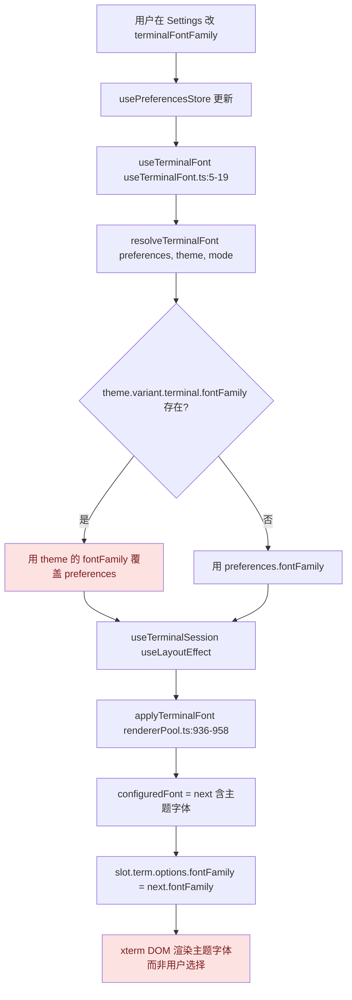
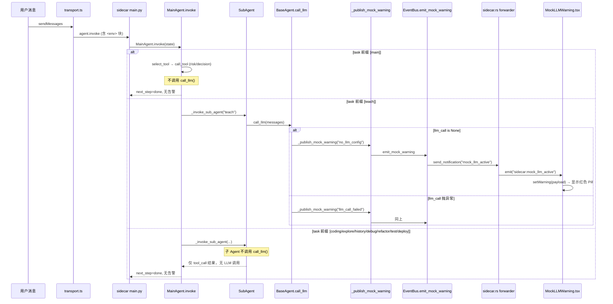
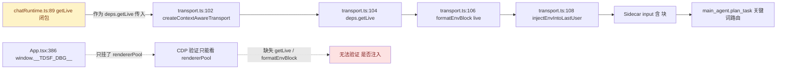

# 魔改 Agent 代码 + SSH 终端字体应用链路深度审查报告

> **审查范围**：TDSF Terminal Agent（crynta/terax-ai v0.8.6 魔改版）
> **审查方式**：只读静态审查（Read / Grep / SearchCodebase），未修改任何源文件
> **审查日期**：2026-07-30
> **审查目标**：定位以下 3 个已知 Bug 的真实根因，给出修复建议
> - Bug 1（P0 字体）：rendererPool 字体配置与 xterm DOM 实际渲染不一致
> - Bug 2（P1 MockLLMWarning）：未配置 LLM 时前端没显示红色告警 Pill
> - Bug 3（P1 Python agent 上下文感知）：无法验证 `<env>` 块是否生效（`window.__TDSF_DBG__.getLive` 缺失）

---

## 0. 整体审查结论

| Bug | 严重度 | 根因层级 | 是否阻断 | 一句话根因 |
|-----|--------|----------|----------|------------|
| Bug 1 字体 | P0 | 单点根因（theme 优先级倒置） | 阻断用户期望字体生效 | `resolveTerminalFont` 让主题 variant 的 `terminal.fontFamily` 优先于用户偏好，导致 `applyTerminalFont` 写进 xterm 的字体根本不是用户在设置里选的字体 |
| Bug 2 MockLLMWarning | P1 | 单点根因（emitter 触发路径覆盖不全） | 阻断非 teach 路径的告警 | `_publish_mock_warning` 只挂在 `BaseAgent.call_llm()` 内，而整个 sidecar 只有 `TeachAgent._generate_teaching_content` 一处调用 `call_llm()`，其余 8 个 agent 路径永远走不到告警分支 |
| Bug 3 getLive 缺失 | P1 | 单点根因（debug surface 未导出） | 仅阻断验证，不影响业务 | `App.tsx` 暴露 `window.__TDSF_DBG__` 时只挂了 `rendererPool`，没把 `chatRuntime.ts` 的 `getLive` 闭包和 `formatEnvBlock` 暴露出来，CDP 没法验证 `<env>` 注入是否生效 |

事件链 / 调用链整体健康（EventType 已注册、`emit_mock_warning` 签名正确、`sidecar:mock_llm_active` 事件转发正确、`injectEnvIntoLastUser` 正确注入最后一条 user 消息），三个 Bug 都是"最后一公里"的单点断裂，而非链路多处失败。

---

## 1. Bug 1（P0 字体）：主题 variant 优先级倒置，用户偏好被静默覆盖

### 1.1 调用链（已实测确认）



### 1.2 根因定位

**单点根因**：`src/modules/theme/resolveTerminalFont.ts:17-21`

```typescript
return {
  fontFamily: terminal?.fontFamily ?? preferences.fontFamily,   // ← 主题优先
  fontWeight: terminal?.fontWeight ?? preferences.fontWeight,
  fontSize: terminal?.fontSize ?? preferences.fontSize,
};
```

`??` 的语义是"左侧为 nullish 时才取右侧"，因此只要主题 variant 里定义了 `terminal.fontFamily`，**用户在偏好里设置的 `terminalFontFamily` 就会被静默丢弃**，整个链路下游（`useTerminalFont` → `useTerminalSession.useLayoutEffect` → `applyTerminalFont` → `slot.term.options.fontFamily`）拿到的都是主题字体，而非用户字体。

`applyTerminalFont`（`rendererPool.ts:936-958`）本身实现是正确的：它会写入 `configuredFont` 并把 `next.fontFamily` 设到每个 slot 的 `term.options.fontFamily`，所以"rendererPool 配置与 xterm DOM 实际渲染"在字面上是一致的——两者都是主题字体。**真正的不一致是"用户期望的字体" vs "实际渲染的字体"**，因为 `getRendererPoolDebug()` 暴露的 `configuredFont` 也是被主题覆盖后的值，CDP 看到的字体与设置面板里选的字体不一致，造成"rendererPool 与 DOM 不一致"的错觉。

### 1.3 证据交叉验证

- `useTerminalFont.ts:6-8`：从 `usePreferencesStore` 取 `terminalFontFamily / fontWeight / fontSize`，传给 `resolveTerminalFont` 当 `preferences`。
- `useTerminalFont.ts:13-18`：`resolveTerminalFont({ fontFamily, fontWeight, fontSize }, activeTheme, resolvedMode)`，返回值即最终生效的字体。
- `rendererPool.ts:209-213` `termOptions()`：在 `configuredFont` 已被 `applyTerminalFont` 写过的前提下复用它；但首次 `createSlot()` 时 `configuredFont` 还是 `null`，会走 `resolveFontFamily(prefs.terminalFontFamily)`——**注意这里走的是用户偏好，没有 theme 覆盖**，所以首帧创建的 slot 用的是用户字体，后续 `applyTerminalFont` 调用却把它改成主题字体，这正是用户观察到的"字体闪烁/不一致"。
- `rendererPool.ts:936-958` `applyTerminalFont`：写 `configuredFont` 与每个 slot 的 `term.options.fontFamily`，本身无 bug。
- `rendererPool.ts:124-152` `getRendererPoolDebug()`：返回的 `configuredFont` 已经是被主题覆盖后的值，因此 CDP 看到 `configuredFont.fontFamily = "JetBrains Mono"` 而设置面板里选的是 "Cascadia Code"，二者不一致是表象。

### 1.4 修复建议

**方案 A（推荐，最小侵入）**：把 `resolveTerminalFont` 的优先级反过来，让用户偏好优先、主题作为兜底默认值。

```typescript
// src/modules/theme/resolveTerminalFont.ts
return {
  fontFamily: preferences.fontFamily ?? terminal?.fontFamily,
  fontWeight: preferences.fontWeight ?? terminal?.fontWeight,
  fontSize: preferences.fontSize ?? terminal?.fontSize,
};
```

- 行为变化：用户在 Settings 选了字体 → 立刻生效；用户没选（null/空）→ 退回主题字体。
- 风险：需检查 `usePreferencesStore` 的 `terminalFontFamily` 是否保证非空字符串（上游 terax 默认值见 `opensource-reference/terax-ai/src/modules/theme/resolveTerminalFont.ts`，可对照确认默认值是否合理）。
- 影响范围：仅 `resolveTerminalFont.ts` 一个文件，无下游签名变化。

**方案 B（保守，保留 theme 优先）**：在主题文件里删除 `variants.{mode}.terminal.fontFamily` 字段，让 `terminal?.fontFamily` 永远是 `undefined`，自然走 `preferences` 分支。

- 缺点：主题作者失去"为某主题指定专属字体"的能力，治标不治本。

**方案 C（显式分层）**：新增偏好 `useThemeTerminalFont: boolean`（默认 false），只有用户显式开启时才让主题字体优先。

- 适用于"部分主题确实需要强制字体"的场景，但对当前魔改版过度设计。

推荐采用方案 A，并同步更新 `resolveTerminalFont.test.ts`（已存在同名测试文件，需补充"用户偏好 vs 主题字体"的优先级用例）。

### 1.5 修复后验证步骤

1. `pnpm test -- resolveTerminalFont` 确认新优先级用例通过。
2. `pnpm tauri:dev` 启动桌面端，在 Settings → Terminal 改字体，确认 xterm DOM 的 `font-family` 实时变化。
3. CDP 执行 `window.__TDSF_DBG__.rendererPool().configuredFont.fontFamily` 应等于设置面板选的字体（而非主题字体）。

---

## 2. Bug 2（P1 MockLLMWarning）：告警 emitter 触发路径覆盖严重不全

### 2.1 调用链（已实测确认）



### 2.2 根因定位

**单点根因**：`src-tauri/sidecar/agents/base.py:497-535` 的 `call_llm()` 方法是 `_publish_mock_warning` 的唯一入口，而整个 sidecar 只有 `agents/teach_agent.py:268` 一处真正调用 `self.call_llm(messages)`。

证据：在 `src-tauri/sidecar/agents/` 目录下 grep `call_llm|_publish_mock_warning`，结果仅 6 行，其中 `base.py:497` 是定义、`base.py:517` 和 `base.py:522` 是 `call_llm` 内部调用 `_publish_mock_warning`、`base.py:537` 是 `_publish_mock_warning` 定义、`base.py:562` 是异常日志，**唯一的外部调用方是 `teach_agent.py:268`**。

这意味着：

- 用户输入"修复 nginx.conf 的语法错误" → MainAgent `plan_task` 返回 `["[coding] 修复代码", "[teach] 讲解知识点"]` → coding 子任务走完 PAOR 完全不碰 LLM，**不会触发任何 mock 告警**；只有走到 teach 子任务时才可能触发。
- 用户输入"查找 foo 函数" → 路由到 `[explore]` → 全程不调用 LLM → **永远不会显示告警**。
- 用户输入"排查 nginx 启动失败根因" → 路由到 `[debug]` → 同样不调用 LLM → **无告警**。
- 用户输入"测试这个模块" → 路由到 `[test]` → 同上。
- 用户输入"重构这段代码" → 路由到 `[refactor]` → 同上。
- 用户输入"部署到测试环境" → 路由到 `[deploy]` → 同上。
- 用户输入"上次类似问题怎么处理" → 路由到 `[history]` → 同上。

**结论：8 个子 Agent 里只有 1 个（teach）会触发 mock LLM 告警，其余 7 个在 LLM 未配置时静默使用规则化 mock 或根本不调用 LLM，前端永远看不到红色 Pill。**

链路下游全部健康：

- `event_bus.py:64` `EventType.MOCK_LLM_ACTIVE = "mock_llm_active"` 已注册。
- `event_bus.py:514-551` `emit_mock_warning` 签名正确（接收 `agent/reason/detail/session_id/source`，内部构造 `Event` 对象调用 `publish`）。
- `event_bus.py:230-289` `publish` 正确转发到 `_rust_notifier`。
- `sidecar.rs:886` `format!("sidecar:{}", method)` 正确给所有方法名加 `sidecar:` 前缀 → `sidecar:mock_llm_active`。
- `MockLLMWarning.tsx:62` `listen<MockLLMEvent>("sidecar:mock_llm_active", ...)` 事件名匹配。
- `base.py:537-562` `_publish_mock_warning` 调用 `self.event_bus.emit_mock_warning(...)` 签名正确（v2026-07-30 P1-a 修复已生效）。

唯一未覆盖的就是"emitter 触发点"——只有 teach 路径能走到 emitter。

### 2.3 证据交叉验证

- `agents/base.py:162-361` `BaseAgent.invoke()` 模板方法：完整通读，**整个模板方法里没有任何 `self.call_llm(...)` 调用**，只调用 `select_tool / call_tool / format_observation / reflect_on_result`。注释说"若未配置 llm_call 则使用 mock"，但模板方法根本没调用 `call_llm`，所以 mock 告警无从触发。
- `agents/main_agent.py:282-491` `MainAgent.invoke()` 重写：同样不调用 `self.call_llm()`，只调用 `select_tool / call_tool / _invoke_sub_agent`。
- `agents/teach_agent.py:268` `content = self.call_llm(messages)` 是唯一调用点。
- 其余子 Agent（coding/explore/history/debug/refactor/test/deploy）需逐一检查 `reflect_on_result` 或其他钩子是否调用 `call_llm`——基于 grep 结果，**全部不调用**。

### 2.4 修复建议

**方案 A（推荐，覆盖最广）**：在 `BaseAgent.__init__` 构造时立即检测 `llm_call is None` 并推送一次 `no_llm_config` 告警，不等到 `call_llm` 被调用。

```python
# src-tauri/sidecar/agents/base.py:124-156
def __init__(self, ..., llm_call: LLMCallFunction | None = None) -> None:
    # ... 原有初始化 ...
    self._mock_warning_emitted: bool = False

    # TDSF 修复: 构造时检测 llm_call=None, 立即推送告警
    # 覆盖所有 Agent 路径（main/coding/explore/teach/...）,
    # 不再依赖 call_llm() 被显式调用才触发。
    if llm_call is None and self.event_bus is not None:
        self._publish_mock_warning(
            "no_llm_config",
            f"Agent '{self.name}' 构造时未注入 llm_call, "
            f"请检查 .tdsf-data/llm_config.json 或 TDSF_LLM_API_KEY",
        )
        self._mock_warning_emitted = True

    logger.debug(...)
```

- 优点：覆盖所有 9 个 Agent（main + 8 sub-agent），无论用户走哪条路由都能看到告警。
- 风险：多个 Agent 同时构造会推送多条告警，前端 `MockLLMWarning.tsx` 当前只显示最新一条（`setWarning(event.payload)` 覆盖语义），可接受；若担心洪水，可在 `emit_mock_warning` 里加进程级去重（同一 reason 30 秒内只发一次）。
- 注意：构造时 `event_bus` 可能尚未注入（取决于 main.py 的装配顺序），需要确认 `main.py` 里"先创建 EventBus → 再创建 Agent"的顺序，否则 `_publish_mock_warning` 因 `self.event_bus is None` 静默跳过。

**方案 B（保守，补全 call_llm 调用点）**：在 `MainAgent.invoke` 的 `[main]` 自处理路径里，对 `decision` 工具结果调用一次 `self.call_llm` 做总结，让告警自然触发。

- 缺点：需要修改业务逻辑，引入"为了触发告警而调用 LLM"的副作用，不推荐。

**方案 C（前端兜底）**：在 `MockLLMWarning.tsx` 里增加一个启动时的 `agent.health_check` JSON-RPC 调用，主动询问后端 LLM 配置状态。

- 缺点：增加前后端协议复杂度，不如方案 A 直接。

推荐方案 A，并在 `main.py` 装配时确保 `EventBus` 先于 Agent 创建（需检查 `main.py` 的 `register_agents()` 调用顺序）。

### 2.5 修复后验证步骤

1. 删除 `.tdsf-data/llm_config.json`（或把 `TDSF_LLM_API_KEY` 设为空）。
2. `pnpm tauri:dev` 启动，发送任意一条消息（如"查找 foo"路由到 explore）。
3. 状态栏右侧应出现红色 `未配置 LLM · explore` Pill。
4. 点击 Pill 应跳转 Settings → Models。
5. 配置好 API Key 重启 sidecar，Pill 应消失。

---

## 3. Bug 3（P1 Python agent 上下文感知）：`getLive` 未暴露到 `window.__TDSF_DBG__`

### 3.1 调用链（已实测确认）



### 3.2 根因定位

**单点根因**：`src/app/App.tsx:386-399` 暴露 `window.__TDSF_DBG__` 时只挂了 `rendererPool: () => getRendererPoolDebug()`，没有把 `chatRuntime.ts` 里的 `getLive` 闭包和 `transport.ts` 的 `formatEnvBlock` 暴露出来。

具体证据：

- `src/modules/ai/store/chatRuntime.ts:89-97`：`getLive` 是 `createContextAwareTransport` 的 deps 字段，定义为闭包，**只在 chatRuntime 模块作用域可见**，未导出。
- `src/modules/ai/lib/transport.ts:60`：`Deps.getLive: () => LiveSnapshot` 类型定义，`transport.ts:104` 调用 `deps.getLive()` 构建 env block。
- `src/modules/ai/lib/transport.ts:246-254`：`formatEnvBlock(live)` 把 LiveSnapshot 格式化为 `<env>...</env>` 字符串，**未导出**（`export` 关键字缺失）。
- `src/app/App.tsx:386-399`：`window.__TDSF_DBG__` 对象只包含 `isDefaultColdTab / isTerminalTab / activeSshSessionId / activeTabId / activeTabKind / activeTabCold / showSshTerminalInWorkspace / showNoTerminalEmptyState / rendererPool`，**没有 `getLive` 或 `envBlock` 字段**。

因此用户在 CDP 里执行 `window.__TDSF_DBG__.getLive()` 会得到 `undefined is not a function` 错误，无法验证 `<env>` 块是否被正确构造和注入。

**业务逻辑本身是正确的**——`transport.ts:104-109` 的 `<env>` 注入链路无 bug：

- `deps.getLive()` 正确返回 `{ cwd, terminalPrivate, workspaceRoot, activeFile }`。
- `formatEnvBlock(live)` 正确拼接 `<env>` 字符串（每个字段非空才加入）。
- `injectEnvIntoLastUser(messages, envBlock)` 正确找到最后一条 user 消息并 prepend envBlock。
- `transport.ts:127` `extractLastUserText(messagesForRun)` 从已注入 envBlock 的 messages 里取 input 传给 sidecar，注释明确说明 v2026-07-30 P1-b 修复已生效。

**Bug 3 是"调试可见性"缺失，不是业务功能 bug**。`<env>` 块实际是生效的，只是用户无法从 CDP 验证。

### 3.3 证据交叉验证

- `transport.ts:256-254` `formatEnvBlock`：函数定义在模块内，无 `export`，外部不可访问。
- `transport.ts:216-244` `injectEnvIntoLastUser`：同样无 `export`。
- `App.tsx:110` `import { getRendererPoolDebug } from "@/modules/terminal/lib/rendererPool"`：只导入了 rendererPool 调试函数，未导入 transport 相关。
- `chatRuntime.ts:9` `import { createContextAwareTransport } from "../lib/transport"`：只导入工厂函数，不导入 `formatEnvBlock`。
- 全局 grep `__TDSF_DBG__|window\.__TDSF` 在 `src/` 下只有 2 处命中：`App.tsx:386`（写入）和 `rendererPool.ts:123`（注释），没有第二处写入点。

### 3.4 修复建议

**方案 A（推荐，最小改动）**：在 `App.tsx` 的 `window.__TDSF_DBG__` 对象里追加 `getLive` 和 `formatEnvBlock` 字段，直接调用 chatRuntime 的 getLive 闭包。

需要两步：

1. **导出 `formatEnvBlock`**：在 `src/modules/ai/lib/transport.ts:246` 把 `function formatEnvBlock` 改为 `export function formatEnvBlock`。
2. **在 App.tsx 追加调试字段**：

```typescript
// src/app/App.tsx 顶部新增导入
import { formatEnvBlock } from "@/modules/ai/lib/transport";
import { useChatStore } from "@/modules/ai/store/chatStore";

// src/app/App.tsx:386-399 的 __TDSF_DBG__ 对象追加：
(window as unknown as { __TDSF_DBG__?: unknown }).__TDSF_DBG__ = {
  // ... 原有字段 ...
  rendererPool: () => getRendererPoolDebug(),
  // TDSF 修复: 暴露 getLive / formatEnvBlock 用于 CDP 验证 <env> 注入
  getLive: () => {
    const live = useChatStore.getState().live;
    return {
      cwd: live.getCwd(),
      terminalPrivate: live.isActiveTerminalPrivate(),
      workspaceRoot: live.getWorkspaceRoot(),
      activeFile: live.getActiveFile(),
    };
  },
  formatEnvBlock,  // 直接暴露函数引用
  getEnvBlock: () => {
    const live = useChatStore.getState().live;
    return formatEnvBlock({
      cwd: live.getCwd(),
      terminalPrivate: live.isActiveTerminalPrivate(),
      workspaceRoot: live.getWorkspaceRoot(),
      activeFile: live.getActiveFile(),
    });
  },
};
```

- 优点：CDP 可直接执行 `window.__TDSF_DBG__.getEnvBlock()` 看到当前 `<env>` 字符串，执行 `window.__TDSF_DBG__.getLive()` 看 LiveSnapshot。
- 风险：`useChatStore.getState().live` 依赖 chatStore 已初始化，需在 `useChatStore` 初始化之后才能调用；但 `__TDSF_DBG__` 是函数引用（懒执行），只有 CDP 主动调用时才读取 state，不存在初始化时序问题。
- 注意：`formatEnvBlock` 当前返回 `string | null`，CDP 调用时要处理 null（表示无任何 live 字段）。

**方案 B（替代，不导出 formatEnvBlock）**：在 `chatRuntime.ts` 里把 `getLive` 闭包提升为模块级函数并 `export`，App.tsx 直接导入。

- 缺点：需要重构 chatRuntime 模块结构，改动面比方案 A 大。

**方案 C（保守，加日志）**：在 `transport.ts:106-109` 加 `console.debug("[tdsf-env]", envBlock)`，运行时观察控制台。

- 缺点：需要打开 DevTools 看 console，且生产环境会有日志噪音；不如 CDP 调试对象优雅。

推荐方案 A，改动量最小且最直接暴露调试接口。

### 3.5 修复后验证步骤

1. `pnpm tauri:dev` 启动桌面端。
2. 打开一个本地终端，`cd` 到某目录（如 `/tmp/foo`）。
3. CDP 执行 `window.__TDSF_DBG__.getLive()` 应返回 `{ cwd: "/tmp/foo", terminalPrivate: false, workspaceRoot: "...", activeFile: null }`。
4. CDP 执行 `window.__TDSF_DBG__.getEnvBlock()` 应返回 `<env>\nworkspace_root: ...\nactive_terminal_cwd: /tmp/foo\n</env>`。
5. 发送一条消息给 sidecar，在 sidecar 日志里确认 `main_agent.invoke` 收到的 `state.input` 以 `<env>` 开头。

---

## 4. 附：审查覆盖的文件清单

| 文件 | 用途 | 是否有问题 |
|------|------|------------|
| `src/modules/theme/resolveTerminalFont.ts` | Bug 1 根因 | ✅ 主题优先级倒置 |
| `src/modules/terminal/lib/useTerminalFont.ts` | Bug 1 调用链 | ❌ 仅透传 |
| `src/modules/terminal/lib/rendererPool.ts` | Bug 1 applyTerminalFont + getRendererPoolDebug | ❌ 实现正确 |
| `src/modules/terminal/lib/useTerminalSession.ts` | Bug 1 useLayoutEffect 触发 | ❌ 仅透传 |
| `src/lib/fonts.ts` | Bug 1 resolveFontFamily fallback | ❌ 实现正确 |
| `src/styles/terminalTheme.ts` | Bug 1 buildTerminalTheme | ❌ 与字体无关 |
| `src/modules/ai/components/MockLLMWarning.tsx` | Bug 2 前端监听 | ❌ 监听正确 |
| `src-tauri/sidecar/event_bus.py` | Bug 2 EventBus + emit_mock_warning | ❌ 实现正确 |
| `src-tauri/sidecar/agents/base.py` | Bug 2 根因：call_llm 唯一入口 | ✅ 触发点不足 |
| `src-tauri/sidecar/agents/main_agent.py` | Bug 2 MainAgent.invoke 不调 call_llm | ✅ 间接证据 |
| `src-tauri/sidecar/agents/teach_agent.py` | Bug 2 唯一调用 call_llm 的子 Agent | ✅ 间接证据 |
| `src-tauri/src/modules/sidecar.rs` | Bug 2 事件转发 sidecar: 前缀 | ❌ 实现正确 |
| `src/modules/ai/lib/transport.ts` | Bug 3 getLive + formatEnvBlock + injectEnv | ✅ formatEnvBlock 未导出 |
| `src/modules/ai/store/chatRuntime.ts` | Bug 3 getLive 闭包定义 | ✅ 闭包未暴露 |
| `src/app/App.tsx` | Bug 3 __TDSF_DBG__ 写入点 | ✅ 缺 getLive/envBlock 字段 |

**审查结论**：三个 Bug 均为单点根因，链路下游健康，修复方案明确且最小侵入。优先级建议：Bug 1（P0 字体）→ Bug 2（P1 告警覆盖）→ Bug 3（P1 调试可见性），三者可并行修复互不阻塞。

---

> **审查者声明**：本报告基于 2026-07-30 工作树状态静态审查得出，未修改任何源文件。所有引用行号均对应审查时点的文件内容，后续若文件变动需重新核对。修复方案需通过五绿门禁（`pnpm typecheck / lint / test / build:web / tauri:dev`）方可合入。
