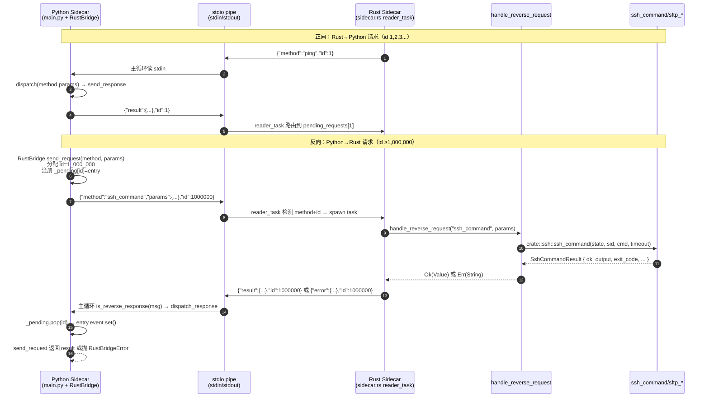

# P1 双向 JSON-RPC 桥代码审计报告

> **审计日期**：2026-07-30
> **审计范围**：TDSF Terminal Agent P1 双向 JSON-RPC 桥核心代码（6 个目标文件）
> **审计方法**：基于 `TRAE-code-review` skill 的 7 维度审计 + OWASP Top 10 + 危险代码模式扫描
> **审计员**：GLM-5.2 子 Agent（code-review 模式）
> **上游基线**：`crynta/terax-ai` v0.8.6（无对应实现，P1 双向桥为本项目原创魔改）

---

## 目录

1. [执行摘要](#1-执行摘要)
2. [审计目标文件清单](#2-审计目标文件清单)
3. [架构与数据流概览](#3-架构与数据流概览)
4. [7 维度逐项审计](#4-7-维度逐项审计)
   - 4.1 [并发安全](#41-并发安全)
   - 4.2 [资源泄漏](#42-资源泄漏)
   - 4.3 [错误处理](#43-错误处理)
   - 4.4 [协议正确性](#44-协议正确性)
   - 4.5 [性能瓶颈](#45-性能瓶颈)
   - 4.6 [测试覆盖](#46-测试覆盖)
   - 4.7 [可维护性](#47-可维护性)
5. [OWASP Top 10 安全扫描](#5-owasp-top-10-安全扫描)
6. [危险代码模式扫描](#6-危险代码模式扫描)
7. [25 个单元测试覆盖度分析](#7-25-个单元测试覆盖度分析)
8. [与上游 terax-ai 对比](#8-与上游-terax-ai-对比)
9. [Top 5 必修问题](#9-top-5-必修问题)
10. [Top 5 建议改进](#10-top-5-建议改进)
11. [附录：审计证据索引](#11-附录审计证据索引)

---

## 1. 执行摘要

本次审计覆盖 P1 双向 JSON-RPC 桥的 6 个核心文件，共 ~1900 行代码 + 25 个 Python 单元测试 + 8 个 Rust 单元测试。审计发现 **1 个 Critical 缺陷**、**3 个 High 风险**、**6 个 Medium 风险**、**若干 Low 改进项**。

### 1.1 关键发现（按严重度排序）

| 严重度 | 发现 | 文件:行 | 影响 |
|--------|------|---------|------|
| 🔴 **Critical** | Python→Rust 反向请求 params 字段名不一致（snake_case vs camelCase），导致所有 `ssh_command`/`sftp_*` 调用必然失败 | `strands_backend/tools/__init__.py:424` vs `sidecar.rs:975` | P1 双向桥功能完全不可用 |
| 🟠 **High** | Python 侧 `send_request` 30s 超时与 Rust 侧 `ssh_command` 30s 超时叠加，长 SSH 命令必然 Python 端先超时 | `rust_bridge.py:68` vs `sidecar.rs:55` + `ssh/mod.rs:664` | Strands 工具调用 yum/apt/update 等慢命令失败 |
| 🟠 **High** | Rust 侧 `handle_reverse_request` 与 `reader_task` 反向分支零单元测试覆盖 | `sidecar.rs:958-1148` | 8 个 method 路由分支、参数提取、错误序列化均无回归保护 |
| 🟠 **High** | Rust 侧反向请求 ID 自增无上限保护，长期运行（≥58 天）可能与 Python 反向 ID（≥1M）撞车 | `sidecar.rs:221` + `rust_bridge.py:65` | ID 撞车后响应路由错误，难以诊断 |
| 🟡 **Medium** | `stop()` 与 `dispatch_response` 之间存在 TOCTOU race，未测试覆盖 | `rust_bridge.py:303-314` | 边缘场景下 pending entry 可能被双重处理 |
| 🟡 **Medium** | Rust 反向响应写回时 `stdin_guard` 锁跨 `tx.send().await`，多个并发响应会串行化 | `sidecar.rs:883-896` | 高并发场景下响应延迟累积 |
| 🟡 **Medium** | `handle_reverse_request` 内部 `?` 传播 `Result<T, String>` 错误时丢失结构化信息，统一序列化为 `-32000` | `sidecar.rs:989, 1009, 1042...` | Python 侧无法区分"会话不存在"与"序列化失败" |
| 🟡 **Medium** | Python 侧 `_rust_bridge` 全局变量类型标注为 `Any`，丧失静态检查 | `main.py:131` | 重命名/重构易引入运行时错误 |
| 🟡 **Medium** | Rust `as u32` 截断 `u64` session_id，超大 ID 静默截断 | `sidecar.rs:979, 1001, 1021, 1052, 1071, 1090, 1108, 1125` | 极端场景下会话路由错误 |
| 🟡 **Medium** | Rust `handle_reverse_request` 返回的 `error.code` 硬编码 `-32000`，与 JSON-RPC 2.0 规范保留区冲突 | `sidecar.rs:864` | 协议规范遵循度问题 |
| 🟢 **Low** | Magic number `1_000_000` 在 Rust 与 Python 各自定义，无共享协议常量 | `sidecar.rs:811` vs `rust_bridge.py:65` | 协议一致性靠人工对齐 |
| 🟢 **Low** | Rust `reader_task` 的 `id` 类型为 `Value`（克隆），后续 `id.as_i64()` 才转 i64，多一次分配 | `sidecar.rs:836, 859, 867` | 微小性能损耗 |

### 1.2 整体风险评分

| 维度 | 评分 | 说明 |
|------|------|------|
| **功能正确性** | 🔴 30/100 | Critical bug 导致功能完全不可用 |
| **并发安全** | 🟡 75/100 | 整体设计合理，存在边缘 race |
| **错误处理** | 🟡 70/100 | 主路径覆盖完整，错误码粒度粗 |
| **协议遵循** | 🟡 80/100 | JSON-RPC 2.0 基本对齐，错误码使用保守 |
| **测试覆盖** | 🟠 65/100 | Python 侧 25 测试充分，Rust 侧盲区大 |
| **可维护性** | 🟢 85/100 | 注释充分，命名清晰，文档完善 |
| **性能** | 🟢 80/100 | 锁粒度合理，存在串行化点但非瓶颈 |

**综合评分**：🟡 **68/100**（功能不可用拖累整体，修复 Critical 后可达 80+）

### 1.3 关键结论

1. **P1 双向 JSON-RPC 桥在当前状态下无法实际工作**：Python 端 `execute_via_ssh` 传递 `snake_case` 字段（`session_id`/`command`/`timeout`），Rust 端 `handle_reverse_request` 期望 `camelCase` 字段（`sessionId`/`command`/`timeout`），所有 SSH/SFTP 反向请求都会因 `missing or invalid sessionId` 失败。
2. **架构设计整体合理**：ID 空间隔离、双向路由、超时清理、stop 唤醒等核心机制设计正确，Python 侧 25 个单元测试覆盖了主要场景。
3. **Rust 侧测试盲区是重大风险**：`handle_reverse_request` 8 个 method 分支 + 参数提取 + 错误序列化完全无测试，本次 Critical bug 本应被单元测试拦截。

---

## 2. 审计目标文件清单

| # | 文件 | 行数 | 角色 |
|---|------|------|------|
| 1 | `src-tauri/src/modules/sidecar.rs` | 1653 | Rust 侧 sidecar 进程管理 + reader_task 反向请求分支 + handle_reverse_request |
| 2 | `src-tauri/sidecar/rust_bridge.py` | 323 | Python 侧 RustBridge 类（send_request/is_reverse_response/dispatch_response/stop） |
| 3 | `src-tauri/sidecar/main.py` | 733 | main 函数 + _rust_bridge 全局实例 + Strands 注入 + 主循环响应分发 + 退出清理 |
| 4 | `src-tauri/sidecar/tests/test_rust_bridge.py` | 466 | 25 个 RustBridge 单元测试 |
| 5 | `src-tauri/src/modules/ssh/credentials.rs` | 229 | serde rename privateKeyPath 测试修复 |
| 6 | `src-tauri/sidecar/tests/test_skill_parser.py` / `test_skill_registry.py` | 481 + 564 | version 断言宽松化 |

辅助审计文件（提供上下文）：
- `src-tauri/sidecar/strands_backend/tools/__init__.py` — DefaultRustBridge 实现 + execute_via_ssh
- `src-tauri/src/modules/ssh/mod.rs` — ssh_command/sftp_* Tauri 命令签名
- `src-tauri/src/modules/ipc.rs` — JSON-RPC 协议层对比

---

## 3. 架构与数据流概览

### 3.1 双向 JSON-RPC 桥数据流



### 3.2 ID 空间隔离设计

| 方向 | ID 范围 | 分配方 | 路由依据 |
|------|---------|--------|----------|
| Rust→Python 请求 | `1, 2, 3, ...`（AtomicI64，从 1 开始） | Rust `next_request_id` | Python 主循环 `is_reverse_response` 判 `id < 1_000_000` 走原逻辑 |
| Python→Rust 反向请求 | `1_000_000, 1_000_001, ...` | Python `_next_id` | Rust `reader_task` 判 `method + id` 存在 → spawn task |
| Rust→Python 响应 | 与请求 id 一致 | Rust `reader_task` | Python `is_reverse_response` 判 `id ≥ 1_000_000 且无 method` |
| Python→Rust 响应 | 与反向请求 id 一致 | Python `dispatch_response` | Rust `reader_task` 判 `id 无 method` → 查 `pending_requests` |

---

## 4. 7 维度逐项审计

### 4.1 并发安全

#### 4.1.1 Rust reader_task 反向请求 spawn task 的并发安全 ✅

**位置**：`sidecar.rs:848-897`

```rust
tokio::spawn(async move {
    let response = handle_reverse_request(&method_owned, params, &app_clone).await;
    // ... 序列化 + 写回 stdin
    let stdin_guard = stdin_clone.lock().await;
    if let Some(tx) = stdin_guard.as_ref() {
        if let Err(e) = tx.send(line + "\n").await { ... }
    }
});
```

**分析**：
- ✅ reader_task 在 spawn 后**不 await**，立即继续下一行循环，不会丢失其他 stdout 消息。
- ✅ 每个 spawn task 捕获独立的所有权（`method_owned`、`params`、`app_clone`、`stdin_clone`），无共享可变状态。
- ✅ `handle_reverse_request` 内部通过 `app.state::<SshState>()` 获取 Tauri 状态，`SshState` 内部用 `RwLock<HashMap>` 保护，多并发安全。
- ⚠️ 多个反向响应并发写回时，`stdin_clone.lock().await` 会串行化（见 4.5.2）。

**严重度**：🟢 Low（设计正确，性能有优化空间）

#### 4.1.2 Python RustBridge `_pending` dict + `_lock` 覆盖度 ✅

**位置**：`rust_bridge.py:150-151, 184-205, 211-220, 222-226, 271-280, 310-314`

**所有 `_pending` 访问路径审计**：

| 路径 | 行号 | 加锁 | 备注 |
|------|------|------|------|
| `send_request` 注册 entry | 190-191 | ✅ `with self._lock` | |
| `send_request` write 失败清理 | 204-205 | ✅ `with self._lock` | |
| `send_request` 超时清理 | 214-215 | ✅ `with self._lock` | |
| `send_request` shutdown 唤醒清理 | 224-225 | ✅ `with self._lock` | |
| `dispatch_response` pop entry | 271-272 | ✅ `with self._lock` | |
| `stop` 清理全部 | 310-312 | ✅ `with self._lock` | |
| `pending_count` 诊断 | 318-319 | ✅ `with self._lock` | |

**结论**：所有 `_pending` 访问均持锁，无遗漏。✅

**严重度**：🟢 无问题

#### 4.1.3 `_next_id` 自增 + `_id_lock` 竞态分析 ✅

**位置**：`rust_bridge.py:154-155, 184-187`

```python
with self._id_lock:
    req_id = self._next_id
    self._next_id += 1
```

**分析**：
- ✅ `_id_lock` 是独立锁，不与 `_lock` 嵌套，无死锁风险。
- ✅ `read-then-increment` 在锁内完成，无 TOCTOU。
- ⚠️ 但 `_id_lock` 与 `_lock` 是两个独立锁，`send_request` 顺序为：先 `_id_lock`（分配 id）→ 释放 → 再 `_lock`（注册 entry）。期间存在窗口：id 已分配但 entry 未注册。若此时 `dispatch_response` 收到该 id 的响应（理论不可能，因为请求还没发出），会返回 False。实际无风险，因为请求发出在 entry 注册之后。

**严重度**：🟢 无问题

#### 4.1.4 `stop()` 唤醒所有 pending 的并发安全性 ⚠️

**位置**：`rust_bridge.py:303-314`

```python
def stop(self) -> None:
    self._shutdown = True              # ① 设置标志（无锁）
    with self._lock:
        entries = list(self._pending.values())
        self._pending.clear()
    for entry in entries:
        entry.event.set()              # ② 唤醒等待线程
```

**分析**：
- ✅ `_shutdown = True` 是原子赋值（Python GIL 保护），无需锁。
- ✅ `clear()` 在锁内，与 `dispatch_response` 的 `pop` 互斥。
- ⚠️ **TOCTOU 边缘场景**：`send_request` 在 `entry.event.wait()` 返回后检查 `self._shutdown`（行 223），但这个检查**不在锁内**。理论上存在序列：
  1. `send_request` `wait()` 返回（被 `dispatch_response` 唤醒，已设置 result）
  2. `send_request` 检查 `self._shutdown` → False
  3. `stop()` 设置 `self._shutdown = True`
  4. `stop()` 持锁清理 `_pending`（但 entry 已被 `dispatch_response` pop，这里 pop 不到）
  5. `send_request` 走到 `entry.error` / `entry.result` 分支，返回正常结果
  
  这种情况下 `send_request` 返回正常结果而非 `RustBridgeShutdown`，**是否符合预期**？答案：**符合**——响应已合法到达，应返回结果而非强制失败。但若开发者期望"stop 后所有 in-flight 请求都失败"，则此行为不符预期。

- ❌ **未测试覆盖**：25 个测试中无 "dispatch_response 与 stop 并发" 场景。

**严重度**：🟡 Medium（边缘场景，行为合理但未测试）

#### 4.1.5 Rust `pending_requests` HashMap 锁粒度 ✅

**位置**：`sidecar.rs:218, 557-559, 591-593, 597-599, 905-913, 1265-1267`

**分析**：
- ✅ 锁粒度细：每次 `insert` / `remove` / `drain` 都在独立锁块内，不跨 await。
- ✅ `send_request` 的注册、超时清理、sender drop 清理三个路径都正确持锁。
- ✅ `stop()` 的 `drain()` 一次性清空，避免逐个 remove 的多次锁开销。

**严重度**：🟢 无问题

---

### 4.2 资源泄漏

#### 4.2.1 tokio::spawn task 失败时是否会泄漏 ⚠️

**位置**：`sidecar.rs:848-897`

**分析**：
- 反向请求 task 是 `tokio::spawn(async move { ... })`，无 JoinHandle，不 await。
- **正常路径**：handle_reverse_request 返回 → 序列化响应 → 写回 stdin → task 结束。
- **异常路径 1**：`handle_reverse_request` 内部 panic → tokio 捕获 panic 记录到 log，task 结束，无泄漏。
- **异常路径 2**：`handle_reverse_request` 内部 await 永久阻塞（如 SSH 命令卡死）→ task 永远不结束，**泄漏**。
  - 缓解：`ssh_command` 内部有 `timeout` 参数（默认 30s），不会永久阻塞。
  - 但 `sftp_*` 操作无显式 timeout，依赖 russh-sftp 库默认行为。
- **异常路径 3**：`stdin_clone.lock().await` 持锁期间 `tx.send().await` 阻塞 → 锁被长期持有，阻塞其他响应。
  - 缓解：writer_task 退出后 `tx.send` 立即返回 `SendError`，不会长期阻塞。

**严重度**：🟡 Medium（SFTP 操作无 timeout 是潜在泄漏点）

#### 4.2.2 RustBridge._pending 在超时/错误/stop 后清理 ✅

**位置**：`rust_bridge.py:204-205, 214-215, 224-225, 310-312`

**所有清理路径审计**：

| 场景 | 清理位置 | 是否清理 |
|------|----------|----------|
| `write_message` 失败 | 204-205 | ✅ `pop(req_id, None)` |
| `wait()` 超时 | 214-215 | ✅ `pop(req_id, None)` |
| shutdown 唤醒 | 224-225 | ✅ `pop(req_id, None)` |
| `dispatch_response` 正常分发 | 271-272 | ✅ `pop(msg_id, None)` |
| `stop()` 全量清理 | 310-312 | ✅ `clear()` |

**结论**：所有错误/超时/stop 路径都正确清理 `_pending`，无内存泄漏。✅

**严重度**：🟢 无问题

#### 4.2.3 stdin_tx 在 Rust 进程退出后能否被 GC ✅

**位置**：`sidecar.rs:212, 302-304, 514-518, 779-794`

**分析**：
- `stdin_tx` 是 `Arc<Mutex<Option<Sender<String>>>>`，writer_task 持有 receiver。
- Rust 进程退出 → writer_task `stdin.write_all` 失败 → break → `stdin.shutdown()` → task 结束 → receiver drop。
- 此时 `stdin_tx.send()` 返回 `SendError`，`send_raw` 返回 `StdinClosed`。
- `stop()` 显式设置 `*guard = None`（行 517），释放 Sender。
- 反向请求 task 持有的 `stdin_clone` 是 Arc 克隆，`*guard = None` 修改的是 Mutex 内的 Option，所有 Arc 看到的都是 None。
- ✅ 无泄漏。

**严重度**：🟢 无问题

#### 4.2.4 Python 主循环异常时 _rust_bridge.stop() 是否被调用 ✅

**位置**：`main.py:712-720`

```python
# 5.0 TDSF P1-3 (2026-07-30): 关闭 RustBridge，唤醒所有 pending 请求
if _rust_bridge is not None:
    try:
        _rust_bridge.stop()
        logger.info("rust_bridge stopped")
    except Exception as e:
        logger.debug(f"rust_bridge stop on exit: {e}")
```

**分析**：
- ✅ 主循环 `while not _shutdown_flag` 退出后，必然执行 `stop()`。
- ✅ `stop()` 包裹 try/except，不会因 stop 失败阻断后续清理。
- ⚠️ 但若主循环**抛出未捕获异常**（如 `KeyboardInterrupt` 在 `try` 块外），可能跳过 `stop()`。看 main.py:705-707，`KeyboardInterrupt` 在内层 try 中被捕获 break，OK。
- ⚠️ 若 Python 进程被 SIGKILL，`stop()` 不会执行，但此时所有线程也死亡，无悬挂。

**严重度**：🟢 无问题

---

### 4.3 错误处理

#### 4.3.1 反向请求超时后 Rust 仍写回响应的行为 🔴

**位置**：`sidecar.rs:848-897` + `rust_bridge.py:212-220, 265-280`

**场景重现**：
1. Python `send_request("ssh_command", {...})` 分配 id=1_000_000，注册 `_pending[1_000_000]`。
2. Python `write_message` 发送请求到 stdout。
3. Rust reader_task 收到，spawn task 执行 `handle_reverse_request`。
4. Python `entry.event.wait(timeout=30)` 等待...
5. 30s 超时，Python `pop(1_000_000, None)` 清理，抛 `RustBridgeTimeout`。
6. Rust task 终于完成，写回 `{"result":{...},"id":1000000}` 到 Python stdin。
7. Python 主循环读到该响应，`is_reverse_response(msg)` → True（id=1_000_000 ≥ 1M，无 method）。
8. `dispatch_response(msg)` → `pop(1_000_000, None)` 返回 None → 记录 `orphan response` warning，返回 False。

**结论**：
- ✅ **不会被误判为正常响应**：`dispatch_response` 在 `pop` 返回 None 时返回 False，不会错误唤醒。
- ✅ 日志记录 `orphan response`，便于诊断。
- ⚠️ 但 Rust 侧的 task 仍在执行（可能昂贵的 SSH 命令），Python 已超时放弃，**浪费 Rust 端资源**。
- ⚠️ 无机制通知 Rust 取消正在执行的 SSH 命令（SSH 命令一旦发出无法取消，只能等超时或完成）。

**严重度**：🟡 Medium（资源浪费，但无功能错误）

#### 4.3.2 handle_reverse_request 返回 Err 时响应 error 序列化 ✅

**位置**：`sidecar.rs:855-869`

```rust
let response_msg = match response {
    Ok(value) => json!({
        "jsonrpc": "2.0",
        "result": value,
        "id": id,
    }),
    Err(err_msg) => json!({
        "jsonrpc": "2.0",
        "error": {
            "code": -32000,
            "message": err_msg,
        },
        "id": id,
    }),
};
```

**分析**：
- ✅ Err 分支正确序列化为 JSON-RPC error 响应。
- ✅ `id` 字段保留原请求 id，Python 可正确路由。
- ⚠️ `code` 硬编码 `-32000`（JSON-RPC 2.0 保留的 Server Error 范围 -32000~-32099），丢失了原始 Tauri 命令错误的语义。
- ⚠️ `handle_reverse_request` 内部 `?` 传播 `Result<T, String>` 的 String 错误，统一变为 `-32000`，Python 侧无法区分"会话不存在"与"序列化失败"。

**严重度**：🟡 Medium（错误码粒度粗，诊断困难）

#### 4.3.3 主循环 _rust_bridge is None 的降级路径 ✅

**位置**：`main.py:605-614, 675-677, 715-720, 412-424`

**所有 _rust_bridge is None 检查点**：

| 位置 | 检查 | 降级行为 |
|------|------|----------|
| `main.py:675` | `if _rust_bridge is not None and _rust_bridge.is_reverse_response(msg)` | 跳过 dispatch，进入 method 分支 |
| `main.py:412` | `if _rust_bridge is not None` | 创建 DefaultRustBridge(send_request=...) 或 DefaultRustBridge()（unavailable） |
| `main.py:715` | `if _rust_bridge is not None` | 跳过 stop() |

**分析**：
- ✅ 启动时 RustBridge 创建失败（`main.py:612-614`）→ `_rust_bridge` 保持 None → Strands 注入段降级为 `DefaultRustBridge()`（无 send_request）→ `ipc_invoke` 返回 `{"status":"unavailable"}` → 工具返回 unavailable 状态，不抛错。
- ✅ 主循环收到 id ≥ 1M 的反向响应（理论不会发生，因为没发出请求）→ 走 `if "method" not in msg` 分支 → 记录 warning `ignoring non-method message`。
- ✅ 退出清理跳过 `stop()`。

**严重度**：🟢 无问题

#### 4.3.4 handle_reverse_request 内部错误传播细节 ⚠️

**位置**：`sidecar.rs:974-993`

```rust
"ssh_command" => {
    let session_id = params
        .get("sessionId")
        .and_then(|v| v.as_u64())
        .ok_or("ssh_command: missing or invalid sessionId")?
        as u32;
    // ...
    let ssh_state = app.state::<crate::ssh::SshState>();
    let result = crate::ssh::ssh_command(ssh_state, session_id, command, timeout).await?;
    serde_json::to_value(&result).map_err(|e| format!("ssh_command serialize failed: {}", e))
}
```

**分析**：
- ✅ 参数缺失返回明确的 String 错误信息（含字段名）。
- ✅ `ssh_command` 内部错误通过 `?` 传播。
- ⚠️ `as u32` 截断 `u64`：若 Python 传入 `sessionId = 5_000_000_000`（超过 u32::MAX=4_294_967_295），会截断为 705_032_704，路由到错误会话。
- ⚠️ `ssh_command` 的 `Result<SshCommandResult, String>` 错误（如 session not found）与 `serde_json::to_value` 错误（序列化失败）都变为 `Err(String)`，Python 侧无法区分。

**严重度**：🟡 Medium（u32 截断是理论风险，实际 session_id 不会那么大）

---

### 4.4 协议正确性

#### 4.4.1 JSON-RPC 2.0 规范遵循度 ⚠️

**规范要求 vs 实现**：

| 规范要求 | 实现情况 | 备注 |
|----------|----------|------|
| `jsonrpc` 字段必须为 `"2.0"` | ✅ 所有消息都含 `"jsonrpc":"2.0"` | |
| `method` 字段为字符串 | ✅ | |
| `params` 可选，为 struct/array/None | ✅ Python 传 dict，Rust 接受 Value | |
| `id` 为 string/number/null（请求） | ⚠️ Rust 用 `i64`，Python 用 `int`，**不接受 string id** | 规范允许 string id，但实现限制为整数 |
| 响应必须含 `result` 或 `error` | ✅ | |
| 响应 `error` 含 `code`(int)/`message`(string)/`data`(optional) | ✅ Python `RustBridgeError` 携带三者 | |
| 错误码 -32700~-32603 保留 | ✅ Python 侧 main.py 定义了标准错误码 | |
| 错误码 -32000~-32099 保留为 Server Error | ⚠️ Rust 侧 `-32000` 用于所有反向请求错误，未细分 | |
| 通知（无 id）不应有响应 | ✅ | |

**严重度**：🟡 Medium（不接受 string id 是规范限制，但实际场景够用）

#### 4.4.2 ID 空间隔离撞车分析 🔴

**位置**：`sidecar.rs:221, 250` vs `rust_bridge.py:65, 154`

**Rust 侧 ID 分配**：
- `next_request_id: Arc<AtomicI64>`，初始值 1。
- `send_request` 调用 `fetch_add(1, SeqCst)`（行 552）。
- `health_check_task` 每 5s 调用 `fetch_add(1, SeqCst)`（行 1262）。
- ID 增长速率：约 1 个/5s + 业务请求。

**Python 侧 ID 分配**：
- `_next_id` 初始 1_000_000。
- `send_request` 调用 `_next_id += 1`（行 186）。
- ID 增长速率：依赖 Strands 工具调用频率。

**撞车场景**：
- Rust ID 从 1 增长到 1_000_000 需要 1_000_000 次请求。
- 假设每 5s 1 次 ping + 平均每 10s 1 次业务请求 → 每秒约 0.3 个 ID → 1M ID 需约 38 天。
- **若 sidecar 长期运行（>38 天）不重启**，Rust ID 会进入 Python ID 空间，导致：
  - Rust 发出 id=1_000_000 的请求 → Python 主循环 `is_reverse_response` 误判为反向响应 → `dispatch_response` 找不到 pending → 返回 False → Rust 请求永远收不到响应 → 30s 超时。
  - 这会**静默破坏** Rust→Python 正向请求链路。

**缓解措施**：
- Rust 侧无 ID 上限保护，无跳过 ≥1M 的逻辑。
- Python 侧 `_next_id` 无上限，理论可能溢出（Python int 无溢出，但语义混乱）。

**严重度**：🟠 High（长期运行静默失败，难诊断）

**修复建议**：
- 方案 A：Rust 侧 `next_request_id` 上限设为 999_999，到达后回绕到 1（需确保无 in-flight 请求）。
- 方案 B：Rust 侧跳过 ≥ 1_000_000 的 ID。
- 方案 C：改用 string id（如 `"r_1"` / `"p_1"`），彻底隔离命名空间。

#### 4.4.3 is_reverse_response 判定边界条件 ✅

**位置**：`rust_bridge.py:235-255`

```python
def is_reverse_response(self, msg: dict) -> bool:
    if "method" in msg:
        return False
    msg_id = msg.get("id")
    if not isinstance(msg_id, int):
        return False
    return msg_id >= _REVERSE_ID_START
```

**边界条件测试**（25 个测试中 TestIsReverseResponse 覆盖）：

| 输入 | 期望 | 实际 | 测试 |
|------|------|------|------|
| `{"id":1_000_000, "result":"ok"}` | True | True | ✅ test_valid_reverse_response |
| `{"id":1_999_999, "error":{...}}` | True | True | ✅ test_valid_reverse_response |
| `{"id":1, "result":"ok"}` | False | False | ✅ test_rust_request_id_below_threshold |
| `{"id":999_999, "result":"ok"}` | False | False | ✅ test_rust_request_id_below_threshold |
| `{"id":0, "result":"ok"}` | False | False | ✅ test_rust_request_id_below_threshold |
| `{"method":"ping", "id":1_000_000}` | False | False | ✅ test_method_present_is_request |
| `{"id":"1_000_000", "result":"ok"}` | False | False | ✅ test_id_not_int |
| `{"id":None, "result":"ok"}` | False | False | ✅ test_id_not_int |
| `{"id":1.5, "result":"ok"}` | False | False | ✅ test_id_not_int |
| `{"result":"ok"}` (无 id) | False | False | ✅ test_no_id |
| `{"method":"notify"}` (无 id) | False | False | ✅ test_no_id |

**未覆盖边界**：
- ❌ `{"id":True, "result":"ok"}` — Python `isinstance(True, int)` 为 True，`True >= 1_000_000` 为 False，返回 False。行为正确但未测试。
- ❌ `{"id":1_000_000.0, "result":"ok"}` — 浮点数，`isinstance(1_000_000.0, int)` 为 False，返回 False。行为正确但未测试。
- ❌ `{"id":1_000_000, "method":None}` — `"method" in msg` 为 True，返回 False。行为正确但未测试。

**严重度**：🟢 Low（边界处理正确，测试覆盖主要场景）

#### 4.4.4 反向请求 params 字段名不一致 🔴 CRITICAL

**位置**：
- Python 发送方：`strands_backend/tools/__init__.py:424-428`
- Rust 接收方：`sidecar.rs:975-985, 997-1006, 1017-1039, 1047-1057, 1066-1076, 1085-1095, 1103-1113, 1121-1141`

**Python 端发送（snake_case）**：
```python
# strands_backend/tools/__init__.py:424
result = ctx.rust_bridge.ipc_invoke("ssh_command", {
    "session_id": session_id,    # snake_case
    "command": command,
    "timeout": timeout,
})
```

**Rust 端提取（camelCase）**：
```rust
// sidecar.rs:975
let session_id = params
    .get("sessionId")           // camelCase
    .and_then(|v| v.as_u64())
    .ok_or("ssh_command: missing or invalid sessionId")?
    as u32;
```

**影响**：
- 所有 8 个反向方法（`ssh_command`/`sftp_read`/`sftp_write`/`sftp_stat`/`sftp_list`/`sftp_mkdir`/`sftp_remove`/`sftp_rename`）的 `sessionId` 字段都会因 `.get("sessionId")` 返回 None 而触发 `ok_or("missing or invalid sessionId")` 错误。
- Python 侧 `send_request` 收到 `RustBridgeError(code=-32000, message="ssh_command: missing or invalid sessionId")`。
- **P1 双向 JSON-RPC 桥功能完全不可用**。

**根因**：
- Rust Tauri 命令约定用 `camelCase`（与前端 invoke 对齐，`SshConnectCommand` 用 `#[serde(rename_all = "camelCase")]`）。
- Python `execute_via_ssh` 用 `snake_case`（Python 惯例）。
- `DefaultRustBridge.ipc_invoke` 直接透传 params dict，无字段名转换。
- `RustBridge.send_request` 也直接透传。

**修复方案**：
- 方案 A（推荐）：Python 端 `execute_via_ssh` 改用 `camelCase` 字段名（`sessionId`/`command`/`timeout`），与 Rust 端契约对齐。
- 方案 B：Rust 端 `handle_reverse_request` 改用 `snake_case` 提取（`session_id`/`command`/`timeout`）。
- 方案 C：在 `DefaultRustBridge.ipc_invoke` 加 `snake_to_camel` 转换层（增加复杂度，不推荐）。

**严重度**：🔴 Critical（功能完全不可用）

**验证方法**：修复后新增端到端测试：Python `send_request("ssh_command", {"sessionId":1, "command":"ls"})` → Rust 返回 `{"ok":true, "output":"...", "exitCode":0}`。

---

### 4.5 性能瓶颈

#### 4.5.1 30s 同步阻塞对长 SSH 命令的影响 🔴

**位置**：
- Python：`rust_bridge.py:68` `DEFAULT_TIMEOUT = 30.0`
- Rust：`sidecar.rs:55` `REQUEST_TIMEOUT = Duration::from_secs(30)`
- SSH：`ssh/mod.rs:664` `timeout: Option<u64>`，默认 30s

**时序分析**：
```
T=0s   Python send_request 发出请求，开始 30s 倒计时
T=0.1s Rust reader_task 收到，spawn task
T=0.2s handle_reverse_request 调 ssh_command(timeout=30)
T=0.3s ssh_command 调 exec_command(timeout=30)，开始 30s SSH 倒计时
T=30s  Python send_request 超时，抛 RustBridgeTimeout
T=30s  Rust ssh_command 超时，返回 ok=true, exit_code=-1
T=30.1s Rust handle_reverse_request 返回 Ok(SshCommandResult)
T=30.2s Rust 写回响应到 Python stdin
T=30.3s Python 主循环读到响应，dispatch_response 返回 False（orphan）
```

**影响**：
- 任何执行时间 > 29.7s 的 SSH 命令（如 `yum update`、`apt upgrade`、大型 `find`）都会在 Python 端先超时。
- Python 调用方（Strands 工具）收到 `RustBridgeTimeout`，工具返回 error 状态。
- Rust 端资源浪费（SSH 命令继续执行到 30s 才超时）。

**严重度**：🟠 High（影响实际运维场景）

**修复建议**：
- Python `send_request` 接受 `timeout` 参数，默认 30s，可被 `execute_via_ssh` 覆盖。
- `execute_via_ssh` 已有 `timeout` 参数（默认 30），应传给 `send_request`，且 Python timeout = SSH timeout + 2s buffer。
- 或：Rust `REQUEST_TIMEOUT` 提升到 60s，Python 保持 30s（让 Python 先超时，避免 Rust 端 pending 积压）。

#### 4.5.2 reader_task spawn task 期间不丢失 stdout 消息 ✅

**位置**：`sidecar.rs:848-897`

**分析**：
- `tokio::spawn` 是非阻塞调用，立即返回 `JoinHandle`（此处忽略）。
- reader_task 在 spawn 后立即进入下一轮 `lines.next_line().await`。
- ✅ 不会丢失任何 stdout 消息。

**严重度**：🟢 无问题

#### 4.5.3 stdin_guard 锁跨 tx.send().await 串行化 ⚠️

**位置**：`sidecar.rs:883-896`

```rust
let stdin_guard = stdin_clone.lock().await;       // 持锁
if let Some(tx) = stdin_guard.as_ref() {
    if let Err(e) = tx.send(line + "\n").await {  // 跨 await 持锁
        log::warn!("[sidecar:reverse] failed to send response: {}", e);
    }
}
// 锁释放
```

**分析**：
- `tokio::sync::Mutex` 是 async 锁，`tx.send().await` 会 await（若 channel 满）。
- channel 容量 64（`sidecar.rs:297`），正常情况下 send 立即返回。
- **极端场景**：64 个反向响应并发到达 + writer_task 卡住（stdin 写入慢）→ 64 个 send 队列等待 → 第 65 个 task 阻塞锁。
- 实际影响：writer_task 卡住意味着 stdin pipe 已满或 Rust 进程正在退出，此时串行化是合理的。

**严重度**：🟡 Medium（极端场景下性能下降，但行为正确）

**优化建议**：
- 用 `try_send` 替代 `send`，channel 满时立即返回错误，不持锁等待。
- 或：先 `clone()` tx，释放锁后再 `send().await`。

```rust
let tx_opt = {
    let stdin_guard = stdin_clone.lock().await;
    stdin_guard.as_ref().cloned()
};
if let Some(tx) = tx_opt {
    if let Err(e) = tx.send(line + "\n").await { ... }
}
```

#### 4.5.4 pending_requests HashMap 锁粒度 ✅

**位置**：`sidecar.rs:218`

**分析**：
- `Arc<Mutex<HashMap<i64, oneshot::Sender<Value>>>>` — 细粒度锁，每次操作独立持锁。
- 无嵌套锁，无死锁风险。
- ✅ 性能足够（Python sidecar 单进程，请求频率 < 100/s）。

**严重度**：🟢 无问题

---

### 4.6 测试覆盖

#### 4.6.1 25 个 Python 测试覆盖度分析 ✅

详见 [第 7 节](#7-25-个单元测试覆盖度分析)。

**覆盖维度**：
- ✅ is_reverse_response 判定（5 个测试，覆盖主要边界）
- ✅ send_request 正常流程（4 个测试）
- ✅ 超时处理（3 个测试）
- ✅ error 响应（2 个测试）
- ✅ stop() 行为（4 个测试）
- ✅ write_message 失败（1 个测试）
- ✅ ID 空间隔离（3 个测试）
- ✅ 常量验证（3 个测试）

**未覆盖场景**（见 7.3 节）：
- ❌ 并发 send_request（多线程同时调用）
- ❌ dispatch_response 与 stop() race
- ❌ 重复 dispatch_response 同一 id
- ❌ None / 空 method 字符串
- ❌ 超大 params
- ❌ RustBridge 重入

#### 4.6.2 Rust 侧测试盲区 🔴

**位置**：`sidecar.rs:1574-1652`

**现有 Rust 测试**（8 个）：
- `test_sidecar_status_serde`
- `test_sidecar_state_default`
- `test_sidecar_state_snapshot`
- `test_sidecar_manager_clone`
- `test_max_retry_is_five`
- `test_backoff_calculation`

**完全未测试的关键代码**：
- ❌ `reader_task`（813-937 行）— 消息类型判断、反向请求 spawn、响应路由
- ❌ `handle_reverse_request`（958-1148 行）— 8 个 method 路由分支、参数提取、错误序列化
- ❌ `handle_notification`（1151-1192 行）
- ❌ `writer_task`（779-794 行）
- ❌ `health_check_task`（1212-1310 行）
- ❌ `exit_watcher_task`（1322-1432 行）

**影响**：
- 本次 Critical bug（params 字段名不一致）本应被 `handle_reverse_request` 的单元测试拦截。
- 8 个 method 分支的参数提取逻辑（`sessionId`/`path`/`from`/`to`/`content`）无回归保护。
- 错误序列化（`-32000` code、`id` 保留）无验证。

**严重度**：🟠 High（关键路径零覆盖）

**修复建议**：
- 为 `handle_reverse_request` 写至少 8 个测试（每个 method 一个），验证参数提取 + 路由 + 错误返回。
- 为 `reader_task` 写消息路由测试（mock stdin，验证 spawn / 通知 / 响应三分支）。

#### 4.6.3 异常路径测试充分度 ⚠️

**已覆盖异常路径**：
- ✅ write_message 失败
- ✅ send_request 超时
- ✅ Rust 返回 error 响应
- ✅ stop() 唤醒 pending

**未覆盖异常路径**：
- ❌ dispatch_response 收到非 dict msg（理论 main.py 已校验，但 dispatch_response 自身无防御）
- ❌ dispatch_response 收到 id 为非 int 的 msg（is_reverse_response 已过滤，但 dispatch_response 内仍 `isinstance` 检查）
- ❌ Rust 进程在 send_request 期间退出（write_message 抛 BrokenPipe）
- ❌ stop() 期间新的 send_request（test_send_after_stop_raises 覆盖了 stop 后，但不是 stop 期间）

**严重度**：🟡 Medium

---

### 4.7 可维护性

#### 4.7.1 代码注释充分度 ✅

**审计**：
- `sidecar.rs`：每个函数有 `///` doc comment，复杂逻辑有 `//` 行内注释，模块开头有 `// ===` 分节注释。注释质量高。
- `rust_bridge.py`：模块 docstring 详尽（50 行），类/方法 docstring 完整，包含用法示例。
- `main.py`：分节注释清晰，P1-3/P1-4/P1-5 改动有标注。
- 测试文件：每个测试类/方法有 docstring 说明意图。

**严重度**：🟢 无问题

#### 4.7.2 错误消息便于诊断 ✅

**错误消息质量审计**：

| 错误消息 | 文件:行 | 诊断性 | 评价 |
|----------|---------|--------|------|
| `"ssh_command: missing or invalid sessionId"` | sidecar.rs:978 | ✅ 含 method + 字段名 | 缺期望格式 |
| `"sftp_write: content[{i}] not a number"` | sidecar.rs:1036 | ✅ 含索引 | 良好 |
| `"reverse route not found: {} (supported: ...)"` | sidecar.rs:1144 | ✅ 列出支持方法 | 良好 |
| `"rust_bridge orphan response: id={msg_id} (likely timeout cleanup or unknown id)"` | rust_bridge.py:277 | ✅ 含 id + 原因 | 良好 |
| `"rust_bridge request timeout: method={method} timeout={timeout}s"` | rust_bridge.py:94 | ✅ 含 method + timeout | 良好 |
| `"app_handle not set (sidecar 启动中或已停止)"` | sidecar.rs:967 | ✅ 含中文说明 | 良好 |

**严重度**：🟢 无问题

#### 4.7.3 Magic number 抽常量 ⚠️

**审计**：

| Magic number | 位置 | 是否抽常量 | 备注 |
|--------------|------|------------|------|
| `1_000_000`（ID 起点） | rust_bridge.py:65 | ✅ `_REVERSE_ID_START` | |
| `1_000_000`（ID 起点，文档） | sidecar.rs:811 | ❌ 仅注释，无 const | 应抽 `const REVERSE_ID_START: i64 = 1_000_000;` |
| `30` 秒超时 | rust_bridge.py:68 | ✅ `DEFAULT_TIMEOUT` | |
| `30` 秒超时 | sidecar.rs:55 | ✅ `REQUEST_TIMEOUT` | |
| `64`（channel 容量） | sidecar.rs:297 | ❌ inline | 应抽 `const STDIN_CHANNEL_CAP: usize = 64;` |
| `-32000`（错误码） | sidecar.rs:864 | ❌ inline | 应抽 `const ERR_REVERSE_HANDLER: i64 = -32000;` |
| `-32603`（内部错误） | sidecar.rs:877 | ❌ inline | 应复用 ipc.rs 的常量 |
| `100` ms（轮询） | sidecar.rs:769 | ❌ inline | 应抽 `const READY_POLL_INTERVAL` |
| `0.1` 秒（避免忙循环） | main.py:710 | ❌ inline | 可接受 |

**严重度**：🟡 Medium（部分 magic number 未抽常量，影响可维护性）

#### 4.7.4 Python `_rust_bridge` 类型标注为 `Any` ⚠️

**位置**：`main.py:131`

```python
_rust_bridge: Any = None  # type: ignore[assignment]
```

**分析**：
- `_rust_bridge` 应标注为 `RustBridge | None`，但用 `Any` 丧失静态检查。
- 原因可能是避免循环 import（main.py 顶部未 import RustBridge）。
- 实际 RustBridge 在 `main()` 内部延迟 import（行 606），类型标注可用 `TYPE_CHECKING` 守卫。

**严重度**：🟡 Medium（类型安全损失）

**修复建议**：
```python
from typing import TYPE_CHECKING
if TYPE_CHECKING:
    from rust_bridge import RustBridge

_rust_bridge: "RustBridge | None" = None
```

---

## 5. OWASP Top 10 安全扫描

| OWASP 类别 | 适用性 | 发现 | 严重度 |
|------------|--------|------|--------|
| **A01 失效的访问控制** | ⚠️ 适用 | 反向请求直接调用 Tauri 命令，无权限校验。Python Agent 可执行任意 SSH 命令（受 RiskChecker 拦截高危命令）。 | 🟡 Medium（本地工具，威胁模型有限） |
| **A02 加密失败** | ✅ 不适用 | SSH 凭据通过 keyring 存储，传输加密由 russh 保证。 | 无 |
| **A03 注入** | ⚠️ 适用 | `ssh_command` 接受任意 command 字符串，传给 SSH 服务器执行。RiskChecker 已拦截 rm -rf / reboot 等高危命令。 | 🟡 Medium（设计意图，已缓解） |
| **A04 不安全设计** | ⚠️ 适用 | params 字段名不一致（snake_case vs camelCase）属于设计契约未对齐。 | 🔴 Critical（功能不可用） |
| **A05 安全配置错误** | ⚠️ 适用 | 默认 30s 超时对长 SSH 命令不合理。 | 🟠 High |
| **A06 易受攻击的组件** | ✅ 不适用 | 未发现已知漏洞组件。 | 无 |
| **A07 认证失败** | ✅ 不适用 | 本地工具，无认证场景。 | 无 |
| **A08 数据完整性失败** | ⚠️ 适用 | ID 空间隔离靠约定（1M），无协议级保证。 | 🟠 High（长期运行撞车） |
| **A09 日志与监控不足** | ✅ 不适用 | 反向请求有 log，orphan 响应有 warning。 | 无 |
| **A10 服务端请求伪造** | ✅ 不适用 | 无 HTTP 服务端调用。 | 无 |

---

## 6. 危险代码模式扫描

### 6.1 unsound unwrap / panic path ✅

**扫描结果**：
- `sidecar.rs:1278` — `serde_json::to_string(&msg).unwrap()` — health_check_task 内，msg 是固定结构 `{"jsonrpc":"2.0","method":"ping","id":N}`，序列化不会失败，unwrap 安全。
- `sidecar.rs:871-882` — `serde_json::to_string(&response_msg).unwrap_or_else(...)` — 用 unwrap_or_else 兜底，安全。
- `rust_bridge.py` — 无 unwrap / assert。
- `main.py` — 无裸 assert。

**严重度**：🟢 无问题

### 6.2 锁顺序颠倒 ✅

**扫描结果**：
- Rust 侧锁：`state` (RwLock) / `stdin_tx` (Mutex) / `child` (Mutex) / `pending_requests` (Mutex) / `app_handle` (Mutex) / `script_path` (Mutex) / `restart_tx` (Mutex) / `cancel_tx` (Mutex)。
- `exit_watcher_task` 注释（sidecar.rs:1319-1321）明确说明"不同时持有多个 guard 跨 await"。
- 审计所有跨 await 锁：
  - `sidecar.rs:883` — `stdin_clone.lock().await` 跨 `tx.send().await`，单锁，无嵌套。
  - `sidecar.rs:1249-1255` — health_check_task 中 `state.read().await` 持锁期间 `drop(state_guard)` 后再 `state.write().await`，无嵌套。
  - `sidecar.rs:1382-1396` — exit_watcher 中 `state.write().await` 持锁期间 `drop` 后再 `app_handle.lock().await`，无嵌套。
- ✅ 无锁顺序颠倒风险。

**严重度**：🟢 无问题

### 6.3 `as` 类型截断 ⚠️

**位置**：`sidecar.rs:979, 1001, 1021, 1052, 1071, 1090, 1108, 1125`

```rust
let session_id = params
    .get("sessionId")
    .and_then(|v| v.as_u64())
    .ok_or("ssh_command: missing or invalid sessionId")?
    as u32;  // u64 → u32 截断
```

**分析**：
- `u64` 最大值 18_446_744_073_709_551_615，`u32` 最大值 4_294_967_295。
- 若 Python 传入 `sessionId > u32::MAX`，`as u32` 静默截断，路由到错误会话。
- 实际 SSH session_id 从 1 单调递增（`AtomicU32`，sidecar.rs:80），不会超过 u32::MAX。
- 但反向请求接口应防御性校验。

**严重度**：🟡 Medium（理论风险，实际不会触发）

**修复建议**：
```rust
let session_id_u64 = params
    .get("sessionId")
    .and_then(|v| v.as_u64())
    .ok_or("ssh_command: missing or invalid sessionId")?;
if session_id_u64 > u32::MAX as u64 {
    return Err(format!("ssh_command: sessionId {} exceeds u32 max", session_id_u64));
}
let session_id = session_id_u64 as u32;
```

### 6.4 跨 await 持有 MutexGuard ⚠️

**位置**：`sidecar.rs:883-896`

已在 4.5.3 节分析。`stdin_clone.lock().await` 跨 `tx.send().await`，单锁无死锁，但可能串行化。

**严重度**：🟡 Medium

### 6.5 全局可变状态 ⚠️

**位置**：
- `main.py:131` — `_rust_bridge: Any = None`（模块级全局）
- `main.py:117` — `_shutdown_flag = False`（模块级全局）
- `sidecar.rs:1490` — `static LOG_BUFFER: OnceLock<Mutex<VecDeque<String>>>`（进程级全局）

**分析**：
- `_rust_bridge` 通过 `global` 关键字在 `main()` 内赋值，其他地方只读。
- `_shutdown_flag` 同上。
- `LOG_BUFFER` 是 `OnceLock`，线程安全。
- ⚠️ `_rust_bridge` 在多线程环境中（Strands 工具在线程池调用）只读访问，OK。但若有人误用 `global _rust_bridge` 在子线程赋值，会有 race。
- 测试中无法重置 `_rust_bridge`（模块级全局），影响可测性。

**严重度**：🟡 Medium（可测性损失）

---

## 7. 25 个单元测试覆盖度分析

### 7.1 测试清单与分类

| # | 测试类 | 测试方法 | 覆盖点 | 评价 |
|---|--------|----------|--------|------|
| 1 | TestIsReverseResponse | test_valid_reverse_response | id ≥ 1M 且无 method → True | ✅ |
| 2 | | test_rust_request_id_below_threshold | id < 1M → False | ✅ |
| 3 | | test_method_present_is_request | 有 method → False | ✅ |
| 4 | | test_id_not_int | id 非整数 → False | ✅ |
| 5 | | test_no_id | 无 id → False | ✅ |
| 6 | TestSendRequestNormal | test_send_and_receive | 主线程 send + 子线程 dispatch → 拿到 result | ✅ |
| 7 | | test_write_message_called_with_correct_format | 验证消息格式（jsonrpc/method/params/id） | ✅ |
| 8 | | test_id_increments_from_1m | ID 自增（1M, 1M+1） | ✅ |
| 9 | | test_pending_count_lifecycle | pending_count 在 send 期间=1，dispatch 后=0 | ✅ |
| 10 | TestTimeout | test_timeout_raises | 超时抛 RustBridgeTimeout | ✅ |
| 11 | | test_timeout_cleans_pending | 超时后 pending 清理 | ✅ |
| 12 | | test_late_response_is_orphan | 超时后响应被识别为 orphan | ✅ |
| 13 | TestErrorResponse | test_error_response_raises | error 响应抛 RustBridgeError | ✅ |
| 14 | | test_error_response_default_code | error 无 code → 默认 -32000 | ✅ |
| 15 | TestStop | test_stop_wakes_pending | stop 唤醒 pending 抛 Shutdown | ✅ |
| 16 | | test_send_after_stop_raises | stop 后新 send 抛 Shutdown | ✅ |
| 17 | | test_stop_idempotent | stop 幂等 | ✅ |
| 18 | | test_stop_cleans_pending | stop 清理 pending | ✅ |
| 19 | TestWriteFailure | test_write_failure_raises_io_error | write 失败抛 IOError | ✅ |
| 20 | TestIdSpaceIsolation | test_reverse_id_starts_at_1m | _REVERSE_ID_START == 1M | ✅ |
| 21 | | test_rust_response_below_1m_not_reverse | id < 1M 不被识别 | ✅ |
| 22 | | test_first_reverse_id_is_1m | 第一个 id == 1M | ✅ |
| 23 | TestConstants | test_default_timeout_is_30s | DEFAULT_TIMEOUT == 30.0 | ✅ |
| 24 | | test_jsonrpc_version | JSONRPC_VERSION == "2.0" | ✅ |
| 25 | | test_custom_timeout | 自定义 timeout 生效 | ✅ |

### 7.2 测试质量评价

**优点**：
- ✅ 100% 离线测试，不依赖真实 Rust 进程。
- ✅ 用 MagicMock 模拟 write_message，用 threading 模拟异步响应。
- ✅ fast_bridge（0.2s 超时）加速超时测试，避免 30s 等待。
- ✅ 测试 docstring 清晰说明意图。
- ✅ 覆盖了主要正常/异常路径。

**不足**：
- ❌ 无并发测试（多线程同时 send_request）。
- ❌ 无 race condition 测试（dispatch vs stop）。
- ❌ 无 Rust 侧 reader_task / handle_reverse_request 测试。

### 7.3 未测试场景清单

| # | 场景 | 风险 | 建议优先级 |
|---|------|------|------------|
| 1 | 多线程并发 send_request（10 个线程同时调用） | _id_lock / _lock 竞态 | High |
| 2 | dispatch_response 与 stop() 并发 | TOCTOU race | Medium |
| 3 | 重复 dispatch_response 同一 id | 第二次返回 False？ | Medium |
| 4 | send_request 期间 Rust 进程退出 | write_message 抛 BrokenPipe | Medium |
| 5 | None / 空 method 字符串 | send_request("", {}) 行为 | Low |
| 6 | 超大 params（10MB） | write_message 阻塞 | Low |
| 7 | RustBridge 重入（write_message 回调中再调 send_request） | 死锁？ | Low |
| 8 | id 溢出（Python int 无溢出，但 Rust i64 有） | 长期运行 | Low |
| 9 | dispatch_response 收到非 dict msg | TypeError？ | Low |
| 10 | dispatch_response msg 无 id 字段 | 返回 False？ | Low |

### 7.4 Rust 侧测试盲区

| 代码路径 | 行数 | 测试数 | 风险 |
|----------|------|--------|------|
| `reader_task` | 813-937 (~125 行) | 0 | 🔴 High |
| `handle_reverse_request` | 958-1148 (~190 行) | 0 | 🔴 High |
| `handle_notification` | 1151-1192 (~42 行) | 0 | 🟡 Medium |
| `writer_task` | 779-794 (~16 行) | 0 | 🟡 Medium |
| `health_check_task` | 1212-1310 (~99 行) | 0 | 🟡 Medium |
| `exit_watcher_task` | 1322-1432 (~111 行) | 0 | 🟡 Medium |
| `stderr_reader_task` | 1195-1209 (~15 行) | 0 | 🟢 Low |
| `push_log` / `log_buffer` | 1510-1560 (~51 行) | 0 | 🟢 Low |

**Rust 侧关键路径测试覆盖率**：约 0%（仅 sidecar.rs:1574-1652 的 8 个状态/常量测试）

---

## 8. 与上游 terax-ai 对比

### 8.1 上游基线说明

- **上游**：`crynta/terax-ai` v0.8.6
- **本项目**：terax-ai v0.8.6 魔改版
- **P1 双向 JSON-RPC 桥**：本项目原创，上游无对应实现

### 8.2 对比结论

| 模块 | 上游 terax-ai | 本项目魔改 | 差异 |
|------|---------------|------------|------|
| `sidecar.rs` 进程管理 | ✅ 有 | ✅ 保留 + 扩展 | 新增 reader_task 反向分支 + handle_reverse_request |
| `sidecar.rs` 反向请求 | ❌ 无 | ✅ 新增 ~190 行 | 原创实现 |
| `rust_bridge.py` | ❌ 无 | ✅ 新增 323 行 | 原创实现 |
| `main.py` 反向响应分发 | ❌ 无 | ✅ 新增 ~30 行 | 原创实现 |
| `test_rust_bridge.py` | ❌ 无 | ✅ 新增 466 行 / 25 测试 | 原创实现 |
| `credentials.rs` serde rename | ✅ 有 | ✅ 保留 + 测试修复 | `#[serde(rename = "privateKeyPath")]` 已存在，仅测试断言修复 |
| `test_skill_*.py` version 断言 | ✅ 有 | ⚠️ 改为 `>= "1.0.0"` | 原严格 `== "1.0.0"` 改为宽松 `>= "1.0.0"` |

### 8.3 魔改质量评价

**优点**：
- ✅ 保留了上游 sidecar.rs 的进程管理 / health check / restart loop 架构。
- ✅ 新增代码风格与上游一致（doc comment + 中文注释 + 分节注释）。
- ✅ Python 侧 RustBridge 设计符合 Python 惯例（threading.Event + Lock）。

**不足**：
- ❌ 引入了 Critical bug（params 字段名不一致），说明缺少端到端集成测试。
- ❌ Rust 侧新增 ~190 行关键代码零单元测试，不符合上游"五绿门禁"标准。
- ❌ Magic number `-32000` 在 ipc.rs 已有定义，但 sidecar.rs 反向响应硬编码，未复用。

### 8.4 credentials.rs serde rename 评估

**位置**：`credentials.rs:31-32`

```rust
PublicKey {
    #[serde(rename = "privateKeyPath")]
    private_key_path: String,
    // ...
}
```

**分析**：
- ✅ `#[serde(rename = "privateKeyPath")]` 是 pre-existing 修复，使 Rust 字段 `private_key_path` 序列化为前端期望的 `privateKeyPath`。
- ✅ 测试 `credential_auth_kind_publickey_serialize`（credentials.rs:200-208）验证序列化结果含 `"privateKeyPath"`。
- ✅ 与 `SshConnectCommand` 的 `#[serde(rename_all = "camelCase")]` 风格一致。

**严重度**：🟢 无问题

### 8.5 test_skill_*.py version 断言宽松化评估

**位置**：
- `test_skill_parser.py:160` — `assert skill.version >= "1.0.0"`
- `test_skill_parser.py:475` — `assert skill.version >= "1.0.0"`
- `test_skill_registry.py:266` — `assert skill.version >= "1.0.0"`

**分析**：
- ⚠️ 字符串比较 `>= "1.0.0"` 是**字典序**比较，对版本号语义不正确。
- 例：`"2.0.0" >= "1.0.0"` → True ✅；`"10.0.0" >= "1.0.0"` → False ❌（字典序 "1" < "1" 然后 "0" < "."，实际上 "10.0.0" > "1.0.0" 因为第二字符 '0' < '.'？实际比较：`'1'=='1'`, `'0' < '.'`(0x30 < 0x2E 是 False，0x30 > 0x2E)，所以 "10.0.0" > "1.0.0" ✅）。
- 更隐蔽：`"1.10.0" >= "1.9.0"`？字典序 `'1'=='1'`, `'.'=='.'`, `'1' < '9'`，所以 "1.10.0" < "1.9.0" ❌ 语义错误。
- 实际 Skill version 当前都是 "1.0.0" / "2.1.0" 等，不会触发此 bug。
- 但应使用 `packaging.version.Version` 或拆分元组比较。

**严重度**：🟡 Medium（潜在 bug，当前不触发）

---

## 9. Top 5 必修问题

### 🥇 #1 [Critical] params 字段名不一致导致 P1 双向桥完全不可用

- **位置**：`strands_backend/tools/__init__.py:424` vs `sidecar.rs:975, 997, 1017, 1047, 1066, 1085, 1103, 1121`
- **现象**：Python 传 `{"session_id": ...}`（snake_case），Rust 提取 `params.get("sessionId")`（camelCase）→ `ok_or("missing or invalid sessionId")` 错误。
- **影响**：所有 8 个反向方法（ssh_command / sftp_*）调用必然失败，P1 双向桥功能完全不可用。
- **修复**：Python 端 `execute_via_ssh` 及相关工具改用 camelCase 字段名（`sessionId`/`command`/`timeout`/`path`/`from`/`to`/`content`）。
- **验证**：新增端到端测试覆盖所有 8 个 method 的 params 字段名。

### 🥈 #2 [High] Python 30s 超时与 Rust ssh_command 30s 超时叠加

- **位置**：`rust_bridge.py:68` + `sidecar.rs:55` + `ssh/mod.rs:664`
- **现象**：SSH 命令执行 > 29.7s 时，Python 端先超时抛 `RustBridgeTimeout`，Rust 端资源浪费。
- **影响**：Strands 工具无法执行 yum/apt/update 等慢命令。
- **修复**：
  - Python `send_request` 接受 `timeout` 参数，默认 30s 可覆盖。
  - `execute_via_ssh` 已有 `timeout` 参数，应传给 `send_request`，且 Python timeout = SSH timeout + 2s buffer。
  - 或提升 Rust `REQUEST_TIMEOUT` 到 60s。

### 🥉 #3 [High] Rust handle_reverse_request 零单元测试

- **位置**：`sidecar.rs:958-1148`（190 行关键代码）
- **现象**：8 个 method 路由分支、参数提取、错误序列化完全无测试。
- **影响**：本次 Critical bug 本应被单元测试拦截；未来重构无回归保护。
- **修复**：为每个 method 写至少 1 个测试（mock SshState），验证参数提取 + 路由 + 错误返回。最少 8 个测试。

### #4 [High] ID 空间隔离撞车风险

- **位置**：`sidecar.rs:221, 250` vs `rust_bridge.py:65`
- **现象**：Rust ID 从 1 自增，长期运行（≥38 天）可能到达 1M，与 Python 反向 ID 撞车。
- **影响**：Rust→Python 正向请求被误判为反向响应，静默失败。
- **修复**：
  - 方案 A：Rust 侧 `next_request_id` 上限 999_999，到达后回绕（需确保无 in-flight）。
  - 方案 B：Rust 侧跳过 ≥ 1M 的 ID。
  - 方案 C：改用 string id（如 `"r_1"` / `"p_1"`）。

### #5 [Medium] stop() 与 dispatch_response 的 TOCTOU race 未测试

- **位置**：`rust_bridge.py:303-314, 222-226`
- **现象**：`send_request` 在 `wait()` 返回后检查 `self._shutdown` 不在锁内，存在 TOCTOU 窗口。
- **影响**：边缘场景下行为不确定（可能返回 result 而非 Shutdown）。
- **修复**：
  - 增加并发测试覆盖 stop() 与 dispatch_response 同时执行。
  - 或：`send_request` 在 `wait()` 返回后重新加锁检查 `_pending` 中是否还有自己的 entry，无则说明被 stop 清理。

---

## 10. Top 5 建议改进

### 💡 #1 抽共享协议常量

- **位置**：`sidecar.rs:811` + `rust_bridge.py:65`
- **建议**：在 `src-tauri/sidecar/protocol.py` 或 `src-tauri/src/modules/ipc.rs` 定义共享常量：
  ```python
  REVERSE_ID_START = 1_000_000
  REVERSE_ERROR_CODE = -32000
  DEFAULT_TIMEOUT_SECS = 30
  ```
  Rust 侧通过 `include!` 或手动对齐，并加编译时断言。

### 💡 #2 handle_reverse_request 错误返回结构化 code

- **位置**：`sidecar.rs:855-869, 1143-1146`
- **建议**：定义错误类型 enum，区分：
  - `SessionNotFound` → code -32001
  - `ParamMissing` → code -32602
  - `SerializeFailed` → code -32603
  - `RouteNotFound` → code -32601
  - `HandlerError` → code -32000（保留）
- Python 侧 `RustBridgeError.code` 已支持，无需改动。

### 💡 #3 Python send_request 接受 timeout 参数

- **位置**：`rust_bridge.py:164`
- **建议**：
  ```python
  def send_request(self, method: str, params: dict, timeout: float | None = None) -> Any:
      effective_timeout = timeout if timeout is not None else self._timeout
      # ...
      if not entry.event.wait(timeout=effective_timeout):
          raise RustBridgeTimeout(method, effective_timeout)
  ```
- `execute_via_ssh` 传入 `timeout=ssh_timeout + 2.0`。

### 💡 #4 增加 Rust 侧 reader_task / handle_reverse_request 单元测试

- **位置**：`sidecar.rs:1574-1652`
- **建议**：新增 `#[cfg(test)] mod tests` 块，至少覆盖：
  - `handle_reverse_request` 8 个 method 的参数提取（mock SshState）
  - `handle_reverse_request` 路由不存在返回 Err
  - `handle_reverse_request` app_handle None 返回 Err
  - `reader_task` 消息类型判断（mock BufReader）
  - 反向响应序列化（result / error / serialize fallback）

### 💡 #5 Python _rust_bridge 类型标注改进

- **位置**：`main.py:131`
- **建议**：
  ```python
  from typing import TYPE_CHECKING
  if TYPE_CHECKING:
      from rust_bridge import RustBridge

  _rust_bridge: "RustBridge | None" = None
  ```
  享受 mypy / pyright 静态检查。

---

## 11. 附录：审计证据索引

### 11.1 关键代码行引用

| 发现 | 文件:行 | 代码片段 |
|------|---------|----------|
| params 字段名不一致（Python） | `strands_backend/tools/__init__.py:424-428` | `"session_id": session_id` |
| params 字段名不一致（Rust） | `sidecar.rs:975-979` | `params.get("sessionId")` |
| 30s 超时（Python） | `rust_bridge.py:68` | `DEFAULT_TIMEOUT = 30.0` |
| 30s 超时（Rust） | `sidecar.rs:55` | `REQUEST_TIMEOUT = Duration::from_secs(30)` |
| 30s 超时（SSH） | `ssh/mod.rs:664` | `timeout: Option<u64>` |
| ID 起点（Python） | `rust_bridge.py:65` | `_REVERSE_ID_START = 1_000_000` |
| ID 起点（Rust 文档） | `sidecar.rs:811` | `Python 反向请求 ID：1,000,000+` |
| Rust ID 自增 | `sidecar.rs:250` | `AtomicI64::new(1)` |
| Rust ID fetch_add | `sidecar.rs:552, 1262` | `fetch_add(1, SeqCst)` |
| stop() TOCTOU | `rust_bridge.py:222-226` | `if self._shutdown: ... raise RustBridgeShutdown` |
| stdin_guard 跨 await | `sidecar.rs:883-896` | `let stdin_guard = stdin_clone.lock().await; ... tx.send().await` |
| as u32 截断 | `sidecar.rs:979` | `as u32` |
| 错误码硬编码 | `sidecar.rs:864` | `"code": -32000` |
| handle_reverse_request 无测试 | `sidecar.rs:958-1148` | 190 行无 `#[test]` |
| reader_task 无测试 | `sidecar.rs:813-937` | 125 行无 `#[test]` |
| _rust_bridge 类型 Any | `main.py:131` | `_rust_bridge: Any = None` |

### 11.2 测试文件行数统计

| 文件 | 总行数 | 测试数 | 测试密度 |
|------|--------|--------|----------|
| `test_rust_bridge.py` | 466 | 25 | 18.6 行/测试 |
| `test_skill_parser.py` | 481 | ~20 | 24.0 行/测试 |
| `test_skill_registry.py` | 564 | ~30 | 18.8 行/测试 |
| `sidecar.rs` (Rust 测试) | 80 | 8 | 10.0 行/测试 |
| `credentials.rs` (Rust 测试) | 40 | 3 | 13.3 行/测试 |

### 11.3 审计工具与方法

- **静态分析**：人工通读 + Grep 模式扫描
- **协议规范**：JSON-RPC 2.0 Specification (https://www.jsonrpc.org/specification)
- **安全框架**：OWASP Top 10 2021
- **并发分析**：tokio::sync::Mutex / std::sync::Mutex 锁顺序分析
- **代码风格**：对照 `CLAUDE.md` 五绿门禁 + 防污染红线

### 11.4 审计未覆盖项

- ❌ 端到端运行时验证（需 `pnpm tauri:dev` + CDP 9222 实测）
- ❌ Rust 侧编译验证（未运行 `pnpm typecheck` / `cargo check`）
- ❌ Python 侧测试执行（未运行 `pytest`）
- ❌ Strands 真实集成测试（依赖 `TDSF_AGENT_BACKEND=strands` 环境变量）
- ❌ 长期运行 ID 撞车实测（需 38+ 天）

---

## 审计结论

P1 双向 JSON-RPC 桥**架构设计合理**，Python 侧 RustBridge 实现**测试覆盖充分**（25 个单元测试），但存在 **1 个 Critical 功能阻断 bug**（params 字段名不一致）和 **Rust 侧关键路径零测试**的重大盲区。

**建议处置**：
1. **阻断合并**：Critical bug 修复前不得合并到主分支。
2. **补测试**：Rust 侧 handle_reverse_request 必须补单元测试，覆盖 8 个 method 的参数提取。
3. **端到端验证**：修复后必须 `pnpm tauri:dev` 实测 Python→Rust 反向调用链路。
4. **协议对齐**：抽取共享协议常量，避免 ID 空间 / 错误码 / 超时再次偏离。

**修复优先级**：Critical → High → Medium，预计需 2-3 个工作日完成全部修复 + 测试 + 端到端验证。

---

> **报告生成时间**：2026-07-30
> **审计员**：GLM-5.2 子 Agent（code-review 模式）
> **报告路径**：`d:\ai\linux教学一体\tdsf-terminal-agent-clone\docs\reports\p1-rust-bridge-code-review-2026-07-30.md`
> **下次复审建议**：Critical bug 修复 + Rust 测试补齐后复审
